# Adobe I/O Events and Amazon EventBridge Integration

Adobe I/O Events, now seamlessly integrates with [Amazon EventBridge](https://aws.amazon.com/eventbridge/), empowering you to effortlessly route events from Adobe's Creative Cloud, Document Cloud, Experience Cloud, and [Custom Events](https://developer.adobe.com/events/docs/guides/using/custom_events/) from [Adobe Developer App Builder](https://developer.adobe.com/app-builder/docs/overview/) to over 20 AWS services, making it easier to build event-driven architectures

By leveraging this integration, you can increase developer agility by spending less time writing integration code and building features faster that combine best-in-class Software-as-a-Service (SaaS) capabilities with AWS services.

## What is Amazon EventBridge?

Amazon EventBridge is a serverless integration service that enables you to create highly scalable event-driven applications by routing events between your own applications, third-party SaaS applications, and AWS services. You can set up rules to determine where to send your events, allowing for applications to react to changes in your systems as they occur. EventBridge makes it easier to build event-driven applications by facilitating event ingestion, delivery, security, authorization, and error handling. EventBridge has over 45 pre-built partner integrations that can scale seamlessly to handle spikes in event delivery without requiring provisioning of infrastructure or ongoing operations.

## Pre-Requisite Setup

A customer AWS account and the corresponding AWS region where the events can be routed to.

## Adobe I/O Events & AWS Eventbridge - VIP Program 

You can sign up for the VIP program [here](https://forms.office.com/r/FvkPuSvqQ9). If you have questions or want to learn more about our VIP Program, please send us an email to **Email:** Grp-CloudIntegration-Dev@adobe.com

## Getting Started

### Configuring Developer Console

Basic instructions for getting started with the EventBridge integration, starting from the [developer console](/console/):

- Start from a new project or an existing one. To create a new project, select `Create new project`.

  

- Click `Add to Project` and select `Event`
  
  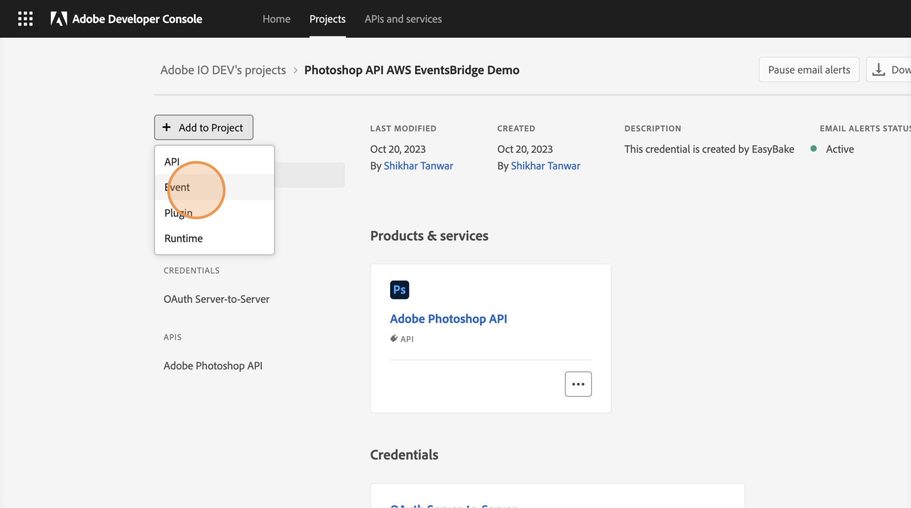

- Filter by product, and then select a suitable event provider from the available list.

  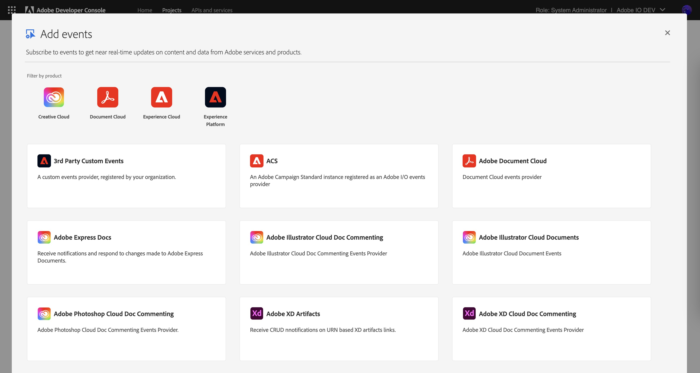

- Subscribe to the events that you're interested in corresponding to the selected event provider.

  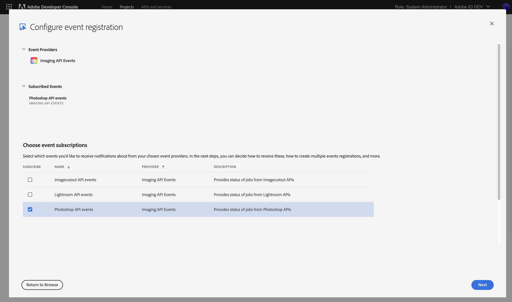

- Set up the authentication to be used

  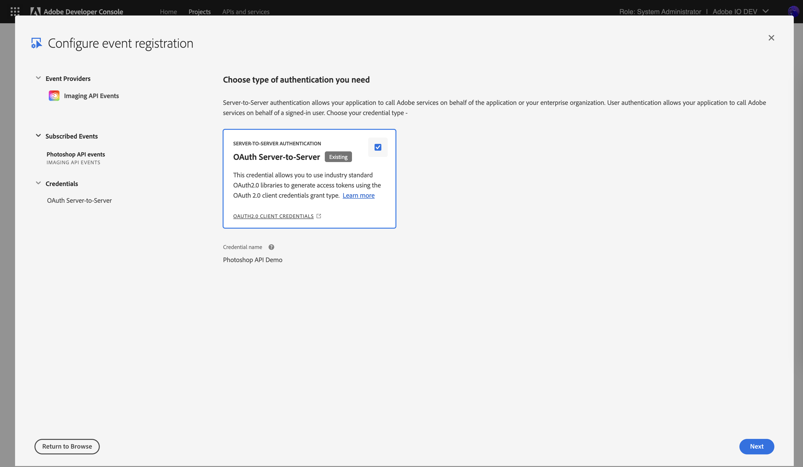

- Set the name and description for your event registration

  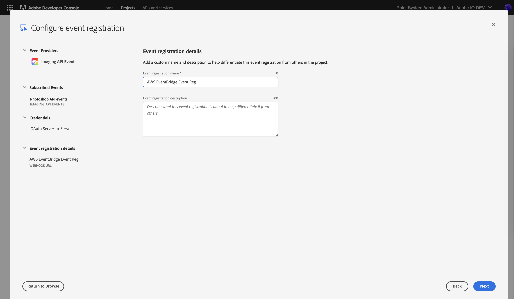

- On the `How to receive events` screen, choose the `Amazon EventBridge` option. Enter the customer's AWS account ID and the AWS region where the events will be routed.

  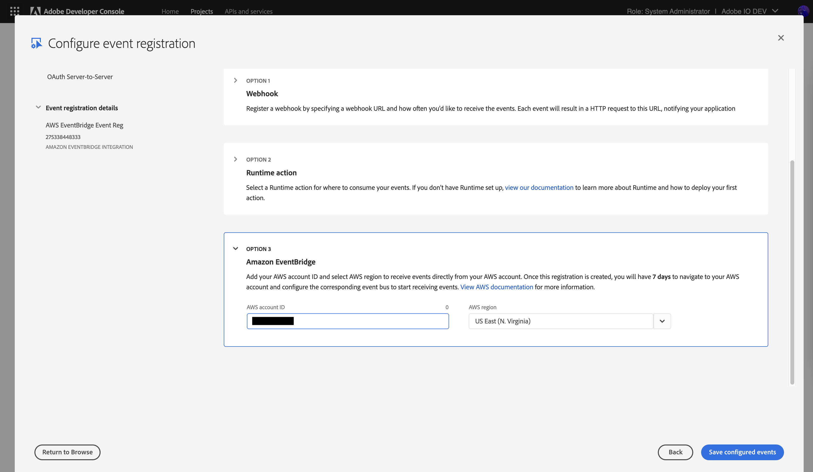

- Finish Event Registration Setup by clicking on the `Save configured events` button.
- After saving, your event registration should appear with a `Pending` status, indicating that further configuration is required on the AWS console.

  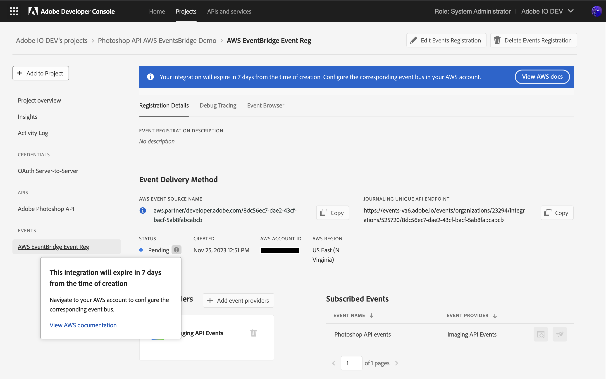

### Configuring AWS Console

Let's move forward and configure the event source on the AWS console now.

- Go to the AWS console corresponding to the region configured in the developer console earlier. Then, navigate to "Amazon EventBridge" service and select "Partner Event Sources" from the left menu.
- Choose the partner event source from the list that corresponds to the event registration created earlier, then click on the "Associate with event bus" button.

  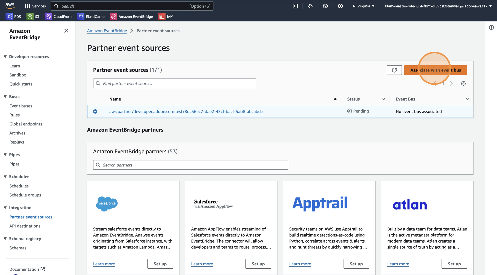

- On the next screen, click on "Associate" button.

  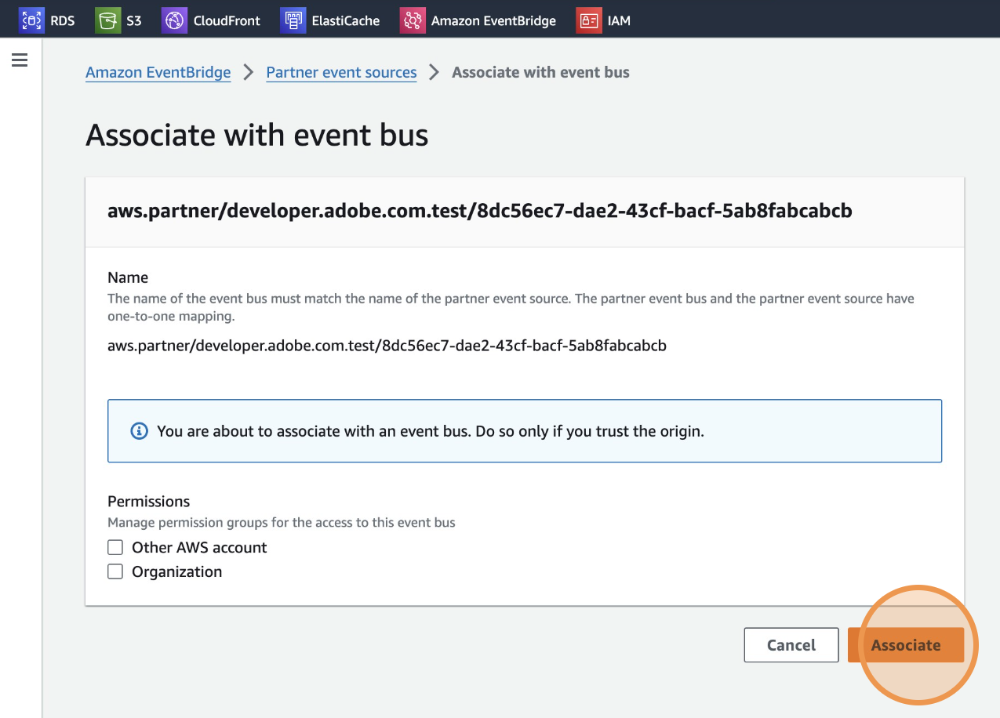
- Now navigate to "Rules" from the left navigation pane in the AWS Console and select the event bus configured above. Then, click on "Create Rule" button.
  
  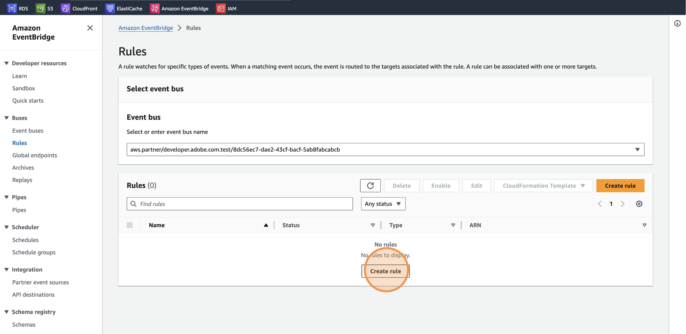

- In the "Create rule" configuration wizard, provide a name for the rule and, optionally, a description. Then, click on "Next".

  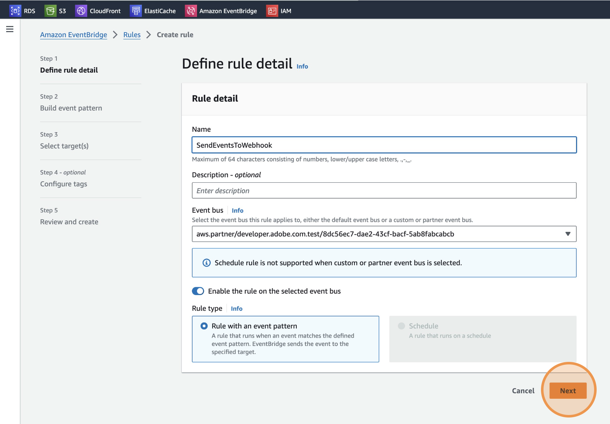

- Build an event pattern against which all events will be matched. For this purpose, we'll use the below rule that matches every event. Once done, click on "Next".
  
  ```json
  {
    "source": [{
      "prefix": "aws.partner/developer.adobe.com"
    }]
  }
  ```

  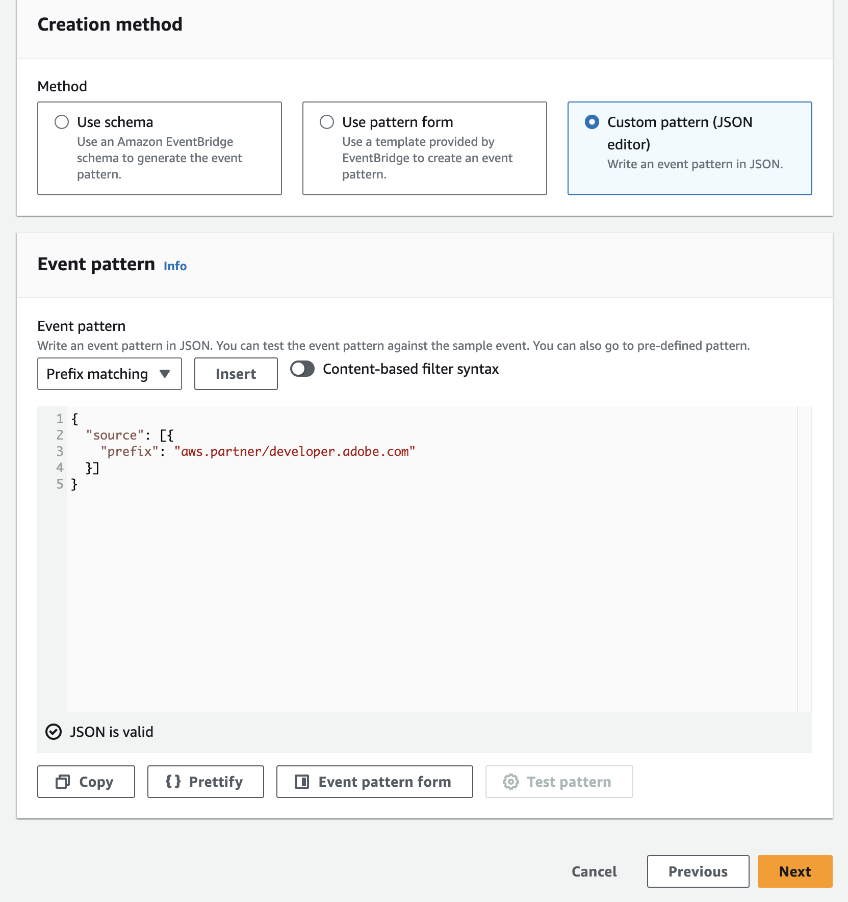

- Afterward, set up a target to which all events will be routed. This could be another Event Bus, an [EventBridge API Destination](https://docs.aws.amazon.com/eventbridge/latest/userguide/eb-api-destinations.html), or one of several AWS services. For this demonstration, we'll use a pre-configured API destination that forwards all events to a custom webhook URL, such as [https://webhook.site/](https://webhook.site/). Once done, click on "Next".

  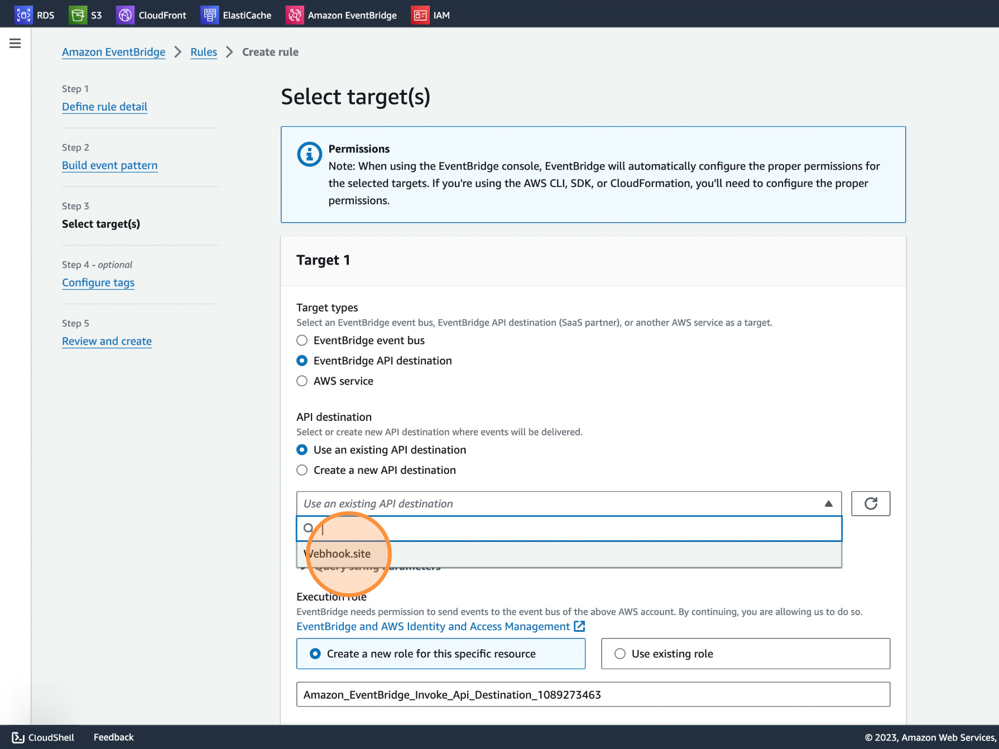

- Then, optionally configure any tags and click on "Next".
- Finish the rule creation by clicking on the "Create rule" button.

  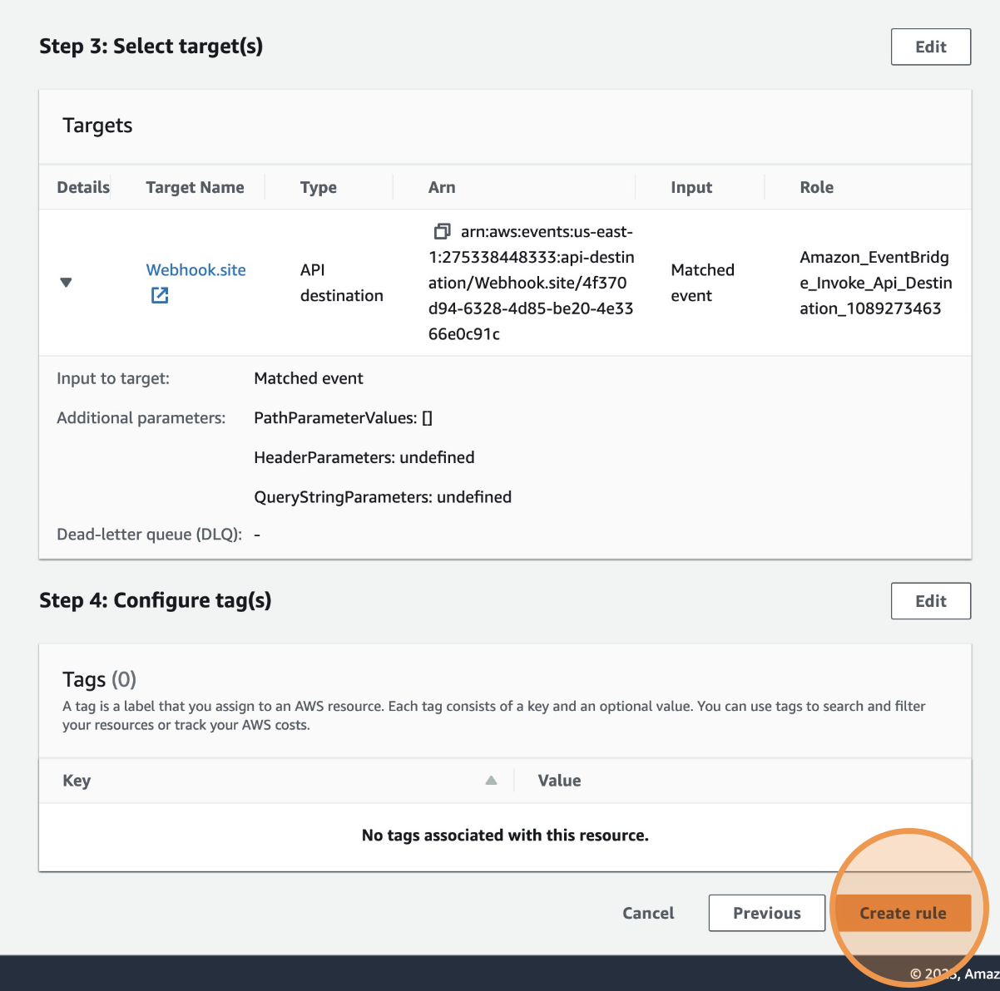

### Verify Status On Developer Console

- Finally, return to the developer console and confirm that the event registration is in an "Active" status.

  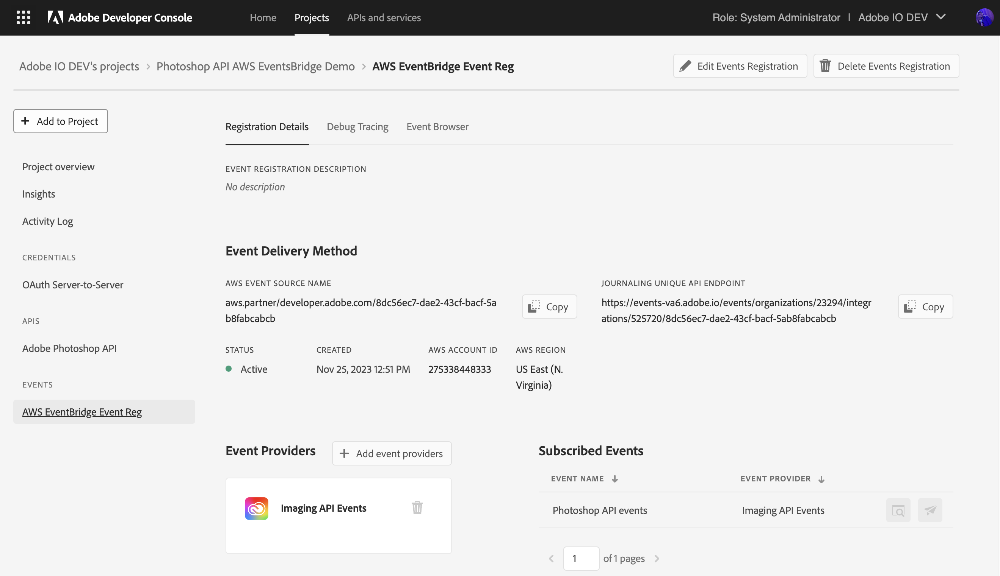

## Output Event Format

Every event follows Amazon's EventBridge event envelope format, where the event data is enclosed within the `detail` key.

```json
{
    "version": "0",
    "id": "4bc56dd4-8009-9893-2bc0-a65214f1ef02",
    "detail-type": "Imaging API Events:photoshop-job-status",
    "source": "aws.partner/developer.adobe.com.test/8dc56ec7-dae2-43cf-bacf-5ab8fabcabcb",
    "account": "XXXXX8448333",
    "time": "2023-11-26T13:44:51Z",
    "region": "us-east-1",
    "resources": [],
    "detail": {
        "key": "value"
    }
}
```
