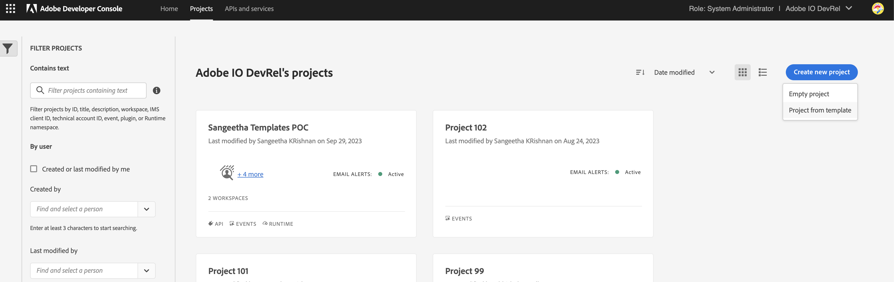
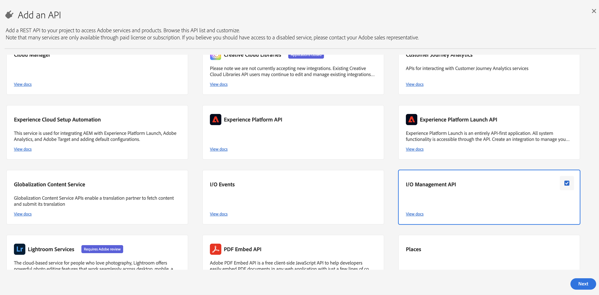
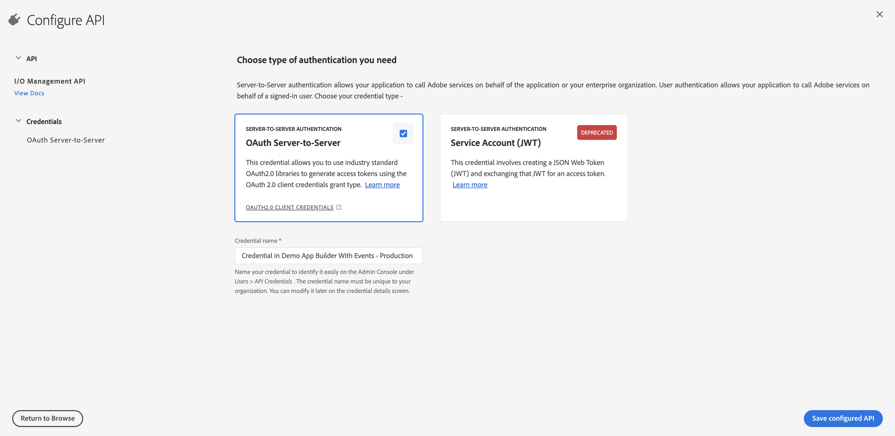
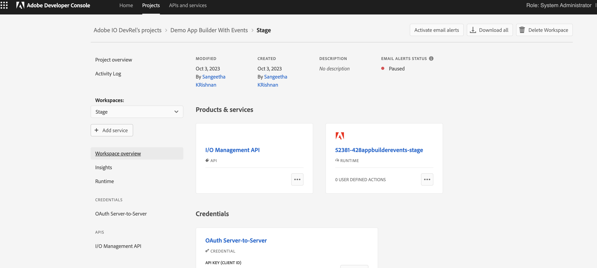
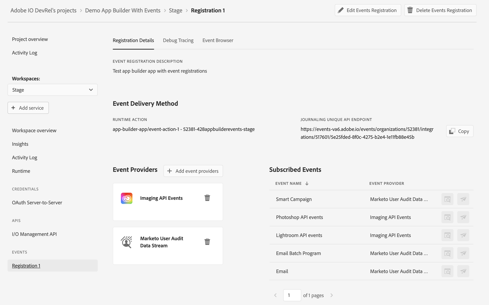

# App Builder with IO Events

In this guide, you will learn to leverage the power of IO Events to build event-driven applications with Adobe Developer App Builder.
You can listen to events coming from various Adobe Products and Services and build applications that respond to or process these events.

## Prerequisites

You will first need to visit [Adobe Developer Console](https://www.adobe.com/go/devs_console_ui) and create a new project from template in your organization and set up the workspaces using App Builder template. For detailed instructions, follow the steps outlined in this tutorial for [creating a new project from template](/developer-console/docs/guides/projects/projects-template/).

<InlineAlert slots="text"/>

The App Builder template is included as part of the App Builder SKU.



Once the project and the workspaces have been created, add the *I/O Management API* service with *OAuth Server to Server* credentials to the Stage workspace and any other workspace you will be working with. This will add the required scope to the authentication token required for setting up the project with IO Events Registrations. For a step-by-step guide to adding an API to a project, follow this tutorial for [adding an API to project using OAuth Server-to-Server credential](/developer-console/docs/guides/services/services-add-api-oauth-s2s/) (the type of authentication used by the I/O Management API).





The workspace is now set up



## Initialising an App Builder App with IO Events Template

Create a new folder where the code for the new app should be added and cd into the folder.

In order to create a new app:

- run aio app init
- Select the project. By default, the Project is initialized for Workspace Stage, you can run **'aio app use -w < workspace\ >'** to switch workspace after initialisation.
- You will then be presented with an option to select a) All Templates, b) All Extensions and c) Only Templates Supported By My Org. Choose either a or c
- Select @adobe/generator-app-events-generic using < space\ > and press < enter\ >

```shell
app-builder-app % aio app init
? Select Org: Adobe IO DevRel
? Select a Project, or press + to create new: Demo App Builder With Events
? What templates do you want to search for? Only Templates Supported By My Org
✔ Downloaded the list of templates
? Choose the template(s) to install:
  Pressing <enter> without selection will skip templates and install a standalone application.
  
┌──────┬─────────────────────────────┬─────────────────────────────┬──────────────────┬──────────────────┐
│      │ Template                    │ Description                 │ Extension Point  │ Categories       │
├──────┼─────────────────────────────┼─────────────────────────────┼──────────────────┼──────────────────┤
│ ❯◉   │ @adobe/generator-app-events │ Adds event registrations    │ N/A              │ action, events   │
│      │ -generic *                  │ and a generic action        │                  │                  │
├──────┼─────────────────────────────┼─────────────────────────────┼──────────────────┼──────────────────┤
│  ◯   │ @adobe/commerce-events-ext- │ Extensibility template for  │ N/A              │ action, events   │
│      │ tpl *                       │ handling Commerce events    │                  │                  │
├──────┼─────────────────────────────┼─────────────────────────────┼──────────────────┼──────────────────┤
│  ◯   │ @adobe/generator-app-api-me │ Extensibility template for  │ N/A              │ action, graphql- │
│      │ sh *                        │ Adobe API Mesh, for App     │                  │ mesh             │
│      │                             │ Builder                     │                  │                  │
├──────┼─────────────────────────────┼─────────────────────────────┼──────────────────┼──────────────────┤
│  ◯   │ @adobe/generator-app-asset- │ Extensibility template for  │ dx/asset-compute │ action           │
│      │ compute *                   │ generator-aio-app           │ /worker/1        │                  │
└──────┴─────────────────────────────┴─────────────────────────────┴──────────────────┴──────────────────┘
* = recommended by Adobe; to learn more about the templates, go to https://
adobe.ly/templates
```

This will now fetch the workspace details and configure your local app

```shell
Bootstrapping code in: app-builder-app
   create package.json
   create README.md
   create jest.setup.js
   create .env
   create .gitignore
 
Changes to package.json were detected.
Skipping package manager install.
 
   create .github/workflows/deploy_prod.yml
   create .github/workflows/deploy_stage.yml
   create .github/workflows/pr_test.yml
ℹ Installing template @adobe/generator-app-events-generic
ℹ Installing npm package @adobe/generator-app-events-generic
...
```

You will be prompted for the following details to set up your webhook registrations

- Name for the non-web runtime action

Each registration is associated with a runtime action, so this template will also add a non-web action that can be modified to react to the events subscribed to by the event registration. Let us name this action event-action-1 or you can use the default name

```shell
✔ Installed npm package @adobe/generator-app-events-generic
ℹ Running template @adobe/generator-app-events-generic
? We are about to create a new sample action that A generic action that logs the events received from IO Events.
How would you like to name this action? event-action-1
```

- Name for the registration (Any valid name with a minimum of 3 and a maximum of 255 characters, and must be unique in the context of the workspace )

```shell
? We are about to create a new Event registration.
How would you like to name this registration? Registration 1
```

- A description about what the registration is being created for

```shell
? What is this registration being created for? Test app builder app with event registrations
```

- Choose one or more provider metadata

<InlineAlert slots="text"/>

**Provider metadata:** Provider metadata indicates a family of providers. It describes the source of events and is categorised under one of the following groups: Creative Cloud, Document Cloud, Experience Cloud and Experience Platform. For eg. Commerce Events is an Experience Cloud product that emits events that can be consumed by subscribing to the Commerce Events provider metadata.

```shell
? Choose from the following provider families ( provider metadata ) (Press <space> to select, <a> to toggle all, <i> to invert selection, and <enter> to proceed)
 ◯ Cloud Manager Events
 ◯ Data Hygiene
❯◉ Imaging API Events
 ◯ Adobe Document Cloud
 ◉ Marketo User Audit Data Stream
(Move up and down to reveal more choices)
```

- Provider Selection
  
<InlineAlert slots="text"/>

**IO Events Provider:** Some provider metadata have one or more instances that emit events. Each instance is registered as an IO Events Provider under the specific provider metadata. For eg. an organisation may have multiple instance of Adobe Commerce. Each instance is registered as a different provider. Some provider metadata have only a single source of events. Such provider metadata consist of only a single provider per organisation.

For multi-instance provider metadata, select an instance to listen to events from, and in case of single instance provider metadata, select the specified provider by pressing \< enter\ >

```shell
? Choose from below provider for provider metadata: di_event_code (Use arrow keys)
❯ Imaging API Events
```

- Event metadata Selection

<InlineAlert slots="text"/>

**Event Metadata:** Providers consist of several types of events that are emitted. These represent the event metadata. For eg. Imaging API Events emits events of type: Imagecutout api events, photoshop api events and lightroom api events.

Select the type of events you are interested in listening to.

```shell
? Choose event metadata for provider: Imaging API Events (Press <space> to select, <a> to toggle all, <i> to invert selection, and <enter> to proceed)
 ◯ Imagecutout API events
❯◉ Photoshop API events
 ◉ Lightroom API events
```

The provider and event metadata selection will repeat for every provider metadata that was selected.

```shell
? Choose from below provider for provider metadata: dx_marketo_audit_user Marketo User Audit Data Stream
? Choose event metadata for provider: Marketo User Audit Data Stream (Press <space> to select, <a> to toggle all, <i> to invert selection, and <enter> to proceed)
 ◯ User
 ◉ Smart Campaign
❯◉ Email
 ◉ Email Batch Program
 ◯ Folder
```

This together constitutes the **Events of Interest**.

The template finishes running successfully, thereby initialising your app with a sample non-web action 'event-action-1' that logs every event it receives belonging to one of the events of interest selected in the provider and event metadata selection.

The app.config.yaml is initialised with the runtimeManifest and event registration

```yaml
application:
  runtimeManifest:
    packages:
      app-builder-app:
        license: Apache-2.0
        actions:
          event-action-1:
            function: actions/event-action-1/index.js
            web: 'no'
            runtime: nodejs:16
            inputs:
              LOG_LEVEL: debug
            annotations:
              require-adobe-auth: false
              final: true
  events:
    registrations:
      Registration 1:
        description: Test app builder app with event registrations
        events_of_interest:
          - provider_metadata: di_event_code
            event_codes:
              - photoshop-job-status
              - lightroom-job-status
          - provider_metadata: dx_marketo_audit_user
            event_codes:
              - com.adobe.platform.marketo.audit.user.smartcampaign
              - com.adobe.platform.marketo.audit.user.email
              - com.adobe.platform.marketo.audit.user.emailbatchprogram
        runtime_action: app-builder-app/event-action-1
```

And .env file contains the required env variable

```dotenv
## Provider metadata to provider id mapping
AIO_EVENTS_PROVIDERMETADATA_TO_PROVIDER_MAPPING=di_event_code:provider-id-1,dx_marketo_audit_user:provider-id-2
```

## Adding Event registrations to your app using the Events Generic Template

You can add more event registrations to your application using the command **aio app add events**

```shell
app-builder-app % aio app add events
✔ Downloaded the list of templates
? Choose the template(s) to install:
  Pressing <enter> without selection will skip templates and install a standalone application.
  
┌──────┬────────────────────────────────────────┬────────────────────────────────────────┬──────────────────────────┬──────────────────────────┐
│      │ Template                               │ Description                            │ Extension Point          │ Categories               │
├──────┼────────────────────────────────────────┼────────────────────────────────────────┼──────────────────────────┼──────────────────────────┤
│ ❯◉   │ @adobe/generator-add-events-generic *  │ Adds event registrations and a generic │ N/A                      │ helper-template, events  │
│      │                                        │ action                                 │                          │                          │
└──────┴────────────────────────────────────────┴────────────────────────────────────────┴──────────────────────────┴──────────────────────────┘
 
* = recommended by Adobe; to learn more about the templates, go to https://adobe.ly/templates
```

Select @adobe/generator-add-events-generic and follow the steps to install the template

Here you will be presented with an option to either use an existing runtime action or create a new runtime action. If you choose to use an existing runtime action, you will be able to choose from the list of non-web actions present in the runtimeManifest of your application. Follow all other steps to add name, description and events of interest to your event registration as described in the previous section

## Deploying the Application

Deploy the application using

```shell
aio app deploy
```

This will deploy the actions and create the event registrations.

You should also be able to see the registrations on Developer Console



Registrations are uniquely identified by the registration name. For registration names that are already part of the workspace, deploying the app will update the registrations, and for those that do not exist, deploying will create the registrations. No registrations are deleted when you just use **aio app deploy**

```shell
aio app deploy --force-events
```

On using this flag, all other registrations that are not part of the config file, but are part of the workspace will be deleted. Thus the workspace will be exactly in sync with the current state of the config file of the app builder app.

See more details on [App Builder deployment](https://developer.adobe.com/app-builder/docs/guides/deployment/)

## Un-deploying the Application

Undeploy the application using

```shell
aio app undeploy
```

This will undeploy all the actions and delete all event registrations that are part of the config file
