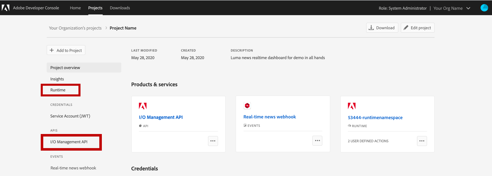
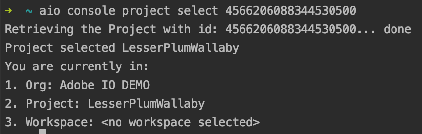

# Events Plugin for Adobe I/O CLI

This guide includes step by step instructions for setting up and using the Events Plugin for the Adobe I/O CLI.

In addition to the information provided in this guide, you can also visit the [Events Plugin GitHub repository](https://github.com/adobe/aio-cli-plugin-events) or the [Adobe I/O CLI GitHub repository](https://github.com/adobe/aio-cli) to learn more.

## Setup and credentials

To begin setting up the Events Plugin, visit [Adobe Developer Console](https://www.adobe.com/go/devs_console_ui) and create a new project in your organization. For detailed instructions, follow the steps outlined in this tutorial for [creating a new project](/developer-console/docs/guides/projects/projects-empty/).

Once the project has been created, add the *I/O Management API* service to the project. This will add the required scope to the authentication token required by the Events SDK. For a step-by-step guide to adding an API to a project, follow this tutorial for [adding an API to a project using OAuth Server-to-Server credential](/developer-console/docs/guides/services/services-add-api-oauth-s2s/) (the type of authentication used by the I/O Management API).



### Setting up credentials using `aio console`

After completing the setup within the Adobe Developer Console, you must then set up the credentials locally in order to run the various CLI commands. This set up will populate the `~/.config/aio` file with the access token, organization ID, workspace, and project details, as well as other credentials, required by the CLI.

On entering any command, you will be taken to the Adobe I/O CLI Login page. After signing in using your ID, you will be redirected to a page stating that you have successfully logged in to the Adobe I/O CLI.


You can now proceed to select the organization, project, and workspace using the following steps:

1. Select the same organization in which you created the project in the Adobe Developer Console. You can list the organizations and select one using ***aio console org list***.

    

    To select an organization, use ***aio console org select <ims_org_id>***.

    

2. Select the project you created in the Adobe Developer Console. You can list the projects using ***aio console project list***.

    

    To select a project, use ***aio console project select <project_id>***.

    

3. Select the workspace from the project you created in the Adobe Developer Console. By default a Production workspace is created when you create a new project. You can list the workspaces using ***aio console workspace list***.

    

    To select a workspace, use ***aio console workspace select <workspace_id>***.

    

## Installing and using the plugin

Use the following outlines how to install the Events Plugin for the Adobe I/O CLI and issue commands. These installation instructions are specific to using the Events Plugin alone. You could also choose to install the Adobe I/O CLI that supports the events plugin. See the [section on installing the Adobe I/O CLI](#installing-adobe-io-cli) for installation instructions.

```shell
$ npm install -g @adobe/aio-cli-plugin-events
$ aio COMMAND
running command...
$ aio (-v|--version|version)
@adobe/aio-cli-plugin-events/1.0.0 darwin-x64 node-v10.18.1
$ aio [COMMAND] --help
USAGE
  $ aio COMMAND
...
```

### Installing Adobe I/O CLI

Use the following instructions to install the Adobe I/O CLI. For more information, including a complete list of available commands for the Adobe I/O CLI, please visit the [Adobe I/O CLI public GitHub repository](https://github.com/adobe/aio-cli).

```shell
$ npm install -g @adobe/aio-cli
$ aio COMMAND
running command...
$ aio (-v|--version|version)
@adobe/aio-cli/3.6.0 darwin-x64 node-v10.16.1
$ aio --help [COMMAND]
USAGE
  $ aio COMMAND
...
```

## Commands

There are a number of commands available when using the Events Plugin, the following sections outline these commands in more detail.

Throughout the guide, example commands are shown using a colon (`:`) to separate values. These commands can also be written without a colon, using a space to separate values.

**Accepted command syntax:**

```shell
$ aio event:registration:get REGISTRATIONID

$ aio event registration get REGISTRATIONID
```

Please select an area from the following list to see available commands:

* [Common command](#common-command)
* [Registration commands](#registration-commands)
* [Provider commands](#provider-commands)
* [Event Metadata commands](#event-metadata-commands)

### Common command

```shell
aio event
```

### Registration commands

* [Manage your Adobe I/O Events Registrations](#manage-your-adobe-io-events-registrations)
* [Get an Event Registration in your workspace](#get-an-event-registration-in-your-workspace)
* [List Event Registrations in your workspace](#list-event-registrations-in-your-workspace)
* [Create an Event Registration](#create-an-event-registration)
* [Delete an Event Registration](#delete-an-event-registration)

#### Manage your Adobe I/O Events Registrations

```shell
USAGE
  $ aio event:registration
 
OPTIONS
  -v, --verbose Verbose output
  --help Show help
  --version Show version
```

#### Get an Event Registration in your workspace

```shell
USAGE
  $ aio event:registration:get REGISTRATIONID
 
ARGUMENTS
  REGISTRATIONID  Id of the registration to get
 
OPTIONS
  -j, --json     Output json
  -v, --verbose  Verbose output
  -y, --yml      Output yml
  --help         Show help
  --version      Show version
 
ALIASES
  $ aio event:reg:get
```

#### List Event Registrations in your workspace

```shell
USAGE
  $ aio event:registration:list
 
OPTIONS
  -j, --json Output json
  -v, --verbose Verbose output
  -y, --yml Output yml
  --help Show help
  --version Show version
 
ALIASES
  $ aio event:registration:ls
  $ aio event:reg:list
  $ aio event:reg:ls
```

#### Create an Event Registration

```shell
USAGE
  $ aio event:registration:create BODYJSONFILE
 
ARGUMENTS
  BODYJSONFILE
      Path to a file in JSON format with the information to create a new Event Registration.
      The JSON should follow the following format:
      {
        "name": "<event registration name>",
        "description": "<event registration description>",
        "delivery_type": "WEBHOOK|WEBHOOK_BATCH|JOURNAL",
        "webhook_url": "<webhook URL responding to challenge>"
        "events_of_interest": [{
          "provider_id": "<event provider id>"
          "event_code": "<event provider event_code metadata>"
        }, { <...more events> }]
      }
 
OPTIONS
  -j, --json     Output json
  -v, --verbose  Verbose output
  -y, --yml      Output yml
  --help         Show help
  --version      Show version
 
ALIASES
  $ aio event:reg:create
```

#### Delete an Event Registration

```shell
USAGE
  $ aio event:registration:delete REGISTRATIONID

ARGUMENTS
  REGISTRATIONID  The requested registration ID

OPTIONS
  -v, --verbose  Verbose output
  --help         Show help
  --version      Show version

ALIASES
  $ aio event:reg:delete
```

### Provider Commands

* [Manage your Adobe I/O Events Providers](#manage-your-adobe-io-events-providers)
* [Get details for a Provider by its ID](#get-details-for-a-provider-by-its-id)
* [List all Providers for the Organization](#list-all-providers-for-the-organization)
* [Create a new Provider](#create-a-new-provider)
* [Update an existing Provider](#update-an-existing-provider)
* [Delete an existing Provider](#delete-an-existing-provider)

#### Manage your Adobe I/O Events Providers

```shell
USAGE
  $ aio event:provider
 
OPTIONS
  -v, --verbose  Verbose output
  --help         Show help
  --version      Show version
```

#### Get details for a Provider by its ID

```shell
USAGE
  $ aio event:provider:get PROVIDERID

ARGUMENTS
  PROVIDERID  The requested provider ID

OPTIONS
  -j, --json            Output json
  -v, --verbose         Verbose output
  -y, --yml             Output yml
  --fetchEventMetadata  Fetch event metadata with provider
  --help                Show help
  --version             Show version
```

#### List all Providers for the Organization

```shell
USAGE
  $ aio event:provider:list
 
OPTIONS
  -j, --json     Output json
  -v, --verbose  Verbose output
  -y, --yml      Output yml
  --help         Show help
  --version      Show version

ALIASES
  $ aio event:provider:ls
```

#### Create a new Provider

```shell
USAGE
  $ aio event:provider:create
 
OPTIONS
  -j, --json     Output json
  -v, --verbose  Verbose output
  -y, --yml      Output yml
  --help         Show help
  --version      Show version
```

#### Update an existing Provider

```shell
USAGE
  $ aio event:provider:update PROVIDERID

ARGUMENTS
  PROVIDERID  The requested provider ID

OPTIONS
  -j, --json     Output json
  -v, --verbose  Verbose output
  -y, --yml      Output yml
  --help         Show help
  --version      Show version
```

#### Delete an existing Provider

```shell
USAGE
  $ aio event:provider:delete PROVIDERID

ARGUMENTS
  PROVIDERID  The requested provider ID

OPTIONS
  -v, --verbose  Verbose output
  --help         Show help
  --version      Show version
```

### Event Metadata Commands

* [Manage Event Metadata for your Adobe I/O Events Providers](#manage-event-metadata-for-your-adobe-io-events-providers)
* [Get details of an Event Code of a Provider](#get-details-of-an-event-code-of-a-provider)
* [List all Event Metadata for a Provider](#list-all-event-metadata-for-a-provider)
* [Create Event Metadata for a Provider](#create-event-metadata-for-a-provider)
* [Update Event Metadata for a Provider](#update-event-metadata-for-a-provider)
* [Delete Event Metadata for a Provider](#delete-event-metadata-for-a-provider)

#### Manage Event Metadata for your Adobe I/O Events Providers

```shell
USAGE
  $ aio event:eventmetadata
 
OPTIONS
  -v, --verbose  Verbose output
  --help         Show help
  --version      Show version
```

#### Get details of an Event Code of a Provider

```shell
USAGE
  $ aio event:eventmetadata:get PROVIDERID EVENTCODE
 
ARGUMENTS
  PROVIDERID  The requested provider ID
  EVENTCODE   The requested eventmetadata event code
 
OPTIONS
  -j, --json     Output json
  -v, --verbose  Verbose output
  -y, --yml      Output yml
  --help         Show help
  --version      Show version
```

#### List all Event Metadata for a Provider

```shell
USAGE
  $ aio event:eventmetadata:list PROVIDERID
 
ARGUMENTS
  PROVIDERID  The requested provider ID
 
OPTIONS
  -j, --json     Output json
  -v, --verbose  Verbose output
  -y, --yml      Output yml
  --help         Show help
  --version      Show version
 
ALIASES
  $ aio event:eventmetadata:ls
```

#### Create Event Metadata for a Provider

```shell
USAGE
  $ aio event:eventmetadata:create PROVIDERID
 
ARGUMENTS
  PROVIDERID  The requested eventmetadata event code
 
OPTIONS
  -j, --json     Output json
  -v, --verbose  Verbose output
  -y, --yml      Output yml
  --help         Show help
  --version      Show version
```

#### Update Event Metadata for a Provider

```shell
USAGE
  $ aio event:eventmetadata:update PROVIDERID EVENTCODE
 
ARGUMENTS
  PROVIDERID  The requested provider ID
  EVENTCODE   The requested eventmetadata event code
 
OPTIONS
  -j, --json     Output json
  -v, --verbose  Verbose output
  -y, --yml      Output yml
  --help         Show help
  --version      Show version
```

#### Delete Event Metadata for a Provider

When deleting event metadata, the `EVENTCODE` value is optional. However, if an Event Code is not provided, all event metadata will be deleted.

```shell
USAGE
  $ aio event:eventmetadata:delete PROVIDERID [EVENTCODE]
 
ARGUMENTS
  PROVIDERID  The requested provider ID
  EVENTCODE   The requested eventmetadata event code
 
OPTIONS
  -v, --verbose  Verbose output
  --help         Show help
  --version      Show version
```
