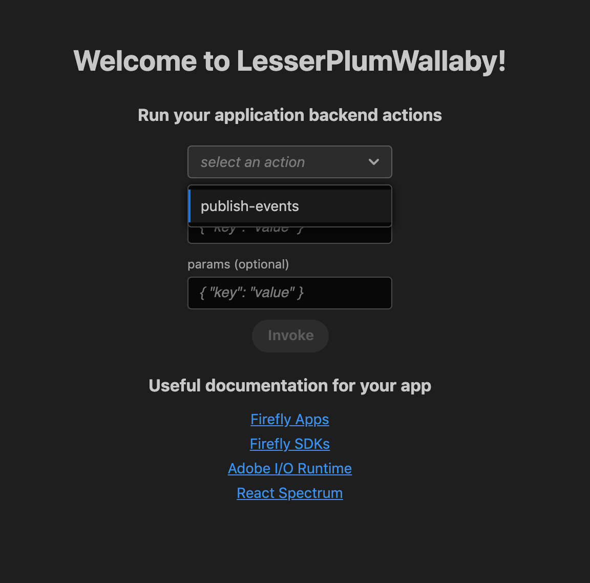

# Event Template Generator

The event template generator bootstraps the project code with a template that allows you to create a basic [Cloud Event](https://cloudevents.io/) and publish that event to Adobe I/O Events. 

This template can be used in conjunction with other action templates that are supported by the CLI such as Target, Analytics, and Campaign, as well as your own custom code. 

To learn more, visit the [generator app public GitHub repository](https://github.com/adobe/generator-aio-app/tree/master/generators/add-events).

## Installation

Run the following command to install the CLI.

```shell
npm install -g @adobe/aio-cli
```

## Getting Started

To bootstrap the project code, create a directory and run the following commands from that directory:

1. First, select the appropriate organization.

    ```shell
    ➜  project aio app init
    Retrieving information from Adobe I/O Console..
    ? Select Org
      AAA-Alpha Org
    ❯ Adobe IO DEMO
      Beta Org 
      Delta Org
    ```

2. Then, select the project from within that organization.

    You can either select the project by scrolling or you can filter the list of projects by beginning to type the name of the project.

    ```shell
    ➜  project aio app init
    Retrieving information from Adobe I/O Console..
    ? Select Org Adobe IO DEMO
    ? Select Project
      service-account-test
    ❯ sample-project-test
      new-cli-test-project
    (Move up and down to reveal more choices)
    ```

3. From within the project, you must then select the appropriate workspace.

    If you have followed the steps for [creating a new project](/developer-console/docs/guides/projects/projects-empty/), there will only be one workspace available: Production.

    ```shell
    ➜  project aio app init
    Retrieving information from Adobe I/O Console..
    ? Select Org Adobe IO DEMO
    ? Select Project Sample Project
    ? Select Workspace (Use arrow keys or type to search)
    ❯ Production
    ```

4. You are then are presented with a series of choices for the project. This includes Actions, Events, Web Assets and CI/CD. 

    If you want would like to have a UI to access your actions, select the Web Assets in addition to your action. 

    By default, all options are selected. You can use the letter 'A' to toggle the selections and the space bar to select actions you wish to add to your project. For this example, only Events and Web Assets are selected.

    ```shell
    ➜  project aio app init
    Retrieving information from Adobe I/O Console..
    ? Select Org Adobe IO DEMO
    ? Select Project Sample Project
    ? Select Workspace Production
      create console.json
    
    You are about to initialize the project '{PROJECT_NAME_FROM_CONSOLE}'
    Generating code in: /{PATH}
    ? Which Adobe I/O App features do you want to enable for this project?
    select components to include
      ◯ Actions: Deploy Runtime actions
      ◉ Events: Publish to Adobe I/O Events
    ❯◉ Web Assets: Deploy hosted static assets
      ◯ CI/CD: Include GitHub Actions based workflows for Build, Test and Deploy
    ```

5. You can then enter the name of the action you want to use for the events project (by default, `publish-event` will be used) and press enter. This triggers the creation of a project that contains the Events Template to publish [CloudEvents]( https://cloudevents.io) and Web Assets. 

    ```shell
    You are about to initialize the project '{PROJECT_NAME_FROM_CONSOLE}'
    Generating code in: /{PATH}
    ? Which Adobe I/O App features do you want to enable for this project?
    select components to include Events: Publish to Adobe I/O Events, Web Assets: Deploy hosted static assets
    ? We are about to create a new sample action that creates messages in cloud events format and publishes to Adobe I/O Events
    how would you like to name this action? (publish-events)
      create package.json
      create manifest.yml
      create .aio
      create README.md
      create test/jest.setup.js
      create .env
      create .gitignore
      create actions/publish-events/index.js
      create test/actions/publish-events.test.js
      create actions/utils.js
      create test/actions/utils.test.js
      create e2e/actions/publish-events.e2e.js
      create web-src/404.html
      create web-src/index.html
      create web-src/src/App.css
      create web-src/src/App.js
      create web-src/src/exc-runtime.js
      create web-src/src/index.js
      create web-src/src/utils.js
      create .babelrc
    ....
    found 0 vulnerabilities
    
    ✔ App initialization finished!
    ```

## Sample Project Structure

The following diagram outlines a sample project structure, showing the files that were previously created and how they relate to other files in the project.

```
.

├── README.md

├── node_modules

├── actions

│   ├── publish-events

│   │   └── index.js (Source file that contains a template to create a publish Cloud Events to Adobe I/O Events.)

│   └── utils.js

├── console.json (Contains Adobe Developer Console credentials that include the org id, workspace id, project id, JWT token credentials, etc.) 

├── e2e

│   └── actions

│       └── publish-events.e2e.js

├── manifest.yml

├── .env (Contains the environment variables required to deploy your action in Adobe I/O Runtime, and other credentials required in order to invoke the Publish API.) 

├── package-lock.json

├── package.json

├── test

│   ├── actions

│   │   ├── publish-events.test.js (Test file for the events sample code.)

│   │   └── utils.test.js

│   └── jest.setup.js

└── web-src

    ├── ........

        └── .......
```

## Deploying the Action

From the same directory, begin by running the following command:

```shell
aio app run
```

This command will create an action in Adobe I/O Runtime. 

```shell
➜  project aio app run
success: generated certificate
A self signed development certificate has been generated, you will need to accept it in your browser in order to use it.
Waiting for the certificate to be accepted.... done
Great, you accepted the certificate!
> Local Dev Server
ℹ using remote actions
ℹ redeploying actions..
ℹ   -> XXX-0.0.1/__secured_publish-events
ℹ   -> https://xxx.adobeioruntime.net/api/v1/web/{PROJECT_NAME_FROM_CONSOLE}-0.0.1/publish-events
ℹ writing credentials to tmp wskdebug config '.wskdebug.props.tmp'..
ℹ injecting backend urls into frontend config
ℹ starting local frontend server ..
ℹ local frontend server running at https://localhost:9080
ℹ setting up vscode debug configuration files..
ℹ press CTRL+C to terminate dev environment
⠋ Local Dev Server
To view your local application:
  -> https://localhost:9080
To view your deployed application in the Experience Cloud shell:
  -> https://experience.adobe.com/?devMode=true#/custom-apps/?localDevUrl=https://localhost:9080
```

You will also receive the action URL which can be invoked from your application or via a CuRL command as well as a link to a user interface (UI) in order to invoke your action.

* Action URL: `https://XXX.adobeioruntime.net/api/v1/web/{PROJECT_NAME_FROM_CONSOLE}-0.0.1/publish-events`
* UI URL: `https://experience.adobe.com/?devMode=true#/custom-apps/?localDevUrl=https://localhost:9080`

## Invoking the Action

You can now invoke the action using the [UI](#user-interface) or a [CuRL command](#curl-command) by providing the following required headers and parameters:

* **Headers:**
    * **Authorization:**  JWT Token that contains the `adobeio_api` scope which can be obtained by adding the I/O Management API in the Adobe Developer Console. This token should be prepended with the word "Bearer". For more information, see the [service account integration documentation](/developer-console/docs/guides/authentication/ServiceAccountIntegration/).
    * **x-gw-ims-org-id:** The IMS Organization ID which can be obtained from the `config.json` file or in the Adobe Developer Console. 

* **Parameters:**
    * **apiKey:** The client ID from the integration, found in the Adobe Developer Console.
    * **providerId:** The ID of the Provider for which the event is being published.
    * **eventCode:** The type of event of the Provider.
    * **payload:** The JSON Payload to be published.

### User interface

Selecting the UI link opens a user interface similar to the image shown below. You can use the **select the action** drop-down to choose the action to be invoked.

For headers, you must pass a JSON Payload containing the `Authorization` and `x-gw-ims-org-id` headers. Use the following example for reference, being sure to substitute real values for the JWT token and IMS Org ID.

```json
{ "Authorization":"Bearer <JWT_TOKEN>", "x-gw-ims-org-id":"<IMS_ORG_ID>" }
```

For params, you must pass a JSON object containing all of the required parameters, being sure to substitute real values for the placeholders shown.

```json
{ "providerId":"<PROVIDER_ID>", "apiKey":"<CLIENT_ID>", "eventCode":"<EVENT_CODE>", "payload":{ "hello":"project" } }
```



Once all of the required information has been provided, select **Invoke** and the corresponding action is executed to convert the JSON payload into [Cloud Event](https://cloudevents.io/) format and publish it to Adobe I/O Events. 

### CuRL Command

The required headers are used as shown below and the parameters are passed as a JSON object in the body of the request.

```shell
curl -X POST \
  https://xxx.adobeioruntime.net/api/v1/web/{PROJECT_NAME_FROM_CONSOLE}-0.0.1/publish-events \
  -H 'Authorization: Bearer <JWT_TOKEN>' \
  -H 'Content-Type: application/json' \
  -H 'x-gw-ims-org-id: <ORG_ID>' \
  -d '{
        "providerId":"<PROVIDER_ID>",
        "apiKey":"<CLIENT_ID>",
        "eventCode":"<EVENT_CODE>",
        "payload":{
          "hello":"project"
        }
      }'
```

## Debugging

From the active directory, running the following command will return the logs of the action executed which can help in debugging any issues. 

```shell
aio app logs
```

### Example Debug Logs

<InlineAlert slots="text"/>

The following code sample does not line wrap. Therefore, you may be required to scroll left and right in order to see the complete logs.

```shell
➜  project aio app logs
__secured_publish-events:cc02982d23234c5a82982d0d1eab1a3f
2020-06-12T13:11:47.993Z       stdout: 2020-06-12T13:11:47.992Z [main /XXX-{PROJECT_NAME_FROM_CONSOLE}/{PROJECT_NAME_FROM_CONSOLE}-0.0.1/__secured_publish-events] info: Calling the main action
2020-06-12T13:11:47.994Z       stdout: 2020-06-12T13:11:47.994Z [main /XXX-{PROJECT_NAME_FROM_CONSOLE}/{PROJECT_NAME_FROM_CONSOLE}-0.0.1/__secured_publish-events] debug: {"statusCode":200,"body":{"message":"validation success"},"payload":{"hello":"world"},"__ow_method":"post",...}
2020-06-12T13:11:48.104Z       stdout: 2020-06-12T13:11:48.104Z [main /XXX-{PROJECT_NAME_FROM_CONSOLE}/{PROJECT_NAME_FROM_CONSOLE}-0.0.1/__secured_publish-events] error: [EventsSDK:ERROR_PUBLISH_EVENT] Error: 403 - Forbidden (https://eventsingress.adobe.io/)
2020-06-12T13:11:48.104Z       stdout: 2020-06-12T13:11:48.104Z [main /XXX-{PROJECT_NAME_FROM_CONSOLE}/{PROJECT_NAME_FROM_CONSOLE}-0.0.1/__secured_publish-events] info: 500: server error
```


