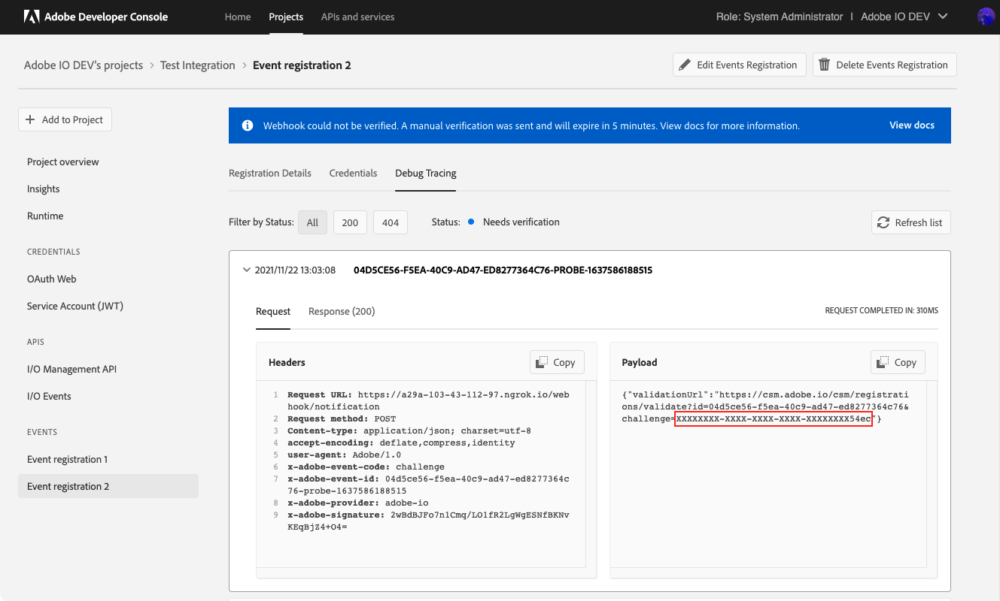

---
keywords:
  - Webhook
  - Testing with ngrok
  - Create a Project
  - Receiving Events
  - Quotas
title: Introduction to Adobe I/O Events Webhooks
description: With Adobe I/O Events webhooks, your application can sign up to be notified whenever certain events occur. For example, when a user uploads a asset, this action generates an event. With the right webhook in place, your application is instantly notified that this event happened.
---


# Introduction to Adobe I/O Events Webhooks

With Adobe I/O Events webhooks, your application can sign up to be notified whenever certain events occur.
For example, when a user uploads a asset, this action generates an event.
With the right webhook in place, your application is instantly notified that this event happened.

Please refer to the `Adobe Developer Console` documentation on how to [Add Events to a project](https://developer.adobe.com/developer-console/docs/guides/services/services-add-event/)

To start receiving events, you create an event registration specifying a webhook URL and the types of events you want to receive. Each event will result in a HTTP request to the given URL, notifying your application. This guide provides an introduction to webhooks.

## Getting started

An **Event** is a JSON object that describes something that happened. Events originate from **Event Providers**. Each event provider publishes specific types of events, identified by an **Event Code**. A **Webhook URL** receives event JSON objects as HTTP POST requests. You start receiving events by creating an **Event Registration**, providing a name, description, webhook URL, and a list of **Event Types** you are interested in.

### Webhook example

Acme Inc. wants to be notified when a new file is uploaded to Adobe Creative Cloud Assets, so it creates the following event registration:

```json
{
  "name": "Acme Webhook",
  "description": "Listen for newly created files",
  "webhook_url": "https://acme.example.com/webhook",
  "events_of_interest": [
    {
      "provider": "ccstorage", 
      "event_code": "asset_created"
    }
  ]
}
```
Now when a file is uploaded, Adobe I/O Events performs the following HTTP request:

```http
POST https://acme.example.com/webhook HTTP/1.1
content-type: application/json

{
  "@id": "82235bac-2b81-4e70-90b5-2bd1f04b5c7b",
  "@type": "xdmCreated",
  "xdmEventEnvelope:objectType": "xdmAsset",
  "activitystreams:published": "2016-07-16T19:20:30+01:00",
  "activitystreams:to": {
    "xdmImsOrg:id": "08B3E5CE5822FC520A494229@AdobeOrg",
    "@type": "xdmImsOrg"
  },
  "activitystreams:generator": {
    "xdmContentRepository:root": "http://francois.corp.adobe.com:4502/",
    "@type": "xdmContentRepository"
  },
  "activitystreams:actor": {
    "xdmAemUser:id": "admin",
    "@type": "xdmAemUser"
  },
  "activitystreams:object": {
    "@type": "xdmAsset",
    "xdmAsset:asset_id": "urn:aaid:aem:4123ba4c-93a8-4c5d-b979-ffbbe4318185",
    "xdmAsset:asset_name": "Fx_DUKE-small.png",
    "xdmAsset:etag": "6fc55d0389d856ae7deccebba54f110e",
    "xdmAsset:path": "/content/dam/Fx_DUKE-small.png",
    "xdmAsset:format": "image/png"
  },
  "@context": {
    "activitystreams": "http://www.w3.org/ns/activitystreams#",
    "xdmEventEnvelope": "https://ns.adobe.com/xdm/common/eventenvelope#",
    "xdmAsset": "http://ns.adobe.com/xdm/assets/asset#",
    "xdmImsOrg": "https://ns.adobe.com/xdm/ims/organization#",
    "xdmContentRepository": "https://ns.adobe.com/xdm/content/repository",
    "xdmAemUser": "https://ns.adobe.com/xdm/aem/user#",
    "xdmCreated": "https://ns.adobe.com/xdm/common/event/created#"
  }
}
```

## Your first webhook

Before you can register a webhook, the webhook needs to be online and operational. If not, then the event registration will fail. So you need to take care of setting that up first. Your webhook must be hosted on a server. For development, you may use [webhook.site](https://webhook.site), but ensure you complete the [asynchronous validation](#asynchronous-validation) for it to be considered functional.

For production, your webhook needs to:

- Be accessible from the internet (not using localhost)
- Be reachable over HTTPS
- Correctly respond to a "challenge" request

### The challenge request

#### Synchronous validation

When creating an event registration using a webhook, Adobe I/O Events will first try to verify that the URL is valid. To do this, it sends an HTTP GET request, with a `challenge` query parameter. The webhook should respond with a body containing the value of the `challenge` query parameter.

##### Request

```http
GET https://acme.example.com/webhook?challenge=8ec8d794-e0ab-42df-9017-e3dada8e84f7
```

##### Response

You can either respond by placing the challenge value directly in the response body:

```http
HTTP/1.1 200 OK

"8ec8d794-e0ab-42df-9017-e3dada8e84f7"
```

or by responding with a JSON object, including the correct `content-type` header:

```http
HTTP/1.1 200 OK
Content-type: application/json

{"challenge":"8ec8d794-e0ab-42df-9017-e3dada8e84f7"}
```

Typically, you would build your webhook to respond to the Adobe challenge in a method to handle HTTP GET requests, and then include another method for handling the HTTP POST requests that will be coming from Adobe containing actual event payloads. For testing purposes, you can start with something as simple as this PHP script:

```php
<?php
 header('Content-Type: text/plain');
 echo $_GET['challenge']; 
?>
```

**Note:** Make sure your response is given in the correct content type. If your webhook script places the challenge value directly in the response body, make sure it's returned as plain text (`text/plain`). For a JSON response, make sure it's `application/json`. Returning a response in the incorrect content type may cause extraneous code to be returned, which will not validate with Adobe I/O Events.

#### Asynchronous validation

When the webhook fails to respond appropriately to the challenge request, Adobe I/O Events sends an HTTP POST request with a body containing a custom URL for manual validation.

```http
POST https://acme.example.com/webhook HTTP/1.1
content-type: application/json

{"validationUrl": "https://csm.adobe.io/csm/registrations/validate?id=<guid1>&challenge=<guid2>"}
```

To complete verification, you need to send a GET request to it using a web browser/cURL or any simple REST client.

```bash
curl -L -X GET 'https://csm.adobe.io/csm/registrations/validate?id=<guid1>&challenge=<guid2>'
```

The custom URL is valid for **5 minutes**. If the validation is not completed within 5 minutes, your event registration is marked `Disabled`.

Your webhook must respond to the POST request with an HTTP status code of 200 before it can be put in the asynchronous validation mode. In other words, if the webhook responds with a 200, but doesn't respond with a body containing the challenge, it is switched to asynchronous validation mode. If there is a GET request on the validation URL within 5 minutes, the event registration is marked `Active`.

<InlineAlert slots="text"/>

Please note that for **security** reasons we **obfuscate** the validation URL in the [debug tracing](/support/tracing/) tab.
So, the only way to intercept the original validation URL is if you own the webhook server (*you could simply log all requests*).


### Testing with ngrok

[Ngrok](https://ngrok.com/) is a utility for enabling secure introspectable tunnels to your localhost. With ngrok, you can securely expose a local web server to the internet and run your own personal web services from your own machine, safely encrypted behind your local NAT or firewall. With ngrok, you can iterate quickly without redeploying your app or affecting your customers.

Among other things, ngrok is a great tool for testing webhooks. Once you've downloaded and installed [ngrok](https://ngrok.com/), you run it from a command line, specifying the protocol and port you want to monitor:

```bash
ngrok http 80
```