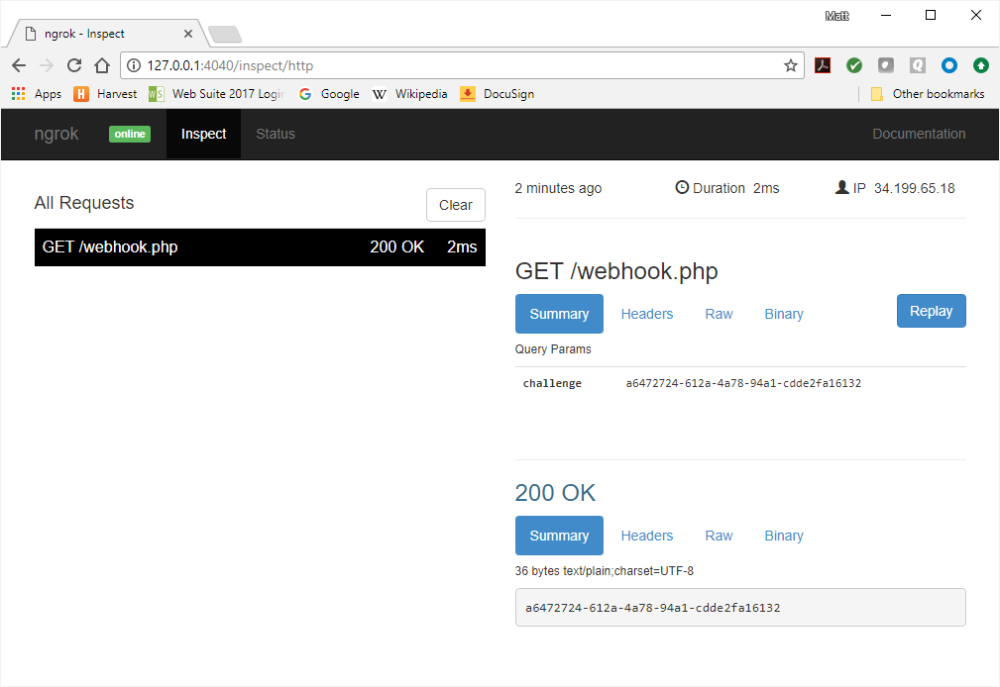
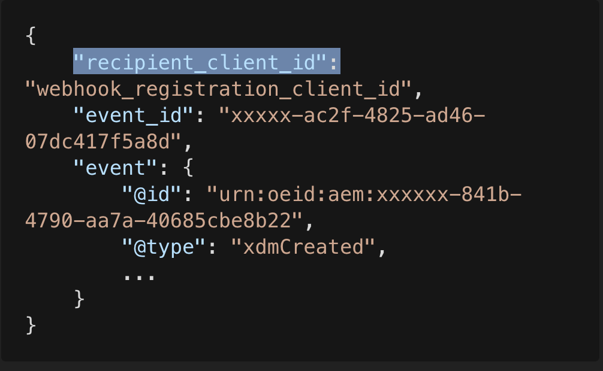

# Introduction to Adobe I/O Events Webhooks

With Adobe I/O Events webhooks, your application can sign up to be notified whenever certain events occur. 
For example, when a user uploads a asset, this action generates an event. 
With the right webhook in place, your application is instantly notified that this event happened.

Please refer to the `Adobe Developer Console` documentation on how to [Add Events to a project](/developer-console/docs/guides/services/services-add-event/)

To start receiving events, you create an event registration specifying a webhook URL and the types of events you want to receive. Each event will result in a HTTP request to the given URL, notifying your application. This guide provides an introduction to webhooks.

## Getting started

An **Event** is a JSON object that describes something that happened. Events originate from **Event Providers**. Each event provider publishes specific types of events, identified by an **Event Code**. A **Webhook URL** receives event JSON objects as HTTP POST requests. You start receiving events by creating an **Event Registration**, providing a name, description, webhook URL, and a list of **Event Types** you are interested in.

### Webhook example

Acme Inc. wants to be notified when a new file is uploaded to Adobe Creative Cloud Assets, so it creates the following event registration:

```json
{
  "name": "Acme Webhook",
  "description": "Listen for newly created files",
  "webhook_url": "https://acme.example.com/webhook",
  "events_of_interest": [
    {
      "provider": "ccstorage", 
      "event_code": "asset_created"
    }
  ]
}
```

Now when a file is uploaded, Adobe I/O Events performs the following HTTP request:

```http
POST https://acme.example.com/webhook HTTP/1.1
content-type: application/json

{
  "@id": "82235bac-2b81-4e70-90b5-2bd1f04b5c7b",
  "@type": "xdmCreated",
  "xdmEventEnvelope:objectType": "xdmAsset",
  "activitystreams:published": "2016-07-16T19:20:30+01:00",
  "activitystreams:to": {
    "xdmImsOrg:id": "08B3E5CE5822FC520A494229@AdobeOrg",
    "@type": "xdmImsOrg"
  },
  "activitystreams:generator": {
    "xdmContentRepository:root": "http://francois.corp.adobe.com:4502/",
    "@type": "xdmContentRepository"
  },
  "activitystreams:actor": {
    "xdmAemUser:id": "admin",
    "@type": "xdmAemUser"
  },
  "activitystreams:object": {
    "@type": "xdmAsset",
    "xdmAsset:asset_id": "urn:aaid:aem:4123ba4c-93a8-4c5d-b979-ffbbe4318185",
    "xdmAsset:asset_name": "Fx_DUKE-small.png",
    "xdmAsset:etag": "6fc55d0389d856ae7deccebba54f110e",
    "xdmAsset:path": "/content/dam/Fx_DUKE-small.png",
    "xdmAsset:format": "image/png"
  },
  "@context": {
    "activitystreams": "http://www.w3.org/ns/activitystreams#",
    "xdmEventEnvelope": "https://ns.adobe.com/xdm/common/eventenvelope#",
    "xdmAsset": "http://ns.adobe.com/xdm/assets/asset#",
    "xdmImsOrg": "https://ns.adobe.com/xdm/ims/organization#",
    "xdmContentRepository": "https://ns.adobe.com/xdm/content/repository",
    "xdmAemUser": "https://ns.adobe.com/xdm/aem/user#",
    "xdmCreated": "https://ns.adobe.com/xdm/common/event/created#"
  }
}
```

## Your first webhook

Before you can register a webhook, the webhook needs to be online and operational. If not, then the event registration will fail. So you need to take care of setting that up first. Your webhook must be hosted on a server. For development, you may use localhost along with a tool like ngrok (see below).

For production, your webhook needs to:

- Be accessible from the internet (not using localhost)
- Be reachable over HTTPS
- Correctly respond to a "challenge" request

You may reuse/fork our [Sample Webhook in Node.js](https://github.com/adobeio/io-event-sample-webhook)

### The challenge request

#### Synchronous validation

When creating an event registration using a webhook, Adobe I/O Events will first try to verify that the URL is valid. To do this, it sends an HTTP GET request, with a `challenge` query parameter. The webhook should respond with a body containing the value of the `challenge` query parameter.

##### Request

```http
GET https://acme.example.com/webhook?challenge=8ec8d794-e0ab-42df-9017-e3dada8e84f7
```

##### Response

You can either respond by placing the challenge value directly in the response body:

```http
HTTP/1.1 200 OK

"8ec8d794-e0ab-42df-9017-e3dada8e84f7"
```

or by responding with a JSON object, including the correct `content-type` header:

```http
HTTP/1.1 200 OK
Content-type: application/json

{"challenge":"8ec8d794-e0ab-42df-9017-e3dada8e84f7"}
```

Typically, you would build your webhook to respond to the Adobe challenge in a method to handle HTTP GET requests, and then include another method for handling the HTTP POST requests that will be coming from Adobe containing actual event payloads. For testing purposes, you can start with something as simple as this PHP script: 

```php
<?php
 header('Content-Type: text/plain');
 echo $_GET['challenge']; 
?>
```

**Note:** Make sure your response is given in the correct content type. If your webhook script places the challenge value directly in the response body, make sure it's returned as plain text (`text/plain`). For a JSON response, make sure it's `application/json`. Returning a response in the incorrect content type may cause extraneous code to be returned, which will not validate with Adobe I/O Events.

#### Asynchronous validation

When the webhook fails to respond appropriately to the challenge request, Adobe I/O Events sends an HTTP POST request with a body containing a custom URL for manual validation. 

```http
POST https://acme.example.com/webhook HTTP/1.1
content-type: application/json

{"validationUrl": "https://csm.adobe.io/csm/registrations/validate?id=<guid1>&challenge=<guid2>"}
```

To complete verification, you need to send a GET request to it using a web browser/cURL or any simple REST client.

```bash
curl -L -X GET 'https://csm.adobe.io/csm/registrations/validate?id=<guid1>&challenge=<guid2>'
```

The custom URL is valid for **5 minutes**. If the validation is not completed within 5 minutes, your event registration is marked `Disabled`.

Your webhook must respond to the POST request with an HTTP status code of 200 before it can be put in the asynchronous validation mode. In other words, if the webhook responds with a 200, but doesn't respond with a body containing the challenge, it is switched to asynchronous validation mode. If there is a GET request on the validation URL within 5 minutes, the event registration is marked `Active`.

<InlineAlert slots="text"/>

Please note that for **security** reasons we **obfuscate** the validation URL in the [debug tracing](/support/tracing/) tab.
So, the only way to intercept the original validation URL is if you own the webhook server (*you could simply log all requests*).<br/>  


### Testing with ngrok

[Ngrok](https://ngrok.com/) is a utility for enabling secure introspectable tunnels to your localhost. With ngrok, you can securely expose a local web server to the internet and run your own personal web services from your own machine, safely encrypted behind your local NAT or firewall. With ngrok, you can iterate quickly without redeploying your app or affecting your customers. 

Among other things, ngrok is a great tool for testing webhooks. Once you've downloaded and installed [ngrok](https://ngrok.com/), you run it from a command line, specifying the protocol and port you want to monitor:

```
ngrok http 80
```


In the ngrok UI, you can see the URL for viewing the ngrok logs, labeled "Web Interface", plus the public-facing URLs ngrok generates to forward HTTP and HTTPS traffic to your localhost. You can use either of those public-facing URLs to register your Webhook with Adobe I/O, so long as your application is configured to respond on your localhost accordingly. Once your testing phase is complete, you can replace the ngrok URL in your Adobe I/O integration with the public URL for your deployed app.

## Create a project in the `Adobe Developer Console`

Integrations are now created as part of a project within the `Adobe Developer Console`. This requires you to have access to the [Console](https://www.adobe.com/go/devs_console_ui) in order to create a project, add events to your project, configure the events, and register your webhook.

For detailed instructions on completing these steps, please begin by reading the [`Adobe Developer Console` Getting Started guide](https://www.adobe.com/go/devs_console_getting_started).

Once you have completed the event registration, check the ngrok log. You should see a `GET` request, including the `challenge` that was passed along in the URL.  
  
    

In the `Adobe Developer Console`, you will be taken to the *Registration Details* page once the event registration is complete. 

The *Status* of the registration should show as **Active**. If the registration shows as **Disabled** please see the [troubleshooting](#troubleshooting-a-disabled-registration-status) section that follows.


### Troubleshooting Unstable/Disabled Registration Status

If you made an error transcribing the webhook URL, Adobe I/O Events' test of your webhook would have failed, resulting in a **Disabled** status.

In general, `Adobe I/O Events` will always confirm that your webhook received an event by means of the response code your webhook sends to each HTTP POST request. 

If `Adobe I/O Events` fails to receive a successful response code from your webhook within 10 seconds, it retries the request, including a special header `x-adobe-retry-count` (this header indicates how many times the delivery of an event or a batch of events has been attempted).

<InlineAlert variant="info" slots="text"/>

Please note that if an event delivery fails with a response status code of [400 Bad Request](https://developer.mozilla.org/en-US/docs/Web/HTTP/Status/400) or [505 HTTP Version Not Supported](https://developer.mozilla.org/en-US/docs/Web/HTTP/Status/505), then those events are **not retried**.

`Adobe I/O Events` will keep on retrying delivery to your webhook for **24 hours** using exponential and fixed backoff strategies. The first retry is attempted after 1 minute and the period between retries doubles after each attempt (second retry is after 2m, etc.), but is at most 15 minutes.

If an event isn't delivered after 2 hours of retries, `Adobe I/O Events` marks the event registration as **Unstable**, but still keeps on attempting delivery. This gives you sufficient time to restore your webhook, and avoid it from getting marked as Disabled. Once restored, it will be marked as **Active** on the next successful event delivery.

If all retry attempts get exhausted and the event still isn't delivered (webhook not responding or responding with a non `2XX` response), `Adobe I/O Events` drops the events, marks the event registration as **Disabled**, and stops sending any further events.

To restart the flow of requests, fix the problem preventing your webhook from responding. Then, log into the `Adobe Developer Console` and edit your events registration. This re-triggers a webhook challenge request, and eventually a re-activation of your event registration.

Note: While your event registration is marked `Disabled`, Adobe will continue to log events in your Journal, allowing you to retrieve all events for the past 7 days (see our [Journaling documentation](./journaling_intro.md)).

*Unstable Event Registration*


*Disabled Event Registration*


## Receiving events

For development, you must first provide consent for yourself, using the following:

```
https://ims-na1.adobelogin.com/ims/authorize/v1?response_type=code&client_id=api_key_from_console&scope=AdobeID%2Copenid%2Ccreative_sdk
```

You will replace `api_key_from_console` with the **Client ID** value from the *Credentials* tab for the event registration details in Console.

Log in to [Creative Cloud Assets (<https://assets.adobe.com>)](https://assets.adobe.com). Use the same Adobe ID as the one you used in the `Adobe Developer Console`. Now upload a file and check the ngrok logs again. If all went well, then an `asset_created` event was just delivered to your webhook. 

  

### Receiving events for users

In a real-world application, you would use the credentials of an authenticated user to register a webhook through the API. This way you will receive events related to that user. Depending on your scenario and the Adobe service you're targeting, you may have to enable different types of authentication; see the [Adobe I/O Authentication Overview](/developer-console/docs/guides/authentication/) for more information on how to set up your app for authentication with your users.

For Creative Cloud Asset events, you'll need to add the Creative Cloud Libraries to your integration and implement the User Auth UI; see [Setting Up Creative Cloud Asset Events](./using/cc-asset-event-setup.md) for details. 

## Security Considerations

Your webhook URL must necessarily be accessible from the open internet. This means third-party actors can send forged requests to it, tricking your application into handling fake events.
 
To prevent this from happening, Adobe I/O Events has a robust event validation process in place as defined below that allows users to secure their webhook. 


<InlineAlert variant="info" slots="text"/>
Adobe strongly encourages validating your webhook deliveries using this new mechanism to avoid processing "events" received from malicious third-party actors and make sure your webhook continues to receive events.

**Improved and Resilient Security Verification for Webhook Events**

For a more robust and reliable verification, Adobe I/O Events adds below security validations for events delivered to your webhook. 

- sending additional field of recipient_client_id as part of your event payload
- signing the event payloads digitally and sending those digital signatures as request headers to your webhook

I/O Events generates two public-private key pairs and sign your event payload using digital signatures following the steps below

- a message digest of your event payload is computed by applying `rsa-sha256` hash function algorithm
- the digest is then encrypted using the I/O Events private key to generate the digital signature

I/O Events sends the 2 digital signatures as webhook request headers and they are available via the header fields
`x-adobe-digital-signature-1` and `x-adobe-digital-signature-2` respectively. 

I/O Events also sends 2 public keys corresponding to the private keys used to generate the digital signatures. These public keys which are stored in Cloud Front and are publicly accessible using the Cloud Front urls which look like `https://xxxxx.cloudfront.net/pub-key-<random-uuid>.pem`. I/O Events sends the public keys urls for both the keys and they are available via the the request header fields `x-adobe-public-key1-url` and  `x-adobe-public-key2-url` respectively.

As mentioned earlier, I/O Events transforms your event payload and adds an additional json field `recipient_client_id` to your payload. See the sample payload after the transformation that I/O Events sends to your webhook.



Upon receiving a request, you must do the below for leveraging the enhanced security measures

- verify you are the actual recipient of the event using the new `recipient_client_id` field available in the payload
- once verified, your app should fetch the public key using the cloud front url present in the header
- after downloading the public key set it in the cache with cache expiry of `not more than 24h` 

You can also consider implementing a retry mechanism to call public key urls in case of any transient error that might occur.  

Once you have the public keys fetched as plain text you can now verify the digital signatures by following the steps as below

- decrypt the message digest using the public key
- compute the hash message digest of the event payload (available in the webhook request body) using the same hash function algorithm `rsa-sha256` used by I/O Events during signing
- now validate each signature by comparing 
  - the message digest computed by hashing 
  - and the digest received after decrypting the signature using the public key

Refer to [this](https://github.com/adobe/aio-lib-events/blob/master/src/index.js#L516) signature verification method of the events sdk to understand the above signature validation steps for your webhook app.

**HMAC Signatures for Security Verification**

<InlineAlert variant="warning" slots="text"/>
I/O Events has now marked this HMAC based signature verification process as deprecated and this will finally be EOL by end of Q2'2022.

In this event verification strategy, Adobe I/O Events  adds a `x-adobe-signature` header to each HTTP request it sends to your webhook URL, which allows you to verify that the request was really made by Adobe I/O Events.
 
This signature or "message authentication code" is computed using a cryptographic hash function and a secret key applied to the body of the HTTP request. In particular, a SHA256 [HMAC](https://en.wikipedia.org/wiki/HMAC) is computed of the JSON payload, using the **Client Secret** provided in the `Adobe Developer Console` as a secret key, and then turned into a Base64 digest. You can find your client secret in the *Credentials* tab for your event registration in Console.
 
Upon receiving a request, you should repeat this calculation and compare the result to the value in the `x-adobe-signature` header, and reject the request unless they match. Since the client secret is known only by you and Adobe I/O Events, this is a reliable way to verify the authenticity of the request.

**HMAC check implementation in JavaScript (pseudo-code):**
 
```javascript
var crypto = require('crypto')
const hmac = crypto.createHmac('sha256', CLIENT_SECRET)
hmac.update(raw_request_body)
 
if (request.header('x-adobe-signature') !== hmac.digest('base64')) {
  throw new Error('x-adobe-signature HMAC check failed')
}
```