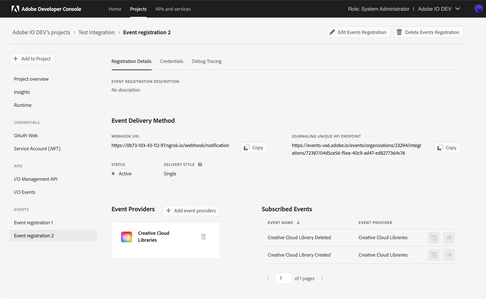
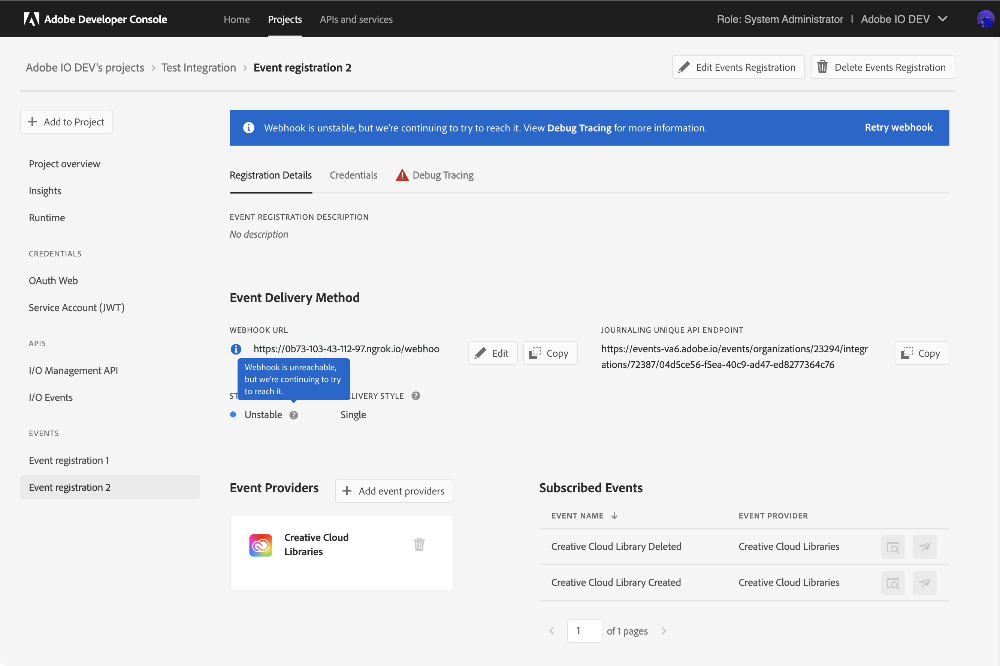
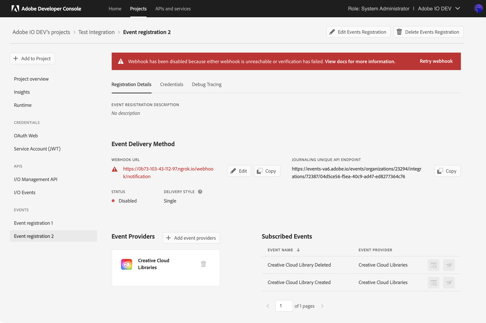
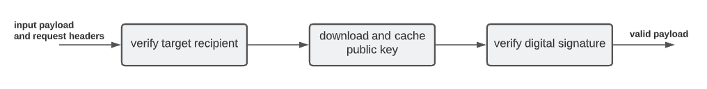

---
keywords:
  - Webhook
  - Testing with ngrok
  - Create a Project
  - Receiving Events
  - Quotas
title: Introduction to Adobe I/O Events Webhooks
description: With Adobe I/O Events webhooks, your application can sign up to be notified whenever certain events occur. For example, when a user uploads an asset, this action generates an event. With the right webhook in place, your application is instantly notified that this event happened.
---

import RetryDoc from '../common/retry-doc.md'
import ReceivingEventsForUsersDoc from '../common/receiving-events-for-users-doc.md'

# Introduction to Adobe I/O Events Webhooks

With Adobe I/O Events webhooks, your application can sign up to be notified whenever certain events occur.
For example, when a user uploads an asset, this action generates an event.
With the right webhook in place, your application is instantly notified that this event happened.

Please refer to the `Adobe Developer Console` documentation on how to [Add Events to a project](http://developer.adobe.com/developer-console/docs/guides/services/services-add-event)

To start receiving events, you create an event registration specifying a webhook URL and the types of events you want to receive.
Each event will result in a HTTP request to the given URL, notifying your application. This guide provides an introduction to webhooks.

## Getting started

An **Event** is a JSON object that describes something that happened. Events originate from **Event Providers**. Each event provider publishes specific types of events, identified by an **Event Code**. A **Webhook URL** receives event JSON objects as HTTP POST requests. You start receiving events by creating an **Event Registration**, providing a name, description, webhook URL, and a list of **Event Types** you are interested in.

### Webhook example

Acme Inc. wants to be notified when a Change segment for a lead occurs, in Adobe Marketo.
so it creates a new IO Events registration

* selecting `Marketo Lead Activity Data Stream` events provider
* selecting the `Change Segment` event type
* specifying their webhook URL `https://acme.example.com/webhook`,

Now when such a segment changes occurs, Adobe I/O Events performs the following `POST` HTTP request against Acme Inc. webhook URL:

```http
POST https://acme.example.com/webhook HTTP/1.1
content-type: application/json

{
  "specversion": "1.0",
  "type": "com.adobe.platform.marketo.activity.standard.changesegment",
  "source": "urn:marketo_activity_stream",
  "id": "ca67f792-f56e-45f3-ba7c-7c97302bcc00",
  "time": "2025-06-25T13:03:41Z",
  "datacontenttype": "application/json",
  "eventid":"8927ce83-2f10-4df9-9eb4-09c381bc4778",
  "recipientclientid":"c5a34355b7f5491f8277b8dd63f0bfa3"
  "data": {
    "munchkinId": "123-ABC-456",
    "leadId": "1234",
    "activityDate": "2025-06-25T13:03:40Z",
    "activityTypeId": 108,
    "activityType": "Change Segment",
    "activityLogItemId": 1234567890,
    "primaryAttributeValueId": 1234,
    "primaryAttributeValue": "Attribute Value",
    "attributes": [
      {
        "name": "New Segment ID",
        "dataType": "object",
        "value": 5678
      }, {
        "name": "Segmentation ID",
        "dataType": "object",
        "value": 1234
      }
    ]
  }
}
```

## Your first webhook

Before you can register a webhook, the webhook needs to be online and operational. If not, then the event registration will fail.
So you need to take care of setting that up first. Your webhook must be hosted on a server. For development, you may use [webhook.site](https://webhook.site),
but ensure you complete the [asynchronous validation](#asynchronous-validation) for it to be considered functional.

For production, your webhook needs to:

- Be accessible from the internet (not using localhost)
- Be reachable over HTTPS
- Correctly respond to a "challenge" request

### The challenge request

#### Synchronous validation

When creating an event registration using a webhook, Adobe I/O Events will first try to verify that the URL is valid. To do this, it sends an HTTP GET request, with a `challenge` query parameter. The webhook should respond with a body containing the value of the `challenge` query parameter.

##### Request

```http
GET https://acme.example.com/webhook?challenge=8ec8d794-e0ab-42df-9017-e3dada8e84f7
```

##### Response

You can either respond by placing the challenge value directly in the response body:

```http
HTTP/1.1 200 OK

"8ec8d794-e0ab-42df-9017-e3dada8e84f7"
```

or by responding with a JSON object, including the correct `content-type` header:

```http
HTTP/1.1 200 OK
Content-type: application/json

{"challenge":"8ec8d794-e0ab-42df-9017-e3dada8e84f7"}
```

Typically, you would build your webhook to respond to the Adobe challenge in a method to handle HTTP GET requests, and then include another method for handling the HTTP POST requests that will be coming from Adobe containing actual event payloads. For testing purposes, you can start with something as simple as this PHP script:

```php
<?php
 header('Content-Type: text/plain');
 echo $_GET['challenge']; 
?>
```

**Note:** Make sure your response is given in the correct content type. If your webhook script places the challenge value directly in the response body, make sure it's returned as plain text (`text/plain`). For a JSON response, make sure it's `application/json`. Returning a response in the incorrect content type may cause extraneous code to be returned, which will not validate with Adobe I/O Events.

#### Asynchronous validation

When the webhook fails to respond appropriately to the challenge request, Adobe I/O Events sends an HTTP POST request with a body containing a custom URL for manual validation.

```http
POST https://acme.example.com/webhook HTTP/1.1
content-type: application/json

{"validationUrl": "https://csm.adobe.io/csm/registrations/validate?id=<guid1>&challenge=<guid2>"}
```

To complete verification, you need to send a GET request to it using a web browser/cURL or any simple REST client.

```bash
curl -L -X GET 'https://csm.adobe.io/csm/registrations/validate?id=<guid1>&challenge=<guid2>'
```

The custom URL is valid for **5 minutes**. If the validation is not completed within 5 minutes, your event registration is marked `Disabled`.

Your webhook must respond to the POST request with an HTTP status code of 200 before it can be put in the asynchronous validation mode. In other words, if the webhook responds with a 200, but doesn't respond with a body containing the challenge, it is switched to asynchronous validation mode. If there is a GET request on the validation URL within 5 minutes, the event registration is marked `Active`.

<InlineAlert slots="text"/>

Please note that for **security** reasons we **obfuscate** the validation URL in the [debug tracing](../support/tracing.md) tab.
So, the only way to intercept the original validation URL is if you own the webhook server (*you could simply log all requests*).


### Testing with ngrok

[Ngrok](https://ngrok.com/) is a utility for enabling secure introspectable tunnels to your localhost. With ngrok, you can securely expose a local web server to the internet and run your own personal web services from your own machine, safely encrypted behind your local NAT or firewall. With ngrok, you can iterate quickly without redeploying your app or affecting your customers.

Among other things, ngrok is a great tool for testing webhooks. Once you've downloaded and installed [ngrok](https://ngrok.com/), you run it from a command line, specifying the protocol and port you want to monitor:

```bash
ngrok http 80
```


In the ngrok UI, you can see the URL for viewing the ngrok logs, labeled "Web Interface", plus the public-facing URLs ngrok generates to forward HTTP and HTTPS traffic to your localhost. You can use either of those public-facing URLs to register your Webhook with Adobe I/O, so long as your application is configured to respond on your localhost accordingly. Once your testing phase is complete, you can replace the ngrok URL in your Adobe I/O integration with the public URL for your deployed app.

## Create a project in the `Adobe Developer Console`

Integrations are now created as part of a project within the `Adobe Developer Console`. This requires you to have access to the [Console](https://www.adobe.com/go/devs_console_ui) in order to create a project, add events to your project, configure the events, and register your webhook.

For detailed instructions on completing these steps, please begin by reading the [`Adobe Developer Console` Getting Started guide](https://www.adobe.com/go/devs_console_getting_started).

Once you have completed the event registration, check the ngrok log. You should see a `GET` request, including the `challenge` that was passed along in the URL.  
  
    

In the `Adobe Developer Console`, you will be taken to the *Registration Details* page once the event registration is complete.

The *Status* of the registration should show as **Active**. If the registration shows as **Disabled** please see the [troubleshooting](#troubleshooting-unstabledisabled-registration-status) section that follows.



### Troubleshooting Unstable/Disabled Registration Status

If you made an error transcribing the webhook URL, Adobe I/O Events' test of your webhook would have failed, resulting in a **Disabled** status.

In general, `Adobe I/O Events` will always confirm that your webhook received an event by means of the response code your webhook sends to each HTTP POST request.

<RetryDoc/>

To restart the flow of requests, fix the problem preventing your webhook from responding.
Then, log into the `Adobe Developer Console` and edit your events registration.
This re-triggers a webhook challenge request, and eventually a re-activation of your event registration.

To help you debug this, have a look at the [Debug Tracing](../support/tracing.md) tab in the `Adobe Developer Console`.

Note: While your event registration is marked `Disabled`, Adobe will continue to log events in your Journal, allowing you to retrieve all events for the past 7 days (see our [Journaling documentation](journaling-intro.md)).

*Unstable Event Registration*


*Disabled Event Registration*


<ReceivingEventsForUsersDoc/>

## Security Considerations

<InlineAlert variant="info" slots="text"/>
Adobe strongly encourages securing your webhook deliveries to avoid processing malicious requests.

Indeed, as your webhook URL must necessarily be accessible from the open internet,
third-party actors can send forged requests to it, tricking your application into handling fake events.

To prevent this from happening, Adobe I/O Events offers two options for securing your webhook deliveries:

* Adobe I/O Events Digital Signature
* Adobe I/O Events  `mTLS` support

Both options are described below. Note that you should choose one: using both is unnecessary and would only consume additional resources without added benefit.

### Adobe I/O Events Digital Signature

- Adobe I/O Events sends an additional field of `recipientclientid` as part of your event payload.
- The event payload is signed digitally using a fixed public/private key pair generated by Adobe I/O Events. The digital signature is sent as a webhook request header.
- Adobe I/O Events sends the relative path of public key, which is served from our fixed Adobe domain [static.adobeioevents.com](https://static.adobeioevents.com), as webhook request headers.

**How it strengthens security**:

- Adobe I/O Events uses the same public/private key pair generated by itself to sign all event payloads flowing through its pipeline. The public keys are also hosted at its own domain i.e. [static.adobeioevents.com](https://static.adobeioevents.com). This ensures that any malicious user can't use their own arbitrary public/private key pair to sign an event payload and send forged requests to your webhook endpoint.
- Adobe I/O Events sends the event payload with an additional field of `recipientclientid`. The webhook consumer can match the payload's client id with their own client id to verify if they are the actual recipient of the event. This ensures they don't receive events they haven't subscribed for.

I/O Events uses two public-private key pairs and signs your event payload using two digital signatures following the steps below.

- a message digest of your event payload is computed by applying `rsa-sha256` hash function algorithm
- the digest is then encrypted using the I/O Events private key to generate the digital signature

I/O Events sends the 2 digital signatures as webhook request headers and they are available via the header fields
`x-adobe-digital-signature-1` and `x-adobe-digital-signature-2` respectively.

I/O Events also sends 2 public keys corresponding to the private keys used to generate the digital signatures. These public keys are publicly accessible using our Adobe domain [static.adobeioevents.com](https://static.adobeioevents.com). I/O Events sends the relative paths of the public keys i.e. `/prod/keys/pub-key-<random-uuid>.pem` via the webhook request header fields `x-adobe-public-key1-path` and  `x-adobe-public-key2-path` respectively.

As mentioned earlier, I/O Events adds an additional json field `recipientclientid` to your payload. See the sample payload after the transformation that I/O Events sends to your webhook.

Upon receiving a request, you must do the below for leveraging the enhanced security measures

- verify you are the actual recipient of the event using the new `recipientclientid` field available in the payload
- once verified, your app should fetch the public key by forming and validating the url using the Adobe domain [static.adobeioevents.com](https://static.adobeioevents.com), and the relative path received from the request header
- after downloading the public key set it in the cache with cache expiry of `not more than 24h`.

To note, Adobe I/O Events doesn't send any `cache-control` header in the webhook request, so you must set up your cache configuration as mentioned above.

You can also consider implementing a retry mechanism to call public key urls in case of any transient error that might occur.

**Verifying the Signature**:

Once you have the `PEM` public keys, you can now verify the digital signatures by following the steps as below:

1. Create the PublicKey object using the pem public key.
2. Create a `Signature` (for java apps) or `crypto` -> [Verify](https://nodejs.org/docs/latest-v14.x/api/crypto.html#crypto_class_verify) (for nodeJS apps) instance using the `rsa-sha256` hashing algorithm.
3. Supply **raw** event payload to the instance created in above step.
4. Use the public key and decoded signature to verify.
5. Do the above for both the signatures and if any one of the signature validations is successful, then the event is valid.

A pictorial block diagram for the signature validation steps above that you should follow:



Refer to [this](https://github.com/adobe/aio-lib-events/blob/1.1.5/src/index.js#L519) signature verification method of the events sdk (**nodeJS** based) to understand the above signature validation steps for your webhook app.

For Java based webhook applications, one can verify signature using the below code snippet.

```javascript
public boolean verifySignature(String message, String signature) throws Exception {
    byte[] data = message.getBytes(UTF_8);

    // signature generated at I/O Events side is Base64 encoded, so it must be decoded
    byte[] sign = Base64.decodeBase64(signature);
    String keyFile = "public_key_pem_file.pem";
    Signature sig = Signature.getInstance("SHA256withRSA");
    sig.initVerify(getPublic(keyFile));
    sig.update(data);
    return sig.verify(sign);
}

//Method to retrieve the Public Key from a file
private PublicKey getPublic(String filename) throws Exception {
  String key = new String(Files.readAllBytes(new File(filename).toPath()));

  String publicKeyPEM = key
      .replace("-----BEGIN PUBLIC KEY-----", "")
      .replaceAll(System.lineSeparator(), "")
      .replace("-----END PUBLIC KEY-----", "");

  byte[] encoded = Base64.decodeBase64(publicKeyPEM);

  KeyFactory keyFactory = KeyFactory.getInstance("RSA");
  X509EncodedKeySpec keySpec = new X509EncodedKeySpec(encoded);
  return keyFactory.generatePublic(keySpec);
}
```

<InlineAlert variant="info" slots="text"/>
Kindly note that this digital signature verification process comes out-of-the-box for I/O Runtime actions, and no action is required on that end.

### Adobe I/O Events mTLS support

Instead of leveraging the Adobe I/O Events Digital Signature, you may choose to secure your webhook using `mTLS`.
`mTLS` (mutual Transport Layer Security) will ensure that only Adobe I/O Events can send events to your webhook.
Once enabled on your server, `mTLS` includes an additional step on top of `TLS`/`https`: for all incoming (webhook) requests,
your server will ask for the client’s certificate and will verify it at its end.

**No additional project configuration is required to activate mTLS. If your server is mTLS enabled,
Adobe I/O Events client certificate will automatically be sent to your server, during the ssl-handshake.**

Adobe I/O Events client certificate lifecycle is fully automated to improve reliability and prevent service disruptions.
With this automation, Adobe I/O Events certificate is:

* generated with a 13-month expiration date;
* reissued 60 days before expiration,
  * the latest issue being instantly promoted,
  * the old certificate being revoked 30 days before expiration,
* revoked if compromised

You are responsible for ensuring that your server trusts Adobe I/O Events client certificates (that did not expire and were not revoked).
To implement this, you will retrieve Adobe I/O Events latest public certificate using [Adobe Platform Certificate API](https://experienceleague.adobe.com/en/docs/experience-platform/data-governance/mtls-api/public-certificate-endpoint).

**Notes**:

* you will need to add the `AEP-Default-All-Users` API to your project in the `Adobe Developer Console` to access this certificate endpoint, see the [Adobe Platform API authentication documentation](https://experienceleague.adobe.com/en/docs/experience-platform/landing/platform-apis/api-authentication).
* Adobe I/O Events certificate is issued by a Certificate Authority (CA) :
  * it can be validated using the CA’s public key
  * if revoked, the certificate will be added to the Certificate Revocation List (CRL) of the CA
* Adobe I/O Events certificate Common Name (CN) and Subject Alternative Names (SAN) will remain the same across renewal, and can be used as an additional layer of ownership validation if you wish to do so.
* In order to debug this mTLS handshake, you can use the [Debug Tracing](../support/tracing.md) tab in Developer Console.

## Quotas

There is an upper limit on the number of registrations that you can create. Following table lists the applicable quotas -

| Maximum number of registrations  | Grouping level             | Adjustable | Description                                                                                                                                                                                                                                                                                                                                                                                                                                                                                                                                                                                                                                                                                                                                                                                                                                                                                                                                                                                                  |
|----------------------------------|----------------------------|------------|--------------------------------------------------------------------------------------------------------------------------------------------------------------------------------------------------------------------------------------------------------------------------------------------------------------------------------------------------------------------------------------------------------------------------------------------------------------------------------------------------------------------------------------------------------------------------------------------------------------------------------------------------------------------------------------------------------------------------------------------------------------------------------------------------------------------------------------------------------------------------------------------------------------------------------------------------------------------------------------------------------------|
| 2500                             | IMS Org                    | No         | A maximum of 2500 event registrations can be created for an IMS Org. This quota cannot be adjusted.                                                                                                                                                                                                                                                                                                                                                                                                                                                                                                                                                                                                                                                                                                                                                                                                                                                                                                          |
| 30                               | IMS Credential (client Id) | Yes        | A maximum of 30 event registrations can be created for an IMS client-id.   To manage this limit, we recommend subscribing to multiple event types within a single registration. If you need to subscribe to many event types and combining them in one registration isn't feasible, group related event types together. Event types can be categorized by domain, estimated traffic, development effort, or other factors. I/O Events is designed to support a small number of registrations in a **Developer Console** Project. This approach improves resiliency, cost-effectiveness, and reduces the development and operational overhead of managing event-consumer webhooks/runtime actions. If you need a large number of event registrations in a Project, please contact us via the [I/O Events Forum](https://experienceleaguecommunities.adobe.com/t5/adobe-developer/ct-p/adobe-io). We'd like to understand your requirements in detail and recommend an appropriate event-subscription pattern. |
