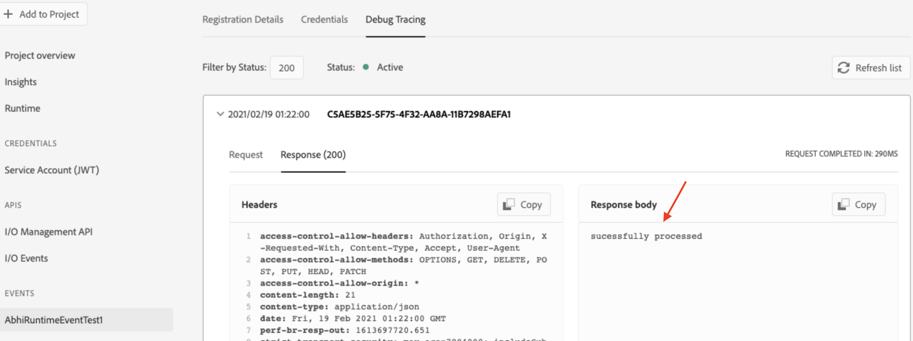
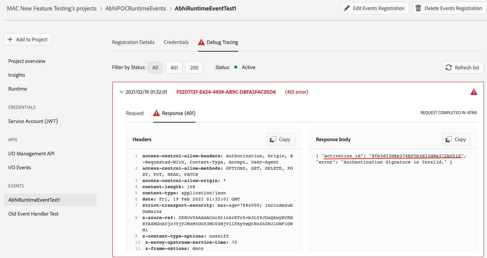
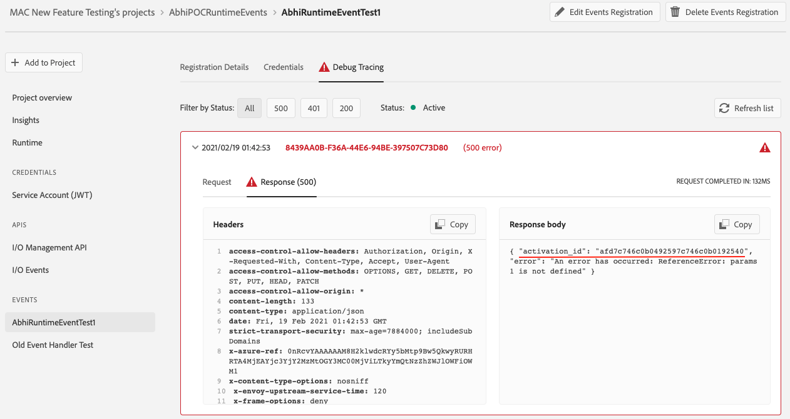

# Runtime Actions as Webhook

The integration between Adobe I/O Runtime and I/O Events lets you create Runtime actions to be set up as webhook endpoints on the `Developer Console` for receiving events, so that every time an event fires, your Runtime action is executed. Set up your runtime action as **webhook** only if you have relatively short-running action (that responds within 60 seconds).

For long-running (async) actions and guaranteed event handling you should consider using the [journaling approach](http://developer.adobe.com/app-builder/docs/resources/journaling-events/) for consuming events.

## Setting up Webhook Integration with Runtime Action

The Runtime cli will let you create a runtime action and hook it up with an integration via Adobe Developer Console. Read [here](https://developer.adobe.com/app-builder/docs/get_started/runtime_getting_started/setup) to setup your cli with Runtime plugin which is required as pre-requisite.

- Go to Developer Console and start creating an event registration
- Add [Runtime](http://developer.adobe.com/developer-console/docs/guides/services/#enable-runtime) to your project, this will create the required auth and runtime namespace for you.
- Go to `aio-cli` and create and deploy your user-action in your namespace.
- Come back to Developer Console and you will see the deployed runtime action in your namespace under the `User Defined Actions` section. Refresh the page if you don't see the action.
- Now set up an event registration using the runtime action you just deployed. You would need to select the `Runtime Action` option in your `Configure event registration` page. Choose your runtime action from the dropdown and click `Save configured events`.
- This will create an event registration with an event handler webhook pointing to your runtime action.

**Things to Note**

- You must create a `non-web` action for that to be used in the `Runtime Action` option. For web actions you should use the `Webhook` option on the Developer Console. You should secure your web action by implementing the [digital signature verification](../../guides/index.md#security-considerations) method recommended by us.
- For integrating action generated via the [app builder](http://developer.adobe.com/app-builder/) as runtime action event consumer, you must set the `require-adobe-auth` field generated by-default in your manifest.yml file to `false` and also make this action non-web (`web:no`). You will get security OOTB for your action as defined below [here](#built-in-signature-verification).

## Benefits of using Runtime Action as Webhook

- [Built In Signature Verification](#built-in-signature-verification)
- [Tracing Actions with Activation Ids](#tracing-actions-with-activation-ids)

### Built In Signature Verification

With integration between I/O Events and Adobe I/O Runtime, you don't need to worry about security as your runtime actions configured as webhooks are secured with an out-of-the-box signature verification implementation. So, basically whatever runtime action you use to create an event registration, the handler webhook created due to that will place a signature validator action along with your action as in a [sequence](https://developer.adobe.com/app-builder/docs/guides/runtime_guides/reference_docs/sequences-compositions). I/O Events signs the event payload using digital signatures generated using its private keys and passes the signatures as well as its public keys as request headers while invoking your webhook. Your business logic runtime action will only be invoked once the validator action successfully verifies any one of the digital signatures using the public keys. You can read more about the digital signatures based authentication mechanism [here](../../guides/index.md#security-considerations).

### Tracing Actions with Activation Ids

[Debug Tracing](../../support/tracing.md) is a pretty important tool on Developer Console for users who want to be informed whether their runtime action invocation is successful or not or what it responds.

After setting up a runtime action as webhook, upon its successful invocation, you can see custom response returned from your own runtime action in the `Debug Tracing` webhook response section as below.

However, in case of any failed invocation to your webhook, you will get an error response body with an activation id for the same. This helps users to debug their actions as below

- This activation id you can use in the `aio cli` to trace the actual error occurred in your invocation by doing `aio rt activation logs <failed_activation_id>`
- You may now get activation ids for two types of failed activations -
  - Signature Validator Action
  - Your Runtime Action
- In case of failure in the signature verification step, this is how you will get the error response and the failed activation id for the same.

    

- For failed invocation to your runtime action, you will get an error response with the failed activation id for the same like below

    

### Request Headers

Some of the headers sent in the event delivery request are also available to the target user runtime action:
- `x-request-id`
- any headers starting with the `x-adobe-` prefix, **except** `x-adobe-digital-signature-1`, `x-adobe-digital-signature-2`, `x-adobe-public-key1-path`, `x-adobe-public-key2-path` (since the [signature verification is already taken care of](#built-in-signature-verification))
  - this means that `x-adobe-retry-count` is available to the target user runtime action; see the [event delivery retrying process](../../support/faq.md#what-happens-if-my-webhook-is-down-why-is-my-event-registration-marked-as-unstable) for more details

