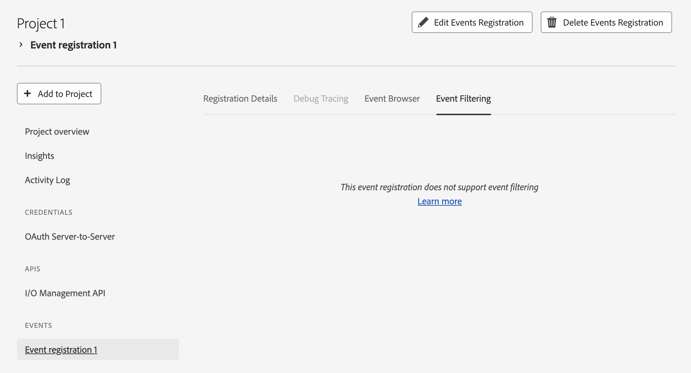

---
keywords:
  - Subscriber Defined Filtering
  - SDF
  - Event Filtering
  - JSON Filter
  - CloudEvents
  - Filter Validation
  - Filter Examples
  - Event Volume Reduction
  - Cost Optimization
  - Performance Improvement
  - UI Guide
  - API Guide
title: Subscriber Defined Filtering
---

# Adobe I/O Events Subscriber Defined Filtering

Adobe I/O Events Subscriber Defined Filtering (SDF) empowers you to create custom filters that specify exactly which events you want to receive. Instead of receiving all events for a given event type, you can now define precise filtering criteria using [JSON-based filter definitions](dsl.md), allowing you to reduce noise and focus on the events that matter most to your application.

By leveraging this feature, you can significantly reduce the number of irrelevant events your application receives, improving performance and reducing costs associated with processing unwanted events.

## What is Subscriber Defined Filtering?

SDF allows you to specify custom filter criteria for each event registration. These filters are evaluated on Adobe’s servers before events are delivered to your webhook or journal. You only receive events that match your filter, reducing the need for post-processing and minimizing unwanted traffic.

Key benefits include:

- **Reduced Event Volume**: Only receive events that match your specific criteria, filters are applied on Adobe's servers
- **Cost Optimization**: Lower processing costs by filtering out irrelevant events at the source
- **Improved Performance**: Reduce network traffic and application load

## Getting Started

We assume you already have a Registration for which [SDF is applicable](#prerequisites).

## Prerequisites

- An active Adobe I/O Events registration which is compatible with SDF:
  - Only includes [CloudEvents](https://cloudevents.io) deliveries.
  - [AWS EventBridge](../amazon-eventbridge/index.md) is not configured among the delivery methods.
- Access to the Adobe I/O Events API with proper authentication
  - You can either use the Developer Console or add your filters through the [Registration APIs](../api/registration-api.md)
- Understanding of JSON syntax and your event payload structure
  - Check the [filtering language details](dsl.md)

### Creating Your First Filter

1. [SDF UI Guide](./sdf-ui-guide.md)
2. [SDF API Guide](./sdf-api-guide.md)

## Best Practices

### Filter Design

1. **Start Simple**: Begin with basic filters and gradually add complexity
2. **Test Thoroughly**: Always validate filters before deploying to production. Remember that the filter will be applied to all delivery methods, journal included.
3. **Use Specific Patterns**: More specific filters are generally more efficient
4. **Consider Performance**: Complex filters may impact processing time, so do not add unneed operators in your definitions.

### Error Handling

- Invalid filter syntax will return a 400 error with a detailed explanation to guide you to resolution.
- Use the validation endpoint to catch issues before deployment

## Output Event Format

Events that pass your subscriber filters maintain the same format as unfiltered events, they are not modified (Cloud Events).

## Troubleshooting

### Common Issues

#### Filter Not Working

- Verify the filter syntax is valid JSON. See [Restrictions](./dsl.md#restrictions)
- Check that field names match the event payload structure
- Ensure the filter logic matches your intended behavior. See [Practical Filter Examples](./dsl.md#practical-filter-examples)

#### Performance Issues

See [DSL Best Practices](./dsl.md#best-practices):

- Simplify complex filters
- Avoid overly broad pattern matching
- Consider breaking complex filters into multiple simpler ones

#### Validation Errors

- Review the error message for specific syntax issues
- Use the validation endpoint to test filters
- Verify that sample events match your expected payload structure

### Support

- Check the [Adobe Developer Community forums](https://forums.adobe.com/community/developers)
- Contact [Adobe Developer Support](/support/index.md)

## Migration Guide

If you're currently using event type filtering only, here's how to migrate to subscriber defined filtering:

1. **Analyze Current Usage**: Identify which events you currently discard in your application
2. **Design Filters**: Create filters that match only the events you actually process
3. **Test Filters**: Use the validation endpoint to ensure filters work correctly
4. **Deploy Gradually**: Start with non-critical registrations to test the functionality or create a copy registration and use the Journalling API to check for the correct logic of your filter without incurring additional infrastructure costs
5. **Monitor Performance**: Watch for any impact on event processing times.

This approach ensures a smooth transition while maximizing the benefits of more precise event filtering.

### In case your registration is not compatible with SDF

#### Mixed delivery formats in the Registration (Cloud Events and Adobe I/O)

You can split the registration and move all Adobe I/O event deliveries to a separate registration. Now you can add a SDF for all events in Cloud Events format.

#### AWS EventBridge enabled registrations

We currently do not support registrations delivering events to EventBridge to add SDF. Please add the filtering logic in AWS.
