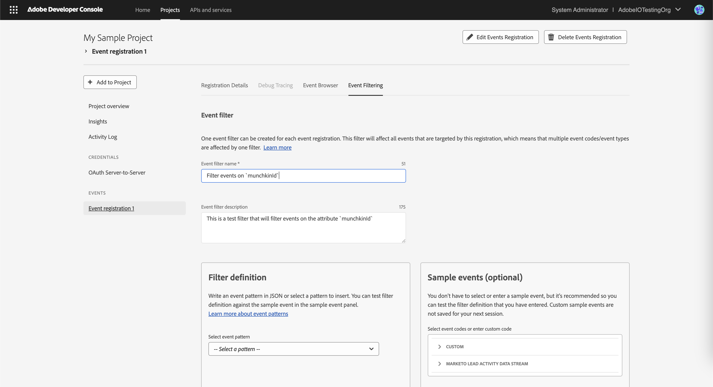

---
keywords:
  - Subscriber Defined Filtering UI Guide
  - SDF
  - Event Filtering
  - Filter Validation
  - Filter Examples
  - Filter Creation
  - Filter Testing
  - Testing Filters with Sample Events
  - Filter Logic
  - Filter Definition
  - Event Filtering Tab
title: Subscriber Defined Filtering UI Guide
description: Learn how to create, test, and apply subscriber-defined filters for event registrations using the Adobe Developer Console UI.
---

import SdfGettingStarted from '/src/pages/common/sdf-getting-started.md'

# Subscriber Defined Filtering UI Guide

This guide walks you through creating a **subscriber-defined filter** for an event registration using the Adobe Developer Console. You will also learn how to test the filter against sample events and apply it with the appropriate event patterns.

<SdfGettingStarted/>

## Step 1: Navigate to the Event Filtering Tab

1. Open your event registration in the Adobe Developer Console.
2. Navigate to the **Event Filtering** tab.

   

## Step 2: Create a New Subscriber-Defined Filter

1. Enter a **Name** and **Description** for the filter.
   > **Tip:** Provide meaningful names so you can easily identify filters later.

   

## Step 3: Define the Filter Logic

1. Select the appropriate **event pattern** from the dropdown.
   >For a list of supported event patterns and practical examples, refer to the [DSL reference guide](./dsl.md).

   

2. In the filter definition editor, specify the event attributes to apply the filter on.
   >You can open a sample event payload in the sample event editor side-by-side to use as a reference while writing your filter definition.

   

## Step 4: Test the Filter Against Sample Events

1. Click **Test filter** to test your filter behavior against all sample events.
2. Review whether each sample event passes or fails the filter.

   

## Step 5: Refine and Re-Test

1. Select a sample event from the available list.
2. Edit the values in the sample event JSON. For example, modify a field value to test edge cases.
3. Click **Test filter** to test your filter behavior against all sample events, including the custom sample event you just created.

   

## Step 6: Apply the Filter

1. Once you are satisfied with the filter definition, click **Apply Filter**.
2. The new filter is now active for this event registration.

   