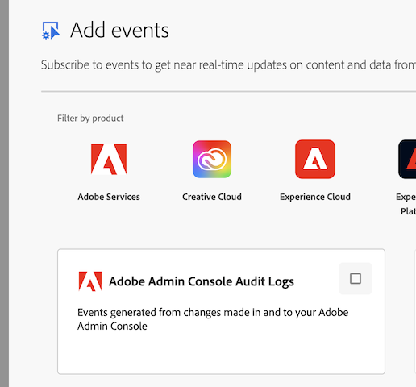
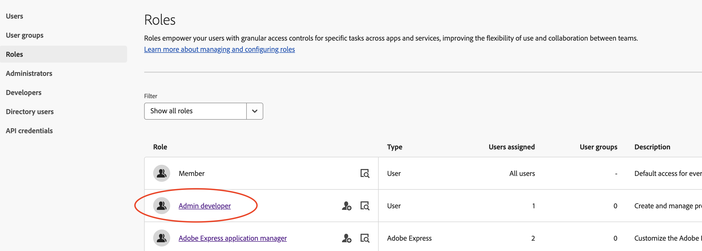

# Admin Console Audit Logs

How to track changes made in or to your Admin Console.

Admin Console Audit Log events are available via Adobe I/O Events to be captured to your
monitoring or other long term storage tools directly via API, webhooks or AWS EventBridge,
as with all other I/O Events event providers.

Note the Admin Console audit log records changes made at the _organizational_ level. It does
not provide information around product-specific events, for example, when a certain Report Suite
was created in Adobe Analytics, or when an HTML template was deleted in Adobe Acrobat Sign.

## Accessing Audit Logs

For security reasons, accessing the Admin Console Audit log event provider works slightly differently
from other event providers in terms of who can create projects that use the events. Typically, event
providers are available for use by anyone with any developer role. Instead, the audit log event
provider is limited to use only by:

* **System Administrators**
* **Admin developers**

System Admins can use all event providers as usual. When creating a project within Adobe
I/O Events, you will see *Adobe Admin Console Audit Logs* as an available provider to add to your
project. If the provider is not listed, you do not have access.

Users with developer access to Adobe Developer Console will be able to see the project in read-only
mode, but will not be able to access the secret required to generate a credential to access.

Instructions for adding Event Providers to a project are at [Add Events to a project](../../guides/services/services-add-event).

### Admin Developer User Role

The _Admin developer_ role was introduced to help protect access to the audit log event stream.
This is similar to other user roles available such as those for Adobe Express. You can read more
about managing user roles these at [*Using Roles*](https://helpx.adobe.com/enterprise/using/roles.html).

The Admin developer role behaves like the API developer role used for products - a user with this 
role has access to create and manage projects in Developer Console (including against APIs that
do not require explicit access checks), and also grants them acccess to include the *Adobe Admin
Console Audit Logs* event provider in projects. Revoking the role will remove that user's ability
to access the relevant projects.

Note that you can add those role to user groups as well, but we generally recommend granting the
role to individual users for clarity on who has the role.

## Version Management

There are a number of ways that the audit log event format might change - we will aim to provide
advance notice of major changes, but as ever you should work with tools and systems that enable
flexibility.

The event payload adheres to OCSF standard values for most fields. The exception to this is where
the standard doesn't support Adobe workflows or concepts, and an ID of `99` (meaning _Other_) is
used. In this case, you should expect the string matching the name of the ID to be variable. This
will be most common in events related to [Entity Management](https://schema.ocsf.io/1.6.0/classes/entity_management)
as new features and capabilities are introduced to Admin Console. You should assume that new entity
names, and activity names operating on those entities, could occur at short notice and design your
integration to deal with that scenario.

For the avoidance of doubt, once a given "other" entity name (e.g., `Role`) has been used in a
public release, altering it will be considered a breaking change.

If you're building custom software to store OCSF events, then you should consider simply using
appropriate technology when designing your storage (e.g., store JSON files directly or in a JSON
column, or use a database that allows for schema flexibility).

For Entity Management, note that the [Managed Entity](https://schema.ocsf.io/1.6.0/objects/managed_entity)
object is quite flexible, and the type will drive which other fields will be present, alongside the
`data` field. Particularly for cases where Adobe uses a `type_id` of `99`, the `data` field will
contain critical information about the entity which can be highly variable, so again the
recommendation would be to capture that as a JSON element as the spec recommends. 

If it is deemed necessary to move to a new OCSF version (or any other breaking change), we will
provide 90 days notice to communicate exact dates for when the old version would be turned off.
We will always run the old and new versions in parallel for a period of time to allow you to test
integrations against the new format.

Note that there may be circumstances that result in changes having to be made with no notice
(e.g., security issues) - given the nature of these events that is expected to be low-risk,
but is called out here for completeness.

## Known Issues

The table below details current issues with the event stream compared with what can be seen in
Admin Console's view or CSV export:

| Issue                                                                     | Fix ETA |
|---------------------------------------------------------------------------|---------|
| Policy changes from Global Admin Console are not published.               | 2025-06 |
