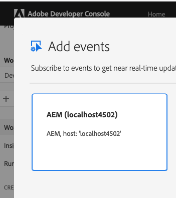

# AEM Link Externalizer Configuration

The AEM Link Externalizer `author` url is used by Adobe I/O Events to create a unique identifier 
of the associated AEM author instance/cluster within an IMS organization.

For AEM as a Cloud Service this configuration is not needed, 
as the AEM Link Externalizer is already set for you by the Adobe `cloudmanager`.

However, for `on premise` version of AEM, you need to make sure the AEM Link Externalizer is properly configured:
* Open the Web Console, or select the **Tools** icon, then select **Operations** and **Web Console**.
* Scroll down the list to find **Day CQ Link Externalizer**, update the `author` url, and select **Save** when done.

Note that this base URL will be reflected in the Adobe Developer Console in the AEM event provider label. 
If you keep it default, that is `http://localhost:4502`, here is how it will be shown the Adobe developer console:

    

