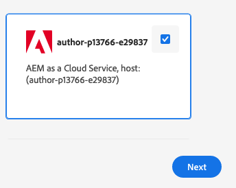

# AEM Events

**Adobe IO Events integration package for AEM is now open source: see [`aem-io-events`](https://github.com/adobe/aio-lib-java/tree/main/aem/aio_aem_events) module in our [`aio-lib-java`](https://github.com/adobe/aio-lib-java) github project**.

## Requirements
To set it up, you need:

* An AEM (version 6.5 and above) instance with administrative permissions.
* [Adobe Developer Console](/console) access, with administrative permissions for your enterprise organization.

Note: If you are still running AEM version 6.4 and wish to use this solution, [let us know](https://github.com/adobe/aio-lib-java/issues/104).

## Installation guides
These installation guides describe how to deploy and configure it so you can use Adobe IO Events for notification of AEM events, such as page or asset CUD operations.
* [AEM (6.5.x and above) on premise installation guide](aem_on_premise_install.md)
* [AEM as a Cloud Service installation guide](aem_skyline_install.md)

## Use Adobe IO Events
Once the previous steps are completed, a new AEM provider should appear in the Events Providers list in your Adobe Developer Console.
Please refer to the Adobe Developer Console documentation on how to [add Events to a project](/developer-console/docs/guides/services/services-add-event/) if you are new to this.

you are ready to register a new [webhook](/src/pages/guides/index.md)
or to start pulling events from this new AEM source using the [journaling](/src/pages/guides/journaling_intro.md).
