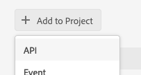

# Adobe Developer Console Setup

## Requirements

Log in to [Adobe Developer Console](https://developer.adobe.com/console/home),
verify you are holding a `System Administrator` role (on the top-right corner of the Adobe Developer Console)

## Adobe Developer Workspace Configuration

Then, if you have no project nor workspace created yet (or if you are new to this,
please refer to the [step-by-step instructions for creating an empty project in Adobe Developer Console](/developer-console/docs/guides/projects/projects-empty/)),
and create your project's workspace.

For your AEM to be authorized to emit events against Adobe I/O,
you need to add the `I/O Management API` to your project's workspace
in the Adobe Developer Console.

1. Click on `Add to Project` > `Service` > API`

   

2. Select `I/O Management API`, Click `Next`
3. In the next `Create a new service account (JWT) credential` screen, choose `Option 2`, see our [JWT public/private key management guide](aem_key_setup.md).
4. Click on `Save configured API`
5. Done ! You should now see `I/O Management API` in your Workspace API list.
6. Bookmark this Adobe Developer Console workspace, as you might need to come back to it more than once,
   to fine tune or troubleshoot your configurations.

## Download your Adobe Developer Console project metadata file

In your Adobe Developer Console workspace
* Select `Project overview` in the left-side links menu
* Click on the `Download` button from the top menu on the right
* Save the file, you will use it when you will be working on [`aio-events-aem` configuration](aem_workspace_setup.md)

