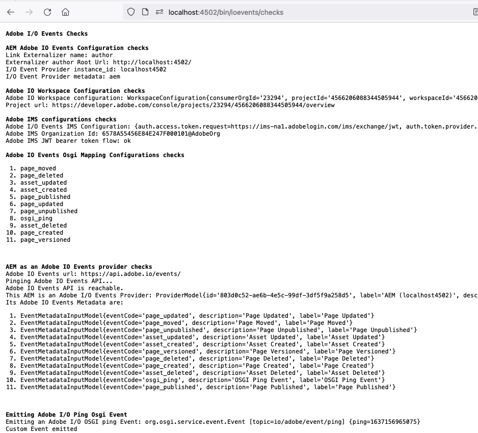

# Trigger Adobe I/O Events Health Checks (applicable to AEM 6.5 and later versions)

Once all your configurations are completed, in order to verify **and enable**
Adobe I/O Events emission, you must trigger the `Adobe I/O Events Servlet Health Check`.
This servlet is available at `/bin/ioevents/checks`

It exposes the following sections:

##  AEM Adobe I/O Events Configuration checks

This section shows your AEM identification configurations:
* the Link Externalizer name: by default set to `author`
* the Link Externalizer Root Url
* the Adobe I/O Event Provider instance_id: derived from the above
* the Adobe I/O Event Provider metadata: by default set to `aem`

## Adobe I/O Workspace Configuration checks

This section shows:
* your [`Adobe Developer Console` worskpace OSGI configuration](./aem_console_setup.md): your consumerOrgId, projectId, workspaceId
* your Project url: the associated https://developer.adobe.com/console deeplink

## Adobe IMS configurations checks

This section shows your [Adobe IMS configuration](./aem_ims_config.md)
and checks that this AEM instance is able to exchange JWT tokens with Adobe IMS.

## Adobe I/O Events Osgi Mapping Configurations checks

This section lists the `Adobe I/O Events Osgi Mapping Configurations` you deployed.

## AEM as an Adobe I/O Events provider checks

This section lists:
* the Adobe I/O Events API url: by default `https://api.adobe.io/events/`
* the ping to the above Adobe I/O Events API...
* the Adobe I/O Events' Provider metadata persisted in Adobe I/O control plane
* the various Adobe I/O Events' Metadata associated with the `Adobe I/O Events Osgi Mapping Configurations` listed in the previous section

**Note that if needed, the above will also create/update the Adobe I/O Events Provider Metadata
(POST-ing or PUT-ting it to Adobe I/O Events API)**

## Emitting Adobe I/O Ping Osgi Event

This final section emits a sample Adobe I/O `OSGI Ping Event`, in order to help you debug your webhook/setup.
