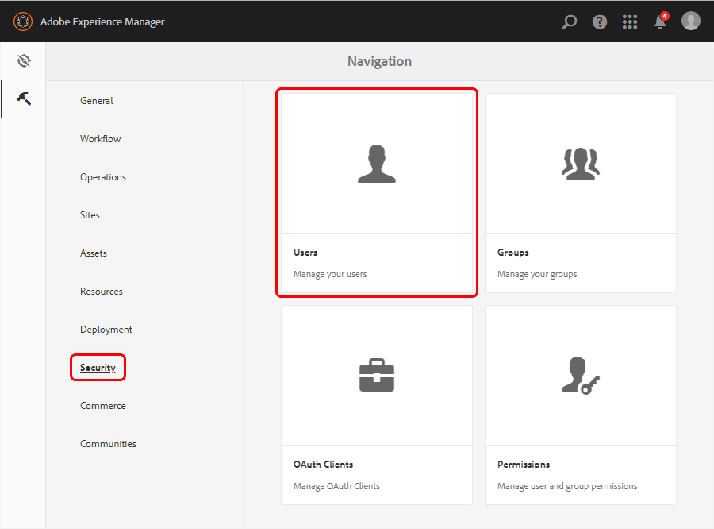
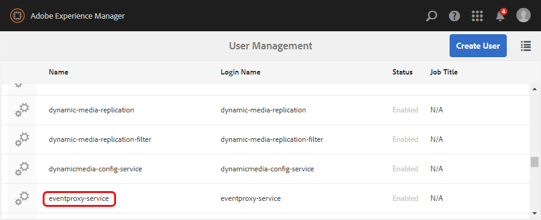

# Create and Upload Adobe I/O Certificate Keystore to AEM

To secure the calls between Adobe I/O and AEM, we leverage an oAuth JWT exchange token flow.
This flow uses a certificate to sign the JWT request and therefore requires certificates configurations
on both ends.

In order to achieve the above, this documentation will described how you can:

* create a public/private certificate key and an associated keystore
* add this keystore into the AEM `eventproxy-service` user&rsquo;s keystores vault.


## Create a certificate and keystore

To create a certificate and keystore:

1. Create an RSA private/public certificate in OpenSSL with the following command:

      ```
      openssl req -x509 -sha256 -nodes -days 365 -newkey rsa:2048 -keyout private.key -out certificate_pub.crt
      ```

2. Add the private key and signed certificate to a PKCS#12 file with the following command:

      ```
      openssl pkcs12 -keypbe PBE-SHA1-3DES -certpbe PBE-SHA1-3DES -export -in certificate_pub.crt -inkey private.key -out author.pfx -name "author"
      ```
3. When prompted, create an export password and store it for later use.

4. Create a keystore from the generated keys with the following command:

      ```
      cat private.key certificate_pub.crt > private-key-crt
      ```

      >Note: On Windows systems, you may need to concatenate the files manually or provide an alternate command. For more information, see the [OpenSSL manpages](https://www.openssl.org/docs/manpages.html).

5. Set the alias as **eventproxy** and a non-empty keystore password (such as admin), with the following command:

      ```
      openssl pkcs12 -export -in private-key-crt -out keystore.p12 -name eventproxy -noiter -nomaciter
      ```
      >Note: On Windows systems, this command expression may vary. For more information, see the [OpenSSL manpages](https://www.openssl.org/docs/manpages.html).

## Add the certificate into the AEM `eventproxy-service` user&rsquo;s keystore

To add the certificate into the AEM `eventproxy-service` user&rsquo;s keystore:

1. In AEM, open the **User Management** group by selecting the **Tools** icon and then selecting **Security** and **Users.**

      

2. Scroll down and Select **eventproxy-service** to open it.

      

3. Select **Create KeyStore**

4. Select **Manage KeyStore** and then expand the section for **Add Private Key from Key Store file.**

5. Add the keystore.p12 file by setting the key pair alias to **eventproxy** or the alias specified previously.

6. Provide the keystore password (the same one provided when generating the key store).

7. Provide the private key password and then provide the private key alias **eventproxy**.

8. Select **Submit**.

      
      
8. Click **Save and Close**  on the top right corner of the screen
      
      
      
      
      

