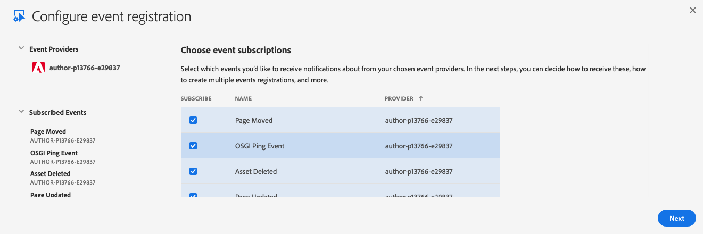
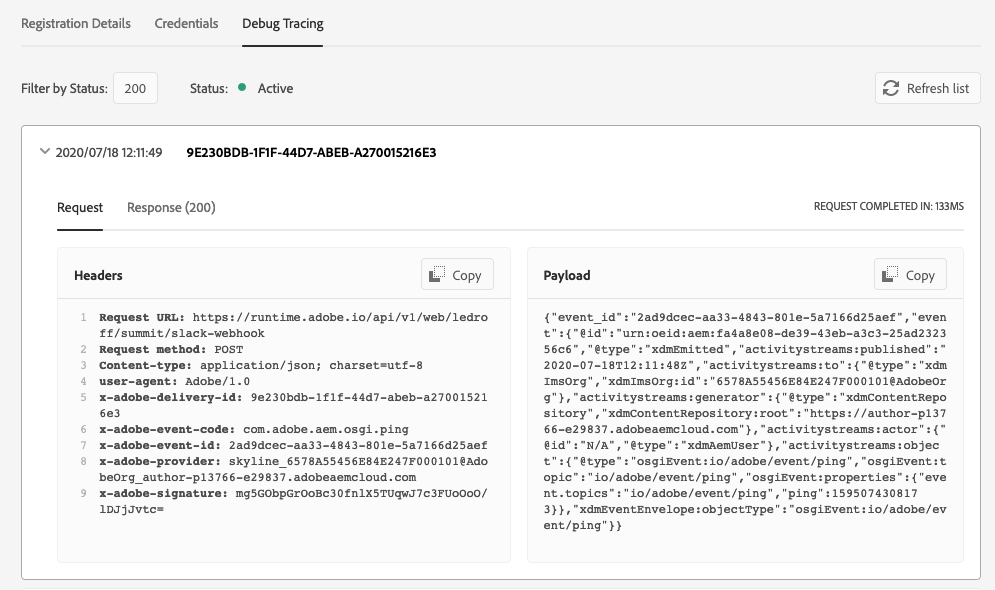
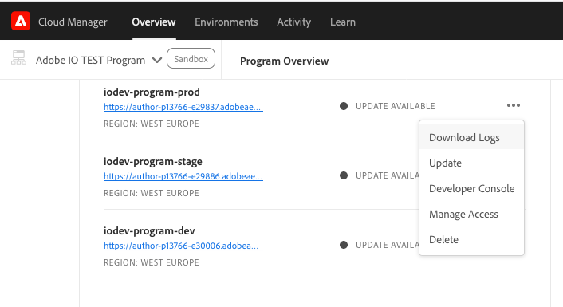

# Integrate with AEM as a Cloud Service

This documentation has instructions to set up I/O Events integrations with AEM as a Cloud Service set up.

To integrate with AEM On Premise, please refer to the other associated [documentation](aem_on_premise_install_6.5.md).

## Deploy Adobe I/O Events integration using Cloud Manager

The Adobe I/O Events integration is currently being exposed through an integration package which requires you to follow the below deployment instructions. This configuration will change in future once Adobe I/O Events is exposed as a configuration in AEM as a Cloud Service. 

1. [Download the code](https://github.com/AdobeDocs/adobeio-events/releases/tag/2020_07_20_13_00). Please download the latest version of the package. 
2. Unzip this archive, and merge it with your own existing Cloud Manager git repo, see [Experience Manager Cloud Manager - Help - Accessing Git ](https://experienceleague.adobe.com/docs/experience-manager-cloud-manager/using/managing-code/setup-cloud-manager-git-integration.html) for further instructions

3. [prepare the Adobe I/O Events service user keystore](aem_keystore_setup.md) 
4. [set up your workspace in the Adobe Developer Console, and as OSGI configuration](aem_console_setup.md)

5. [Deploy the code](https://docs.adobe.com/content/help/en/experience-manager-cloud-manager/using/how-to-use/deploying-code.html)
6. [Finalize the Adobe IMS configuration in AEM](aem_ims_config.md)
7. [Trigger the final Adobe I/O Events health checks](aem_healthcheck_servlet.md)
   
## Verify your AEM Cloud Service is showing in the Adobe Developer Console
   
Once the previous steps are completed, a new AEM as a Cloud Service provider should appear in the Events Providers list in the Adobe Developer Console.
Please refer to the Adobe Developer Console documentation on how to [add Events to a project](https://www.adobe.io/apis/experienceplatform/console/docs.html#!AdobeDocs/adobeio-console/master/services-add-event.md) if you are new to this.

  
 

## Verify Events are being emitted from 'AEM as a Cloud Service'

Now you can start verifying that your AEM as a Cloud Service environment is emitting events to Adobe I/O.
To do that register a new [webhook](../../index.md) or start pulling events from this new source using the [journaling API](../api/journaling_api.md).

Make sure you register to receive `OSGI Ping Event`

   
 
If your webhook registration is active, every minute or so, you should see ping events showing up in the debug tracing tab:

   

If not, [have a look at your logs](https://docs.adobe.com/content/help/en/experience-manager-learn/cloud-service/debugging/debugging-aem-as-a-cloud-service/logs.html), and look for `com.day.cq.dam.eventproxy` in the error logs to better identify the issue.

  

You can also use the [developer console](https://docs.adobe.com/content/help/en/experience-manager-learn/cloud-service/debugging/debugging-aem-as-a-cloud-service/developer-console.html) to verify the state of the `aem-event-proxy` bundle.

Note that if you using a localhost instance for test, developement purpose you may also perform a few [health checks](aem_healthcheck_6.4.md)
or even [configuration fine tuning](aem_advanced_configurations.md).
