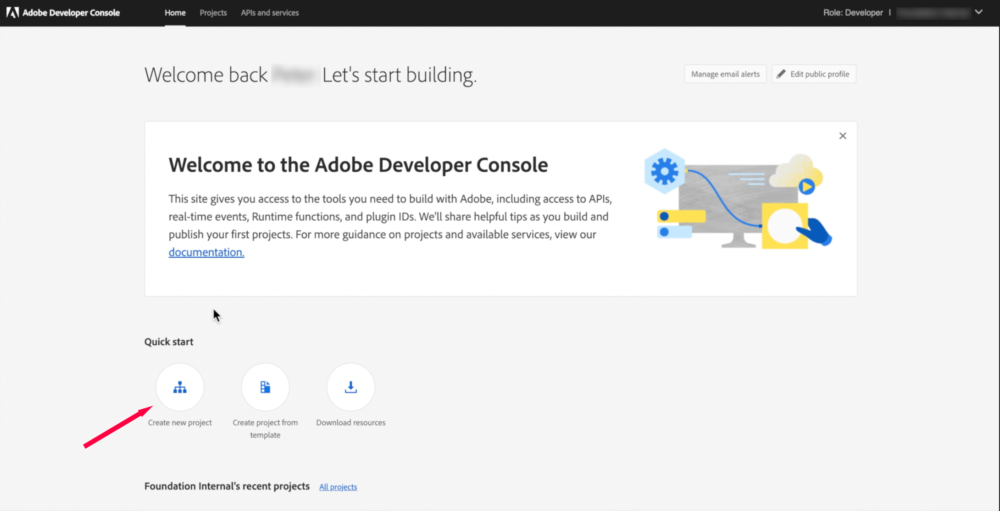
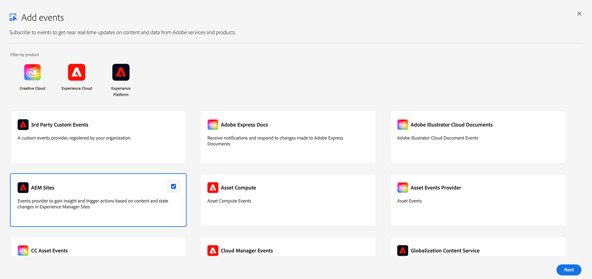
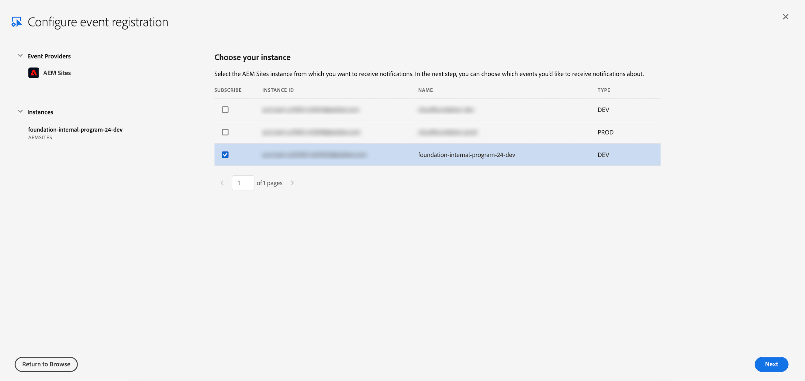
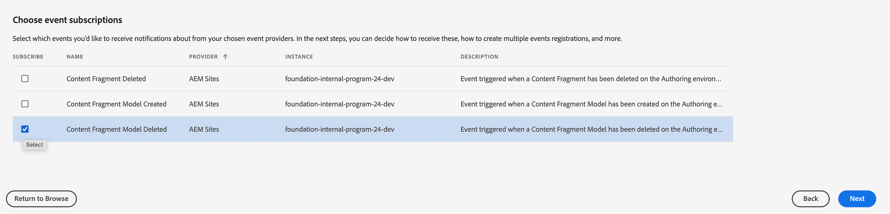
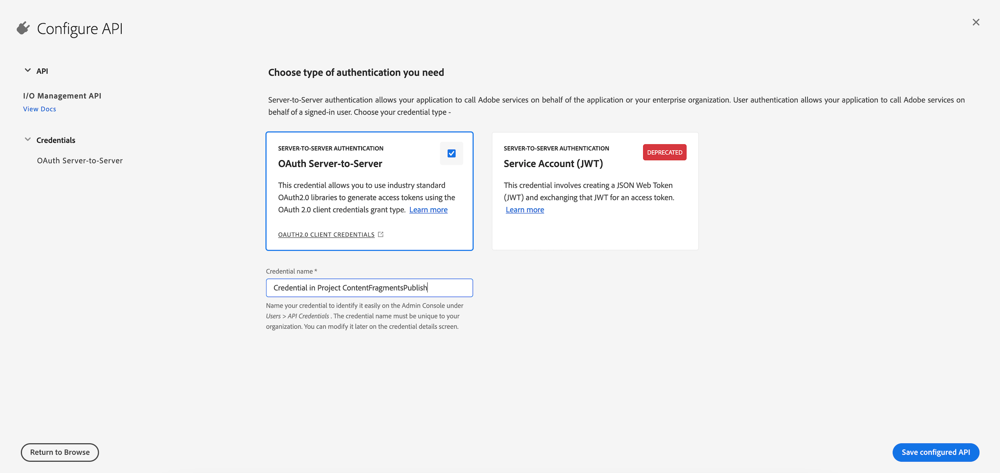
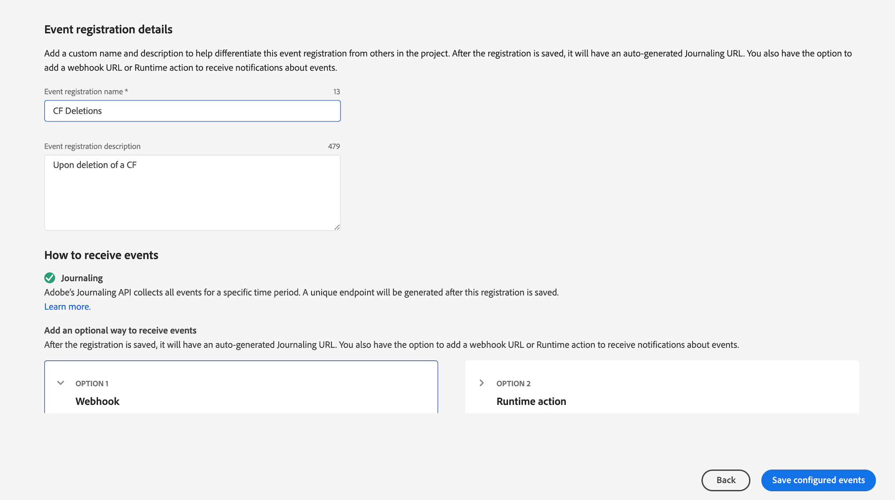

## Introducing Cloud-Native AEM Events in AEM as a Cloud Service

A strength of AEM has always been interoperability, based on open standards. This has enabled custom extensions and integrations and created countless additional use cases with AEM as the content centerpiece. With the new development of AEM Events, AEM as a Cloud Service now offers a cloud-native solution for AEM expandability and thus pursues the following goals:

* A generic eventing platform that makes it easy to subscribe to events, process them according to your project needs in most lightweight, scalable, and secure ways
* Separation of functions like AEM Events in this case into standardized dedicated services for improved scalability and maintainability
* Avoidance of custom code in AEM runtimes for better robustness and reduced effort when deploying, testing, and maintaining AEM as Cloud Service

The new AEM Eventing is by design initiated for AEM as a Cloud Service and is not supported for AEM On Premise installations or AEM on Adobe Managed Service installations.

## Why AEM Events?

Exposing events in AEM as Cloud Service to external services, both first and third-party, can solve several problems related to integrating various systems and improving the overall functionality of AEM as Cloud Service. Here are a few specific problems that can be addressed by exposing events:

* Real-time updates: By exposing events to external services, you can enable real-time updates to content and metadata within AEM. This means that changes made within AEM can be immediately reflected in other systems and platforms that are integrated with it.
* Cross-system integration: Many organizations use multiple systems to manage different aspects of their business. By exposing events in AEM, you can facilitate integration with other systems, such as customer relationship management (CRM) or marketing automation tools. This allows for a more seamless exchange of data between systems, reducing manual data entry and improving overall efficiency.
* Customization and flexibility: Exposing events in AEM allows for greater customization and flexibility in how the system is used. Developers can create custom integrations that use the events exposed by AEM to trigger specific actions in other systems or platforms. This allows for a more tailored approach to content management that can meet the unique needs of a particular organization. Traditionally, this comes at the cost of custom code integration in AEM, not so with AEM Events.
* Improved analytics and reporting: By exposing events in AEM, you can gather more detailed data about how content is being used and consumed across different systems and platforms. This data can be used to generate more robust analytics and reporting, which can help inform content strategy and improve overall performance.

Overall, exposing events in AEM can help to create a more integrated and efficient content ecosystem, while also providing greater flexibility and customization options for organizations.

## Example Use Cases

For project-specific extensions and integrations with AEM, AEM Events can help to inform external systems about all possible events in AEM in real time. This means that an automated reaction can be defined or implemented upon every event in AEM. Below you will find a few use case examples to illustrate how you could use AEM Events.

* You are publishing headless content in AEM and want to forward content changes as webhooks on a native mobile app. AEM Events is the perfect real-time trigger.
* You want to log and archive all activities in AEM in an audit-proof manner. With AEM Events, you obtain relevant changes in AEM and forward them to an external system suitable for info retrieval and archiving.
* You want to integrate an external search engine for site search on AEM Publish and update the indexes in real time.
* You want to inform user groups about certain events in AEM in external channels. Forward the events as needed, for example to a Slack channel or to an email group.

In some use cases, it is sufficient to forward AEM events as notifications. However, in most cases AEM Events must be combined with custom business logic and AEM APIs to access AEM content. Adobe offers comprehensive support here with Adobe Developer Console, Adobe I/O, and AEM APIs. This tutorial is intended to give you an overview of AEM Events and step-by-step instructions on how you can effectively extend AEM via Events and integrate it with other systems.

<InlineAlert slots="text" />

**Disclaimer**
It is important to note that there is no Service Level Agreement (SLA) for AEM Events. The cloud-native eventing architecture has been designed with scalability, performance and resilience in mind and has common DevOps methodologies such as monitoring and alerting to resolve faults promptly. However, transactionality is not currently part of the requirements for AEM Events, which is why there is no guarantee of absolute completeness for the transport of AEM Events to Adobe I/O.  
For example, if an asset is downloaded from AEM, we will serve the download to the user and then post an event.  If the AEM cloud environment were to restart after the download but before the event were sent or if the event infrastructure were to be temporarily unavailable, the user's download would complete but the event would not be sent.
This was a conscious decision made when designing our event capabilities as it allows us to ensure higher performance and reliability of core AEM features, albeit at the cost of not ensuring 100% accuracy in the events that are generated.  While the level of reliability that this approach provides should meet the requirements of most use cases, some customers may need to implement additional measures to ensure that no updates are lost.

## AEM Events processing via Adobe I/O

AEM events are routed to Adobe I/O by default and are available instantly as soon as you subscribe to them in the Adobe Developer Console. In Adobe I/O, you have the three consumption options described below for processing AEM events. It's best to familiarize yourself with the options in advance, as each has its own characteristics and it's up to you to choose a suitable strategy based on your project requirements.

| Process                   | Description                                                                                                                                       | Consumption | Scope                                                                                                                                                                                                                                                                                                                                              | Documentation                                                                                                             |
|---------------------------|---------------------------------------------------------------------------------------------------------------------------------------------------|-------------|----------------------------------------------------------------------------------------------------------------------------------------------------------------------------------------------------------------------------------------------------------------------------------------------------------------------------------------------------|---------------------------------------------------------------------------------------------------------------------------|
| Adobe I/O Events Webhooks | Sign up a Webhook URL that receives event JSON objects as HTTP POST requests instantly.                                                           | PUSH        | Choose any webhook client or webhook automation service to forward specific AEM Events.                                                                                                                                                                                                                                                            | [Adobe I/O Events Webhooks Documentation](https://developer.adobe.com/events/docs/guides/)                                |
| Adobe I/O Journaling API  | Enables enterprise integrations to consume events according to their own cadence and process them in bulk.                                        | PULL        | Use your existing ressources, for example Java Development, to process AEM Events with custom logic from any infrastructure by using Adobe I/O Journaling API.                                                                                                                                                                                     | [Adobe I/O Events Journaling API](https://developer.adobe.com/events/docs/guides/journaling_intro/)                       |
| Adobe I/O Runtime         | AEM Events trigger serverless functions                                                                                                           | PUSH        | Use Adobe Developer App Builder and create custom business logic in NodeJS for subscribed AEM event types. AEM Events result in execution as a serverless function in Adobe I/O Runtime.                                                                                                                                                           | [Adobe I/O Events Runtime](https://developer.adobe.com/runtime/docs/guides/overview/what_is_runtime/)                     |
| Amazon Eventbridge        | Create highly scalable event-driven applications by routing events between your own applications, third-party SaaS applications, and AWS services | PUSH        | EventBridge makes it easier to build event-driven applications by facilitating event ingestion, delivery, security, authorization, and error handling. EventBridge has over 45 pre-built partner integrations that can scale seamlessly to handle spikes in event delivery without requiring provisioning of infrastructure or ongoing operations. | [Adobe I/O Events and Amazon EventBridge Integration](https://developer.adobe.com/events/docs/guides/amazon_eventbridge/) |

## Available Event Types

Current available event types are documented in the AEM API specification as listed below:

* [AEM Sites Author Events](https://developer.adobe.com/experience-cloud/experience-manager-apis/api/stable/sites/)
* [AEM Assets Author Events](https://developer.adobe.com/experience-cloud/experience-manager-apis/api/stable/assets/author/)

<InlineAlert slots="text" />

The list of available event types for AEM as a Cloud Service is being expanded on a rolling basis. If you are missing the event types you need, please contact Adobe Support. We can provide you with immediate information about which event types are in progress or how quickly we can provide the event types you need. Your project success is our goal, and accordingly, the AEM Events Team will do everything possible to provide you with the event types you need as fast as possible.

Cloud-native AEM events are ready-to-use and each one is predetermined for a specific event. Modification or extension is not intended, with the aim of avoiding custom code in the AEM runtime as much as possible. This is conceptually different from the AEM Events powered by [AEM add-on module](https://developer.adobe.com/events/docs/guides/using/aem/aem-addon-module/).

## Enable AEM Events on your AEM Cloud Service Environment

First, you need to enable your User Role in order to be able to subscribe to AEM Events from your AEM as a Cloud Service Environment via Adobe Developer Console. The following steps are necessary for this:

1. Visit [Admin Console](https://adminconsole.adobe.com/) and login with an Administrator account.
1. Select “Adobe Experience Manager as a Cloud Service” from the eligible products.
1. Select the desired AEM as a Cloud Service environment from which you want to subscribe to AEM Events
1. Select an associated product profile where your user is assigned as an admin user, otherwise you can make this edit in the product profile dialog.

## How to subscribe to AEM Events in the Adobe Developer Console

In order to subscribe to AEM Events, you first need to create a new project in the Adobe Developer Console. You can do this by following these steps:

1. Visit [https://developer.adobe.com/console/projects](https://developer.adobe.com/console/projects) and create a new project. But first, make sure you know how you want to process AEM events in Adobe I/O. If you want to use Adobe I/O Runtime, create a new project from a template. This gives you the opportunity to create your Adobe I/O project with App Builder. You can find more information about App Builder at the [App Builder Developer Documentation](https://developer.adobe.com/app-builder/docs/overview/).
   If you are unsure how to handle AEM Events in your project, please see the section [AEM Events processing via Adobe I/O](#aem-events-processing-via-adobe-io) of this tutorial.

   

1. Add a new Service "Event" to your preferred workspace in your new Adobe Developer Console project. This will open the "Add Event" dialog for you, which shows you all Adobe product solutions to which you are entitled.

   

1. Select the AEM Solution from which you want to subscribe to AEM Events, for example AEM Sites or AEM Assets. Once you click "Next", you will be provided with all AEM as a Cloud Service Environments, to which you are entitled as per Admin Console Configuration. See also the section [Enable AEM Events on your AEM Cloud Service Environment](#Enable-AEM-Events-on-your-AEM-Cloud-Service-Environment) in this tutorial.

   

1. Choose the AEM as a Cloud Service Environment, from which you want to receive AEM Events. Once you click "Next", you will be provided with a list of available AEM Events for your selected AEM Solution.

1. Select the Event Types to which you want to subscribe and click "Next". For a list of available event types, see [Available Event Types](#available-event-types).
   

1. You will see the preselected **OAuth Server-To-Server** card, edit the credential name for better identification in the Admin Console and click "Next".

   

1. Provide a name and a description for your AEM Event registration and click "Next".
1. Next, choose how you would want to consume the events in Adobe I/O for this event registration. For more information, consult the [AEM Events processing via Adobe I/O](#aem-events-processing-via-adobe-io) section.

   

1. The Journaling API is generally always available to access the AEM Events queue. You can copy the Journaling endpoint - specific to your event registration, to access the Journaling API.

Other AEM Event consumption options are:

* Adobe I/O Webhook: Enter the URL of your webhook client and decide whether you want to forward events individually at runtime or in batches
* Adobe I/O Runtime: Link the runtime action of your App Builder project to this event registration. This requires that you have initially activated (cmd: init) and deployed (cmd: deploy) your App Builder application.
* Adobe I/0 and Amazon Eventbridge Integration: Add your AWS account ID and select AWS region to determine the Amazon Eventbridge target for your AEM Events.

That's it! The AEM events from your AEM as a Cloud Service environment should now arrive in your Adobe Developer Console project. You can observe this on the Events dialog of your event registration: In the "Debug tracing" section you can see the AEM Events Requests and the Runtime Action Response in JSON format. On the **Event Browser** section, you can view the entire AEM Event Journal in detail.

You can check things like:

* Whether your AEM events arrive in Adobe I/O
* What the AEM event payload looks like
* Identify errors via HTTP status in request/response traffic
* What the response payload of your runtime action looks like

**If you decide to use Adobe I/O Runtime for your custom business logic in your project, we recommend that you familiarize yourself with Adobe App Builder in advance. Once you learn how to initiate, develop, debug, and deploy an App Builder stand-alone application locally, you'll realize how easy it is and how much work it takes away from you. Try it out yourself!**

<InlineAlert variant="help" slots="text" />

For additional details and tutorials on AEM Cloud Service Events, please visit: [AEM Cloud Service Events Marketing Documentation](https://experienceleague.adobe.com/docs/experience-manager-learn/cloud-service/aem-eventing/overview.html).
