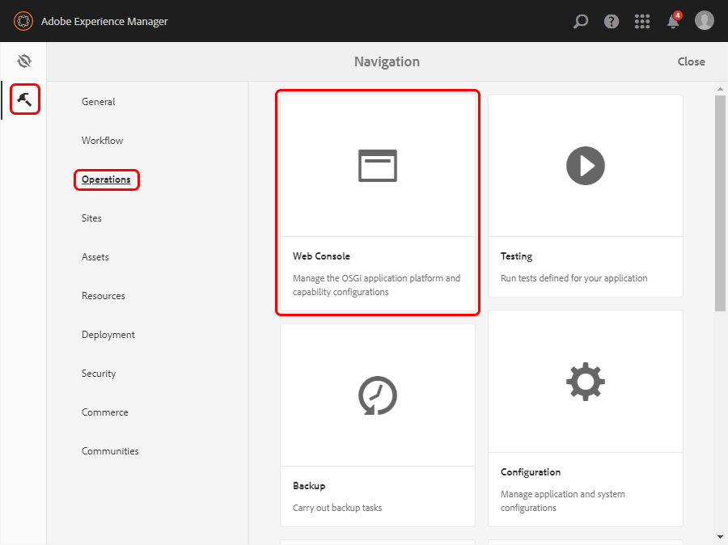
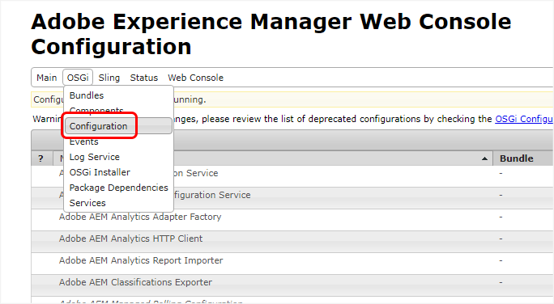
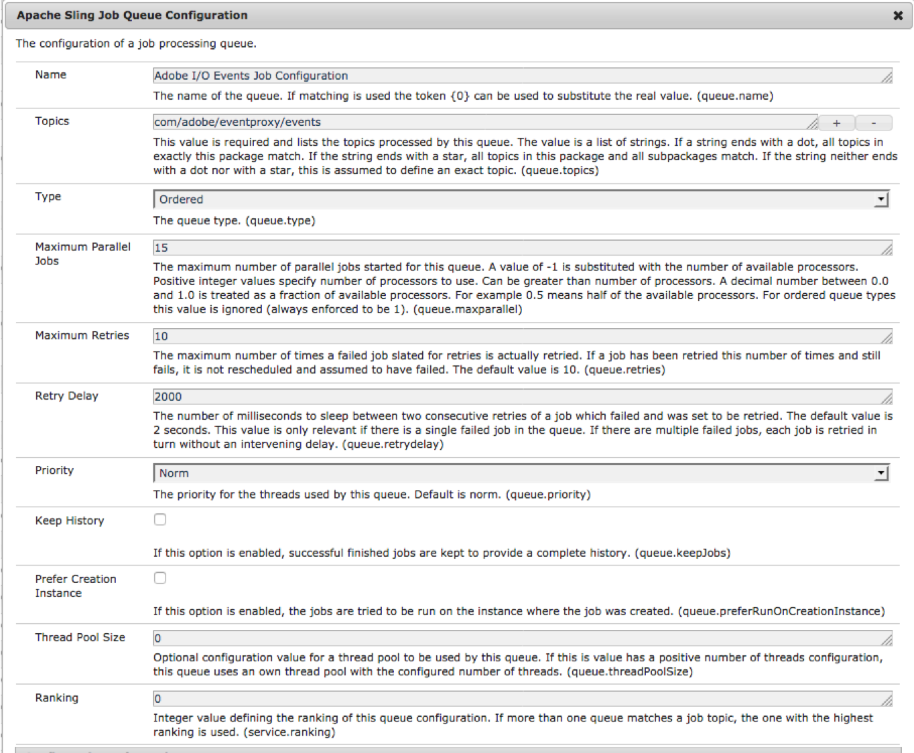
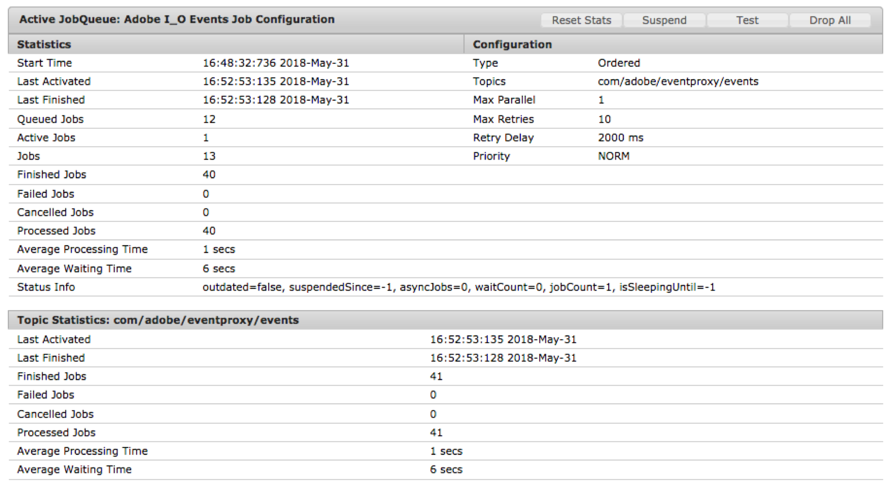

# AEM (6.4.x) - Advanced Configurations

## Adobe I/O Events OSGI to XDM event mapping configurations:

For all Adobe I/O event types defined by the Adobe I/O Event Model, there is an **Adobe I/O Events OSGI to XDM event mapping configuration**.

For each of these you can edit:

* The OSGI Topic you want to observe: `osgiTopic`
* The OSGI Filter you want to apply in your OSGI event observation. If left empty no osgi filtering is done: `osgiFilter`
* The JCR `osgiJcrPathFilter` to filter the OSGI events further. If left empty, no resource path filtering is done: `osgiJcrPathFilter`
* The OSGI Event Handler Type (use the default `com.day.cq.dam.eventproxy.service.impl.listener.AdobeIoEventHandler` to map any custom OSGI event): `osgiEventHandlerClassName`
* The Adobe I/O XDM Event Type to map to the OSGI event: again, use the default (`com.adobe.xdm.event.OsgiEmittedEvent`) to map your custom OSGI events: `adobeIoXdmEventClassName`
* The Adobe I/O Event Code (unique to your event provider; in other words, unique to your AEM instance/cluster): `adobeIoEventCode`
* The Adobe I/O Event Label as it will appear on the Adobe Developer Console: `adobeIoEventLabel`

The various OSGI event handlers will intercept the events according to these values and then map these OSGI events to the Adobe I/O Event Model before forwarding them to Adobe I/O.

The solution leverages the OSGI configuration factory pattern; hence you can not only edit these configurations, but you can also remove and add such configurations.

To configure using the panel:

1. Select **Tools** in AEM and then select **Operations** and **Web Console**.

      

2. In the **OSGI** menu, select **Configuration**.

        
      and search for: **Adobe I/O Events CSM Registration**.

3. For **Adobe I/O Events OSGI to XDM Event Mapping Configuration**, select **+**, **Edit**, or **Delete**.

## Adobe I/O Events queuing and retries

When an OSGI event of interest is triggered (i.e an OSGI events that matches one of your `OSGI to XDM event mapping configurations`), it makes it to a job queue handled by `Sling Job Handler`.

This job is persisted in the resource tree (for failover etc.), then the job is distributed to an instance responsible for processing the job; and on that instance the job is put into a processing queue, where eventually a Sling Job Consumer will execute it.

Adobe I/O Events Sling Job Consumer's job is to send this event to Adobe I/O.
* `JobResult.OK` should be returned. If the job has not been processed completely,
* `JobResult.FAILED` should be returned if Adobe I/O fails either to receive or to process it (due to network failure or Adobe I/O failure).
In that case the job will be rescheduled/retried   
* if the max number of retries is met, the process will not be rescheduled and treated like the method would have returned `JobResult.CANCEL`.

Note that
* Adobe I/O Events Sling Job Consumer topic is `com/adobe/eventproxy/events`
* Adobe I/O Events `Sling Job Queue configuration` is the default `Apache Sling Job Default Queue` with
  * a Normal job priority
  * 10 maximum retries
  * 2 seconds retry delay
  * 15 maximum parallel jobs

You can tune this configuration according to your needs: using the `OSGI > configuration` menu of AEM's `system console`
and create there a new `Apache Sling Job Queue Configuration`

  

Note that you can use the `Sling > Jobs`  menu of AEM `system console`,
to look up the statistics and health of your queues

 

Please refer to the Sling documentation:
* https://sling.apache.org/apidocs/sling7/org/apache/sling/event/jobs/consumer/JobConsumer.html
* https://sling.apache.org/documentation/bundles/apache-sling-eventing-and-job-handling.html
