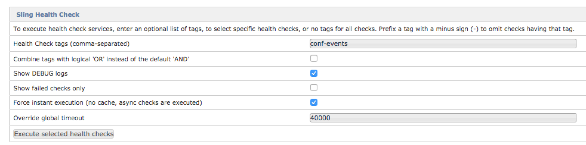
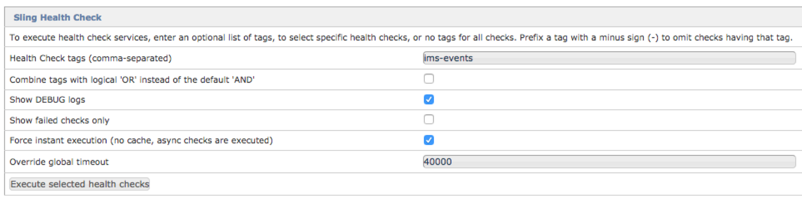
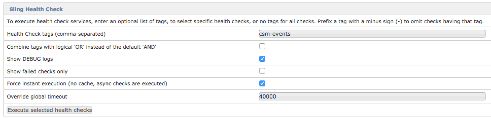

# Adobe IO Events - AEM (6.4.x) Sling Health Checks

Note we strongly recommend you go through an upgrade and instead use either
* our [AEM version 6.5 package](aem_on_premise_install_6.5.md),
* our [`AEM as cloud service` support](aem_skyline_install.md).

## Bundle configuration health heck 

In order to verify your configurations, you can use the AEM Web Console Sling Health Check
and execute the health check tagged with `conf-events`.

   

## IMS health check 

In order to check that the AEM instance is able to exchange JWT tokens 
with Adobe I/O Identity Management System (IMS), you may execute a sling health check using the `ims-events` tag.

This verifies that your IMS related configurations are correct and working.

   

## Adobe I/O Events registration health check 

In order to check that the AEM instance registered itself as an Adobe I/O Events Provider,
 execute a sling health check using the `csm-events` tag.

   

## Checks events emitting

In order to check that the AEM instance is able to emit events:
* trigger an event 
   * for instance an asset update event by editing an asset
   * or POST a (custom/ping) osgi events through the `system/console/events` UI.
* and watch 
  * your AEM logs 
  * your webhook registration endpoint

If for some reason, your webhook is failing, note that the Adobe Developer Console holds a `Debug Tracing` feature:
It allows you to watch all the events payloads emitted by Adobe I/O towards your webhook and the associated webhook response.
