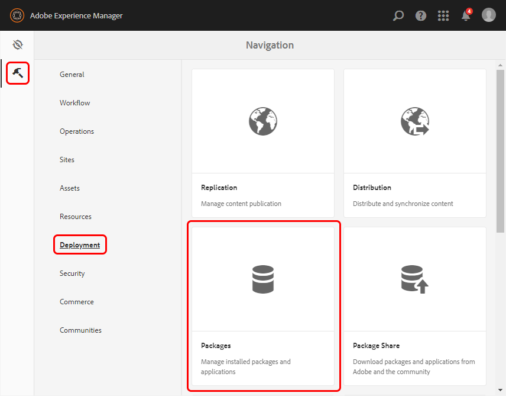
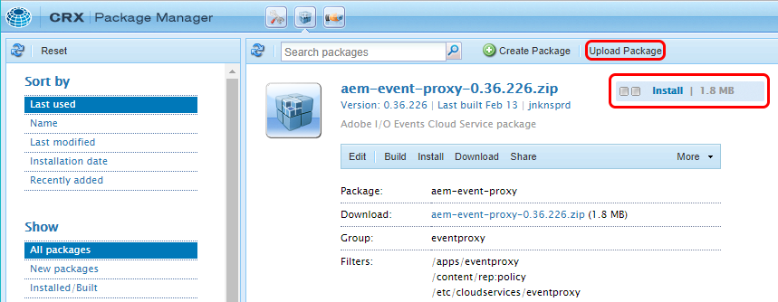
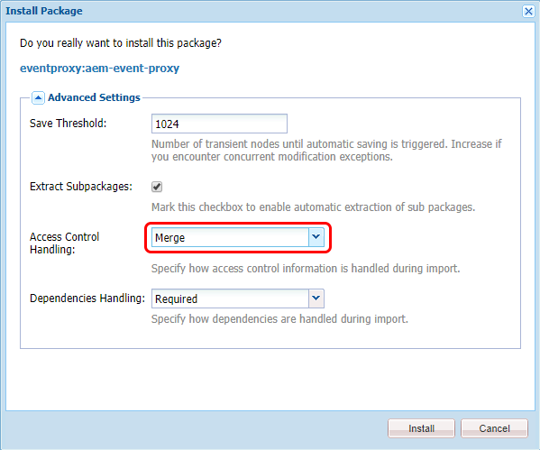
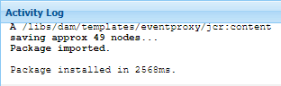

# Install the AEM (6.4.x) Event Proxy Package

To install the AEM event proxy package:
   
2. Open AEM Package Manager by selecting the **Tools** icon and then selecting **Deployment** and **Packages**.

   

3. In **Package Manager**, select **Upload Package**. Select **Browse** and navigate to the package zip file. Select **OK**.

      >Note: If you have an older version of the package, delete it to avoid potential conflicts. You can delete it from the following location: **crx/de/index.jsp#/apps/eventproxy/install**.

4. Select **Install**.

      

5. On the **Install Package** dialog box, select **Merge** from the **Access Control Handling** drop-down list and select **Install**.

      

6. Watch the **Activity Log**. If installed, the log reports that the package is imported.

      

For more information on installing packages in AEM, see [How to Work with Packages](https://helpx.adobe.com/experience-manager/6-3/sites/administering/using/package-manager.html).

## Additional package installation notes:

1. If you are upgrading the package, delete the previous .jar file from the following location: **`/apps/eventproxy`**

2. Verify that the Access Control Handling is properly applied by checking permissions for the `eventproxy-service` user at **/useradmin**.
If applied correctly, the `eventproxy-service` user is added to the following:

      *   **`/home/users/system/eventproxy/eventproxy-service` with `jcr:read` and `rep:write` authorizations**
      *   **`/content` with `jcr:read` authorization**
      *   **`/etc/cloudservices/eventproxy` with `jcr:read` and `rep:write` authorizations** (for AEM versions prior to 6.4.0)
      *   **`/var/eventproxy` with `jcr:read` and `rep:write` authorizations** (for AEM 6.4.0 and beyond)

For more information, see AEM [User, Group and Access Rights Administration](https://helpx.adobe.com/experience-manager/6-3/sites/administering/using/user-group-ac-admin.html).

