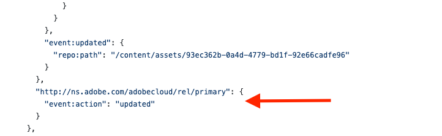

# Asset Events Actions

## Overview

Asset Events are initiated by actions, which are operations (create, update, move, etc.) made on the [resources](asset-events-glossary.md#resource) of [assets](asset-events-glossary.md#asset). You can determine which action has been made on which resource by looking at certain [Asset Events properties](asset-events-properties.md).

1. The `event:resources` object contains the Resource Change objects, which describe [resources](asset-events-glossary.md#resource) that have been impacted by an action. Resources are identified by their associated link relations.

   

2. One of the Resource Change objects always represents the [Repository Metadata Resource](asset-events-glossary.md#repository-metadata-resource), given that this [resource](asset-events-glossary.md#resource) is required to be embedded in the event (i.e., as the value of `event:embedded`). This is the case even if the Repository Metadata Resource wasn't affected by the action that triggered the event. (The value of `event:action` indicates in what way a resource was affected, or if it was affected at all. The possible values for this property are `none`, `updated`, `created`, and `deleted`.)

   

3. Below is an example of a Resource Change object that signals a [resource](asset-events-glossary.md#resource) **has** been affected by an action. (In this case, the [Primary Resource](asset-events-glossary.md#primary-resource) has been updated.)

   

4. When an [asset](asset-events-glossary.md#asset) has been moved, discarded, or restored, the `event:updated` property will be present in the Resource Change object that represents the [Repository Metadata Resource](asset-events-glossary.md#repository-metadata-resource). The value of this property is an object that, depending on the action, contains one or more of the following properties:

   - `repo:path`: the previous path of the [Primary Resource](asset-events-glossary.md#primary-resource) of the asset
     - **Note**: This property is only present when the asset has been moved.
   - `storage:region`: the previous storage region of the asset
     - **Note**: This property is only present when the asset has been moved into a different region.
   - `repo:state`: the previous state of the asset
     - **Note**: This property is only present when the asset has been either discarded or restored.

   

<br/>

## Actions by Asset Type

This section is organized by [asset](asset-events-glossary.md#asset) type ([files](asset-events-glossary.md#file)/[directories](asset-events-glossary.md#directory) and [composites](asset-events-glossary.md#composite)), and is intended to help you recognize, via an Asset Event object, how an asset's [resources](asset-events-glossary.md#resource) has been affected by a given action. Each subsection contains an abbreviated Asset Event object, so that you can more easily view the relevant properties.

### Files/Directories

<HorizontalLine/>

#### Created

An event is triggered by the creation of a [file](asset-events-glossary.md#file)/[directory](asset-events-glossary.md#directory). In `event:resources`, the [Primary Resource](asset-events-glossary.md#primary-resource) is listed as `created`.

- **Note**: If the [Repository Metadata Resource](asset-events-glossary.md#repository-metadata-resource) did not exist prior to the creation of the [file](asset-events-glossary.md#file)/[directory](asset-events-glossary.md#directory), this Resource will be listed as `created`. If the [asset](asset-events-glossary.md#asset) is versioned, the [Versions Resource](asset-events-glossary.md#versions-resource) will be listed as `created`.

```json
{
  "data": {
    "xdmEntity": {
      "event:resources": {
        "http://ns.adobe.com/adobecloud/rel/metadata/repository": {
          "event:action": "created"
        },
        "http://ns.adobe.com/adobecloud/rel/primary": {
          "event:action": "created"
        },
        "version-history": {
          "event:action": "created"
        }
      }
    }
  }
}
```

<HorizontalLine/>

#### Updated

An event is triggered by an update to a [file](asset-events-glossary.md#file)/[directory](asset-events-glossary.md#directory) that did not involve copying or moving the file/directory (e.g., updating an image). In `event:resources`, both the [Repository Metadata Resource](asset-events-glossary.md#repository-metadata-resource) and the [Primary Resource](asset-events-glossary.md#primary-resource) are listed as `updated`.

- **Note**: If the [asset](asset-events-glossary.md#asset) is versioned, the [Versions Resource](asset-events-glossary.md#versions-resource) will be listed as `updated`.

```json
{
  "data": {
    "xdmEntity": {
      "event:resources": {
        "http://ns.adobe.com/adobecloud/rel/metadata/repository": {
          "event:action": "updated"
        },
        "http://ns.adobe.com/adobecloud/rel/primary": {
          "event:action": "updated"
        },
        "version-history": {
          "event:action": "updated"
        }
      }
    }
  }
}
```

<HorizontalLine/>

#### Copied

Two separate Events are triggered by copying a [file](asset-events-glossary.md#file)/[directory](asset-events-glossary.md#directory) (i.e., duplicating it at a specified target location):

- An event for the creation of the copy
- An event for the update of the copy's parent directory

##### Event for the Creation of the Copy

In `event:resources`, the [Repository Metadata Resource](asset-events-glossary.md#repository-metadata-resource) is listed as `created`.

- **Note**: The event may list more [resources](asset-events-glossary.md#resource) as `created`, depending on the resources available at the source [asset](asset-events-glossary.md#asset)

```json
{
  "data": {
    "xdmEntity": {
      "event:resources": {
        "http://ns.adobe.com/adobecloud/rel/metadata/repository": {
          "event:action": "created"
        }
      }
    }
  }
}
```

##### Event for the Update of the Parent Directory

In `event:resources`, the [Primary Resource](asset-events-glossary.md#primary-resource) is listed as `updated`.

```json
{
  "data": {
    "xdmEntity": {
      "event:resources": {
        "http://ns.adobe.com/adobecloud/rel/metadata/repository": {
          "event:action": "none"
        },
        "http://ns.adobe.com/adobecloud/rel/primary": {
          "event:action": "updated"
        }
      }
    }
  }
}
```

<HorizontalLine/>

#### Moved

Three separate events are triggered by moving a [file](asset-events-glossary.md#file)/[directory](asset-events-glossary.md#directory) (i.e., changing the path of the [asset](asset-events-glossary.md#asset)):

- An event for the moving of the asset
- An event for the update of the source parent directory (i.e., the asset's previous parent directory)
- An event for the update of the target parent directory (i.e., the asset's new parent directory)

##### Event for the Moving of the Asset

In `event:resources`, the [Repository Metadata Resource](asset-events-glossary.md#repository-metadata-resource) is listed as `updated`.

The `event:updated` object contains two properties that describe the source location of the moved [asset](asset-events-glossary.md#asset).

- The value of `repo:path` is the previous path of the [Primary Resource](asset-events-glossary.md#primary-resource) of the asset.
- The value of `storage:region` is the previous storage region of the asset. (`storage:region` is present only if the asset has moved to a different region.)

```json
{
  "data": {
    "xdmEntity": {
      "event:resources": {
        "http://ns.adobe.com/adobecloud/rel/metadata/repository": {
          "event:action": "updated",
          "event:updated": {
            "repo:path": "<the previous path of the Primary Resource of the asset>",
            "storage:region": "<the previous storage region (if the asset was moved to a different region)>"
          }
        }
      }
    }
    }
  }
}
```

##### Event for the Update of the Parent Directory (Source and Target)

In `event:resources`, the [Primary Resource](asset-events-glossary.md#primary-resource) is listed as `updated`.

```json
{
  "data": {
    "xdmEntity": {
      "event:resources": {
        "http://ns.adobe.com/adobecloud/rel/metadata/repository": {
          "event:action": "none"
        },
        "http://ns.adobe.com/adobecloud/rel/primary": {
          "event:action": "updated"
        }
      }
    }
  }
}
```

<HorizontalLine/>

#### Discarded

An Event is triggered by discarding a [file](asset-events-glossary.md#file)/[directory](asset-events-glossary.md#directory). In `event:resources`, the [Repository Metadata Resource](asset-events-glossary.md#repository-metadata-resource) is listed as `updated`. The value of `repo:state` in `event:updated` is the previous state of the [asset](asset-events-glossary.md#asset). (The current state is `DISCARDED`.)

```json
{
  "data": {
    "xdmEntity": {
      "event:resources": {
        "http://ns.adobe.com/adobecloud/rel/metadata/repository": {
          "event:action": "updated",
          "event:embedded": {
            "repo:state": "DISCARDED"
          },
          "event:updated": {
            "repo:state": "ACTIVE"
          }
        }
      }
    }
  }
}
```

<HorizontalLine/>

#### Restored

An Event is triggered by restoring a [file](asset-events-glossary.md#file)/[directory](asset-events-glossary.md#directory). In `event:resources`, the [Repository Metadata Resource](asset-events-glossary.md#repository-metadata-resource) is listed as `updated`. The value of `repo:state` in `event:updated` is the previous state of the [asset](asset-events-glossary.md#asset). (The current state is `ACTIVE`.)

```json
{
  "data": {
    "xdmEntity": {
      "event:resources": {
        "http://ns.adobe.com/adobecloud/rel/metadata/repository": {
          "event:action": "updated",
          "event:embedded": {
            "repo:state": "ACTIVE"
          },
          "event:updated": {
            "repo:state": "DISCARDED"
          }
        }
      }
    }
  }
}
```

<HorizontalLine/>

#### Deleted

Two separate Events are triggered by the deletion of a [file](asset-events-glossary.md#file)/[directory](asset-events-glossary.md#directory):

- An event for the deleted [asset](asset-events-glossary.md#asset)
- An event for the update of the parent directory of the deleted asset

##### Event for the Deleted Asset

In `event:resources`, both the [Repository Metadata Resource](asset-events-glossary.md#repository-metadata-resource) and the [Primary Resource](asset-events-glossary.md#primary-resource) are listed as `deleted`.

```json
{
  "data": {
    "xdmEntity": {
      "event:resources": {
        "http://ns.adobe.com/adobecloud/rel/metadata/repository": {
          "event:action": "deleted"
        },
        "http://ns.adobe.com/adobecloud/rel/primary": {
          "event:action": "deleted"
        }
      }
    }
  }
}
```

##### Event for the Update of the Parent Directory

In `event:resources`, the [Primary Resource](asset-events-glossary.md#primary-resource) is listed as `updated`.

```json
{
  "data": {
    "xdmEntity": {
      "event:resources": {
        "http://ns.adobe.com/adobecloud/rel/metadata/repository": {
          "event:action": "none"
        },
        "http://ns.adobe.com/adobecloud/rel/primary": {
          "event:action": "updated"
        }
      }
    }
  }
}
```

#### Created/Updated Embedded Metadata Resource

An Event is triggered by the creation or update of a file's/directory's [Embedded Metadata Resource](asset-events-glossary.md#embedded-metadata-resource). In `event:resources`, the Embedded Metadata Resource is listed as `updated`.

- **Note**: This resource is automatically created when the [Primary Resource](asset-events-glossary.md#primary-resource) is created. In this case, the value of `event:action` is still `updated`.

```json
{
  "data": {
    "xdmEntity": {
      "event:resources": {
        "http://ns.adobe.com/adobecloud/rel/metadata/embedded": {
          "event:action": "updated"
        },
        "http://ns.adobe.com/adobecloud/rel/metadata/repository": {
          "event:action": "none"
        }
      }
    }
  }
}
```

<HorizontalLine/>

### Composites

A [Composite](asset-events-glossary.md#composite) differs from a regular [Files](asset-events-glossary.md#file) in that it a) has a [Manifest Resource](asset-events-glossary.md#manifest) which is closely coupled with—but not the same as—its [Primary Resource](asset-events-glossary.md#primary-resource) and b) has any number of [Component Resources](asset-events-glossary.md#component) which can be created/updated without an immediate update to the Primary/Manifest. These differences make it necessary to include some additional data in the created/updated Events for Composites.

---

#### Created Manifest

An Event is triggered by the upload of a [Manifest Resource](asset-events-glossary.md#manifest) to a Composite. In `event:resources`, the [Repository Metadata Resource](asset-events-glossary.md#repository-metadata-resource) is listed as `updated`. The following [resources](asset-events-glossary.md#resource) are listed as `created`:

- [Primary](asset-events-glossary.md#primary-resource)
- [Manifest](asset-events-glossary.md#manifest)
- [Embedded Metadata](asset-events-glossary.md#embedded-metadata-resource)
- [Versions](asset-events-glossary.md#versions-resource)
- [Rendition](asset-events-glossary.md#rendition-resource)

```json
{
  "data": {
    "xdmEntity": {
      "event:resources": {
        "http://ns.adobe.com.adobecloud/rel/metadata/repository": {
          "event:action": "updated"
        },
        "http://ns.adobe.com/adobecloud/rel/primary": {
          "event:action": "created"
        },
        "http://ns.adobe.com.adobecloud/rel/manifest": {
          "event:action": "created"
        },
        "http://ns.adobe.com/adobecloud/rel/metadata/embedded": {
          "event:action": "created"
        },
        "version-history": {
          "event:action": "created"
        },
        "http://ns.adobe.com/adobecloud/rel/rendition": {
          "event:action": "created"
        }
      }
    }
  }
}
```

<HorizontalLine/>

#### Updated Manifest

An Event is triggered by the update of the [Manifest Resource](asset-events-glossary.md#manifest) of a [Composite](asset-events-glossary.md#composite). In `event:resources`, the following [resources](asset-events-glossary.md#resource) are listed as `updated`:

- [Repository Metadata](asset-events-glossary.md#repository-metadata-resource)
- [Primary](asset-events-glossary.md#primary-resource)
- [Manifest](asset-events-glossary.md#manifest)
- [Embedded Metadata](asset-events-glossary.md#embedded-metadata-resource)
- [Versions](asset-events-glossary.md#versions-resource)
- [Rendition](asset-events-glossary.md#rendition-resource)

```json
{
  "data": {
    "xdmEntity": {
      "event:resources": {
        "http://ns.adobe.com.adobecloud/rel/metadata/repository": {
          "event:action": "updated"
        },
        "http://ns.adobe.com/adobecloud/rel/primary": {
          "event:action": "updated"
        },
        "http://ns.adobe.com.adobecloud/rel/manifest": {
          "event:action": "updated"
        },
        "http://ns.adobe.com/adobecloud/rel/metadata/embedded": {
          "event:action": "updated"
        },
        "version-history": {
          "event:action": "updated"
        },
        "http://ns.adobe.com/adobecloud/rel/rendition": {
          "event:action": "updated"
        }
      }
    }
  }
}
```
