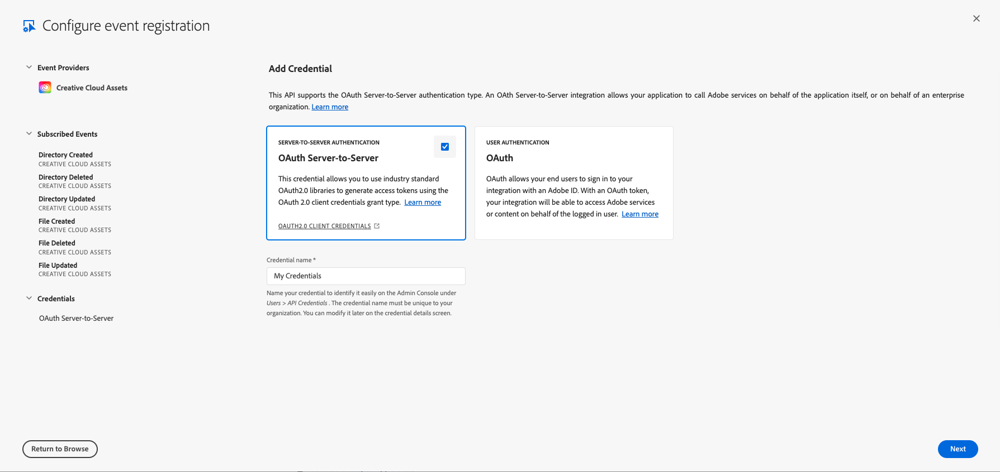

import ReceivingEventsForUsersDoc from '../../../common/receiving-events-for-users-doc.md'

# Asset Events Configuration

To configure Asset Events, refer to [Add Events](https://developer.adobe.com/developer-console/docs/guides/services/services-add-event), keeping in mind the following amendments to the **Add Events** and **Credentials** sections:

## Add Events Section

When you get to the step about the _Add events_ dialog, refer to [Asset Events Providers](asset-events-providers.md) for additional guidance.

## Credentials Section

For Asset Events providers, you have the option of selecting which type of authentication to use, either **Server-to-Server Authentication (OAuth Server-to-Server)** or **User Authentication (OAuth)**.

### Server-to-Server Authentication (OAuth Server-to-Server)

OAuth server-to-server authentication credentials allow your application to generate access tokens and make API calls on behalf of your application itself.

Note that your application using a Service Account integration will be receiving all events generated within your organization. As a consequence your application will be responsible to not disclose information about assets, libraries, and cloud documents to users who are not intended to know about those assets. In particular, your application must ensure that no user sees events refering to assets, libraries, and cloud documents to which the user does not have at least read access.

### User Authentication (OAuth)

OAuth allows your end users to sign in to your integration with an Adobe ID. With an OAuth token, your integration will be able to access Adobe services or content on behalf of the logged-in user.

Note that your application using end user based integration will be receiving events generated within your organization personalized to the users using your application. That is all events will be tagged with the user ID of the intended recipient user and only events for assets, libraries, and cloud documents (read) accessible to the recipient user will be forwarded to your application. As a consequence your application will be responsible to only make events available to the user tagged in the event itself.

<ReceivingEventsForUsersDoc/>
