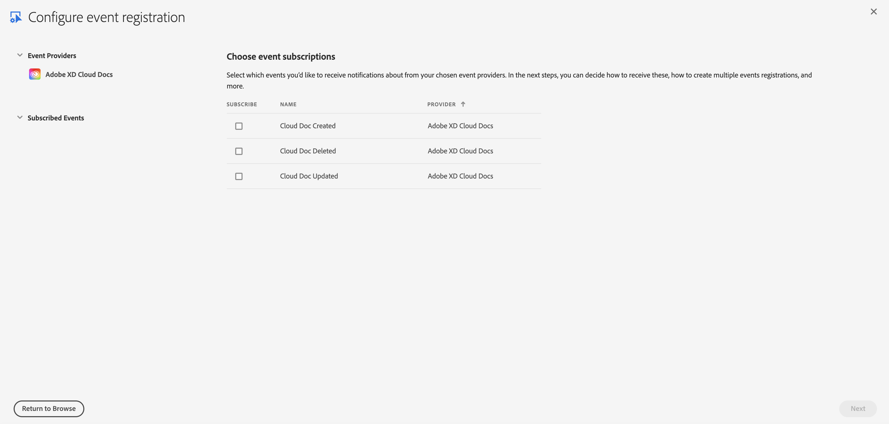

# Asset Events Providers

There are several different Asset Events providers (i.e., Adobe applications that generate events). Once you have created a project at https://developer.adobe.com/console and selected `Add Event`, you can select which events you want to receive from which providers. Below are all the event providers, along with their respective events.

**Note**: Regardless of which provider is generating events, the structure and [properties](asset-events-properties.md) of the events remains consistent. 

## Selecting an Event Provider

For [files](asset-events-glossary.md#file) and [directories](asset-events-glossary.md#directory), Creative Cloud Assets is the event provider 

For cloud docs, here is the set of event providers:

- Creative Cloud Libraries
- Adobe Illustrator Cloud Docs
- Adobe Photoshop Cloud Docs
- Adobe XD Cloud Docs

Once you have selected a provider, you can subscribe to its respective events.

## Creative Cloud Assets (Files and Directories)

For Creative Cloud Assets, you can subscribe to the following events:

- Directory Created
- Directory Deleted
- Directory Updated
- File Created
- File Deleted
- File Updated

## Creative Cloud Libraries

For Creative Cloud Libraries, you can subscribe to the following events:

- Creative Cloud Library Created
- Creative Cloud Library Deleted
- Creative Cloud Library Updated 

## Adobe Illustrator Cloud Docs

For Adobe Illustrator Cloud Docs, you can subscribe to the following events:

- Cloud Doc Created
- Cloud Doc Deleted
- Cloud Doc Updated

## Adobe Photoshop Cloud Docs

For Adobe Photoshop Cloud Docs, you can subscribe to the following events:

- Cloud Doc Created
- Cloud Doc Deleted
- Cloud Doc Updated 

## Adobe XD Cloud Docs

For Adobe XD Cloud Docs, you can subscribe to the following events:

- Cloud Doc Created
- Cloud Doc Deleted
- Cloud Doc Updated 

