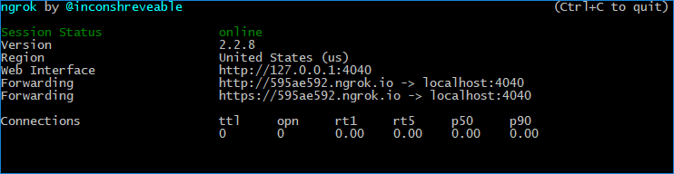

# Setting Up Creative Cloud Asset Events on Adobe I/O Events (Deprecated)

These instructions describe how to set up Creative Cloud Asset events using Adobe I/O Events. You can use Adobe I/O for notification of CC Asset events. 

## Introduction
Creative Cloud Assets provides a simple set of events to which you can subscribe: 
- **asset-updated:** Triggers when an asset is changed or modified.
- **asset-created:** Triggers when a new asset is uploaded to Creative Cloud, or when an asset is _copied_ to a new folder (not when an asset is merely moved).
- **asset-deleted:** Triggers when an asset is _permanently_ deleted from Creative Cloud. Merely archiving an asset does not trigger the event. 
- **directory-created:** Triggers when a new folder is created in Creative Cloud.

There are no events for the following activities:
- Moving a file from one folder in Creative Cloud to another.
- Renaming a file. This is because assets are tracked in Creative Cloud by GUIDs, and the GUID doesn&rsquo;t change when the file is renamed. Creative Cloud recognizes that the asset hasn&rsquo;t changed, and can still find the asset by the same GUID. Any URL paths you create to that file, however, would change, since they do include the filename.

## Access events
Unlike other Cloud Platform event providers, Creative Cloud Assets does not require an enterprise account, or administrative status, to gain access for creating integrations or receiving events. However, the integrations you create will still need to authenticate the same way any other Adobe integrations do. Consider what kind of authentication your integration needs before you start, and follow the correct procedure (see [Adobe Authentication](/apis/cloudplatform/console/authentication/gettingstarted.html)) to get the access rights your integration needs.

## Create a webhook

In order to receive events you first need to create a webhook. For more on webhooks, see [Adobe I/O Events Webhooks](../index.md). The webhook you ultimately use should be part of the app you develop. For now, however, it&rsquo;s easy to set up a simple webhook to test your integration&rsquo;s connection with Adobe Events. 

Several tools exist on the web that can be used for this purpose: [ngrok](https://ngrok.com/), [Postman](https://www.getpostman.com/), and more. For this example, use ngrok. Ngrok is a utility for enabling secure introspectable tunnels to your localhost. With ngrok, you can securely expose a local web server to the internet and run your own personal web services from your own machine, safely encrypted behind your local NAT or firewall.

First, configure a local web server. There are a number of choices, depending on whether you're Windows, Mac, or Linux.

Next, you'll need a simple function to respond to the Adobe I/O challenge. Try this JavaScript:

```javascript
var express = require('express');
var Webtask = require('webtask-tools');
var bodyParser = require('body-parser');
var app = express();

app.use(bodyParser.json());
app.get('/webhook', function (req, res) {
var result = "No challenge";
if (req.query["challenge"]){
    result = req.query["challenge"]
    console.log("got challenge: " + req.query["challenge"]);
} else {
    console.log("no challenge")
}
res.status(200).send(result)
});

app.post('/webhook', function (req, res) { 
console.log(req.body)
res.writeHead(200, { 'Content-Type': 'application/text' });
res.end("pong");
});

module.exports = Webtask.fromExpress(app);
```

This simple webhook is designed merely to do what Adobe Events requires: handle an HTTPS GET request containing a `challenge` parameter by returning the value of the challenge parameter itself. 

Now you&rsquo;re ready to configure ngrok to serve your webhook over the internet:

1. Go to `https://ngrok.com/`. Download and install the application. Add the ngrok folder to your PATH, so you can invoke it from any command prompt.

2. Open a command-line window and type `ngrok http 80`; or whichever port you wish to monitor.

    

    In the ngrok UI, you can see the URL for viewing the ngrok logs, labeled "Web Interface", plus the public-facing URLs ngrok generates to forward HTTP and HTTPS traffic to your localhost. You can use either of those public-facing URLs to register your Webhook with Adobe I/O, so long as your application is configured to respond on your localhost accordingly. Once your testing phase is complete, you can replace the ngrok URL in your Adobe I/O integration with the public URL for your deployed app.

## Create a project in Adobe Developer Console

Integrations are created as part of a project within Adobe Developer Console. This requires you to have access to [Console](https://www.adobe.com/go/devs_console_ui) in order to create a project, add events to your project, configure the events, and register your webhook.

For detailed instructions on completing these steps, please begin by reading the [Adobe Developer Console Getting Started guide](https://www.adobe.com/go/devs_console_getting_started). 

When you are ready to [add events to your project](https://www.adobe.io/apis/experienceplatform/console/docs.html#!AdobeDocs/adobeio-console/master/services-add-event.md) follow the steps provided, making sure to select **Creative Cloud Assets**.

In addition to selecting the events you would like to register for, you will be required to specify your webhook URL. Do this by pasting in the URL you got from ngrok with the path under localhost to your webhook file, adding `/webhook` to the end. For example, `https://595ae592.ngrok.io/webhook`. 

Once you have completed the event registration, you will be taken to the *Registration Details* page where you will be able to see the details of your new registration. 

For more information, read the [Introduction to Webhooks](../index.md). 

*The following image shows an example of an event registration using Adobe XD. Results for Creative Cloud Assets will be similar.*


## Receive events

Your integration is now set up, and your webhook is in place; but to receive events, your integration needs to connect to its event provider, Creative Cloud Assets, on behalf of its user. This requires authentication; see [OAuth Integration](/authentication/auth-methods.html#!AdobeDocs/adobeio-auth/master/AuthenticationOverview/OAuthIntegration.md). 

For authentication setup, you&rsquo;ll need to add the Creative Cloud Libraries as a service, and then use the [OAuth 2.0 protocol](/authentication/auth-methods.html#!AdobeDocs/adobeio-auth/master/OAuth/OAuth.md) to build an interface for your user to log into your app and give your app authorization to access Creative Cloud Assets. 

To add Creative Cloud Libraries as a service, you will need to follow the steps for [adding an API that uses OAuth to a Console project](/apis/experienceplatform/console/docs.html#!AdobeDocs/adobeio-console/master/services-add-api-oauth.md), being sure to select **Creative Cloud Libraries** from the list of available APIs.
 
Adobe OAuth 2.0 lets you build into your application a login function that takes the user&rsquo;s Adobe ID and lets the user give your app permission to access the assets and Adobe Solutions to which they&rsquo;re subscribed. Once your app is authenticated, Adobe will begin to push events to your integration&rsquo;s webhook via HTTP POST messages.

## Adobe Consent API

To authenticate your app to receive your users&rsquo; events, you&rsquo;ll need to direct your users to the Adobe Consent API:

`https://ims-na1.adobelogin.com/ims/authorize/v1?response_type=code&client_id=`_`api_key_from_console`_`&scope=AdobeID%2Copenid%2Ccreative_sdk`

You will need to replace api_key_from_console with the Client ID value provided on the *Credentials* tab of the *Registration Details* in your Console project.

A good utility for testing this process is the [Adobe IMS OAuth Playground](https://runtime.adobe.io/api/v1/web/io-solutions/adobe-oauth-playground/oauth.html). Follow instructions in the FAQ.
