# Publish your own Custom Events with Adobe Commerce

These instruction describe how to set up and get started with Adobe I/O Events for Adobe Commerce. You can use Adobe I/O for sending Adobe Commerce user driven events.

## Introduction

This document will describe all steps necessary to setup, emit and receive events. Firstly, the event provdire will be set up, then we will trigger events from Adobe Commerce and finally an event registration will be created.

## Requirements

You will need for this tutorial:
- an Adobe Commerce instance
- an IMS Organization with AppBuilder

## Setting up the Event Provider

### Setup the Adobe I/O Events

In this step, we will create a project. Within that project we will add an API connection to Adobe I/O Events and setup JWT Credentials.

See [Getting Started with Adobe I/O Events](/src/pages/index.md)

For basic instructions for this use case, starting from [console.adobe.io](/console/):

*When prompted, click the designated button to proceed*

- Select `Create new project`

  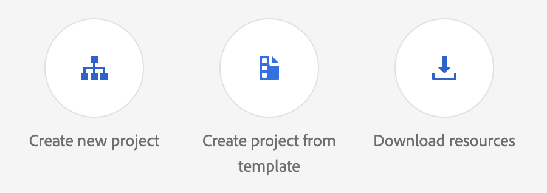

- Select `Add API`

  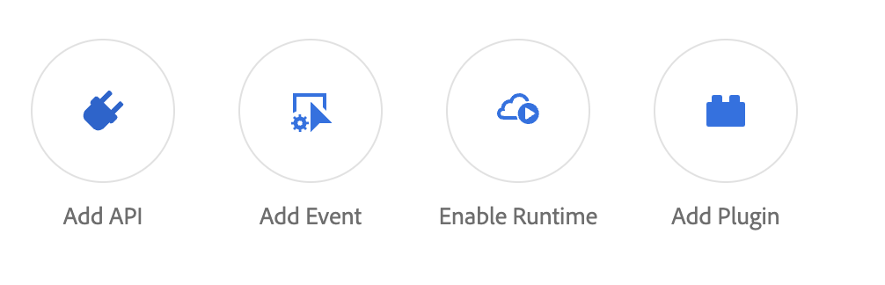

- Filter by `Adobe Services`
- Select `I/O Management API`

  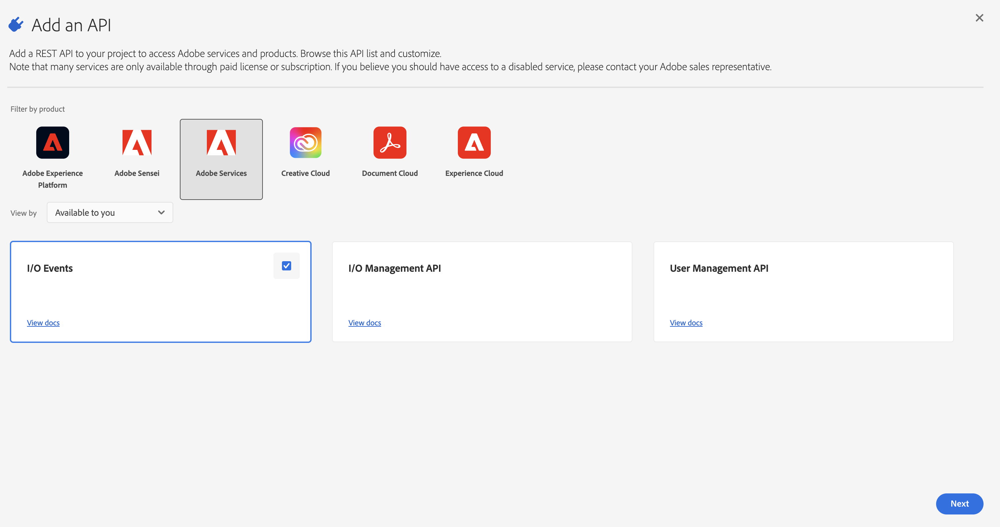

- Set up JWT Credentials (either generate a new key pair or upload a public key). Make sure to keep the private key from that step, we will need it in the following.

  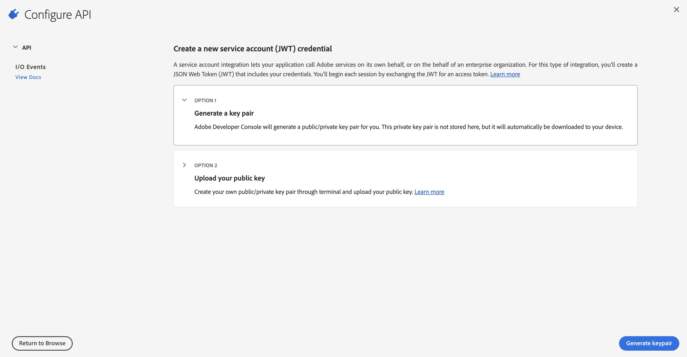

- Set up API Integration

  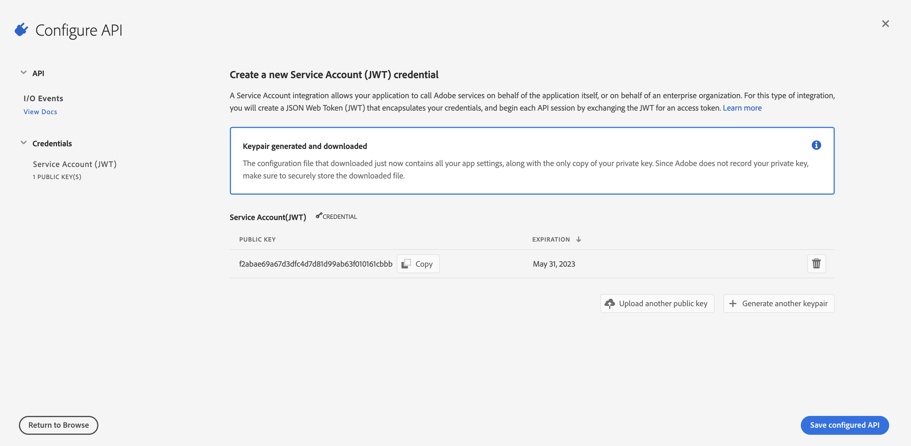

#### Download your workspace configuration

- Select `Project Overview`
- Click `Download` to download the workspace configuration file.
  
  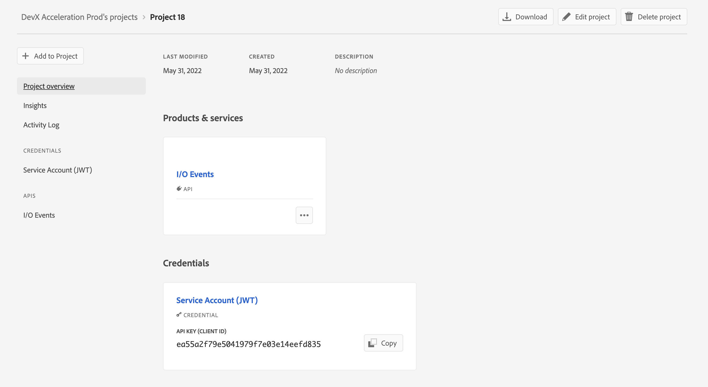

### Setup Adobe Commerce

From the previous step will we require the following files:
- the workspace configuration, ours is `691FuchsiaReptile-343284-Stage.json` yours will match your Runtime namespace name.
- the private key from your service account, ours is `private.key`

#### Configure Adobe Commerce

You will need to create three environment variables containing:
- Adobe Console Workspace Configuration
- Technical Account Private Key
- Intance ID

*Commands to configure*

    magento-cloud variable:set env:ADOBE_IO_CONSOLE_CONFIGURATION "`cat 691FuchsiaReptile-343284-Stage.json`"
    magento-cloud variable:set env:ADOBE_IO_TECHACCT_PRIVATE_KEY "`cat config/private.key`"
    magento-cloud variable:set env:ADOBE_IO_EVENTS_INSTANCE_ID "commerce-343284-instance-stage"

#### Install the Adobe I/O Event module

In your Adobe Commerce instead run `composer require magento/module-adobe-io-events`

#### Declare your Events

Place a file with the following configuration in `app/etc/event-types.json`:

*Events Configuration*

    {
        "provider": {
            "label": "My Commerce Instance",
            "description": "Provides out-of-process extensibility for Adobe Commerce"
        },
        "events": [
            {
                "event_code": "com.adobe.commerce.product.updated",
                "label": "Product updated",
                "description": "Product updated"
            },
            {
                "event_code": "com.adobe.commerce.product.created",
                "label": "Product created",
                "description": "Product created"
            }
        ]
    }

#### Create Event Provider

Now we are ready to create the event provider.

*Create Event Provider*

    magento-cloud ssh bin/magento events:create-event-provider
    No event provider found in app/etc/env.php, a new event provider will be created
    A new event provider has been created. Please run the following command: 
	magento-cloud variable:set env:ADOBE_IO_EVENTS_PROVIDER_ID 'b2e56b46-fd29-4a1e-a611-8d29c7deea35'
    Connection to ssh.us-5.magento.cloud closed.

#### Synchronize the Event Metadata

*Synchronize Event Metadata*

    magento-cloud ssh bin/magento events:sync-events-metadata

## Sending some custom events

Let's create a new custom module in `app/code/MyCorp/CustomEvents`.

We will start by the registration file in `app/code/MyCorp/CustomEvents/registration.php`

    <?php

    use Magento\Framework\Component\ComponentRegistrar;

    ComponentRegistrar::register(
        ComponentRegistrar::MODULE,
        'MyCorp_CustomEvents',
        __DIR__
    );

Then we will create the `module.xml` file at `app/code/MyCorp/CustomEvents/etc/module.xml`:

    <?xml version="1.0"?>
    <config xmlns:xsi="http://www.w3.org/2001/XMLSchema-instance"
            xsi:noNamespaceSchemaLocation="urn:magento:framework:Module/etc/module.xsd">
        <module name="Devex_ProductCreated" setup_version="0.1.0">
            <sequence>
                <module name="Magento_AdobeIms"/>
            </sequence>
        </module>
    </config>

We will then build minimal logic to send the events in `app/code/MyCorp/CustomEvents/Observer/ProductUpdateObserver.php`

    <?php

    namespace Devex\ProductCreated\Observer;

    use Magento\AdobeIoEvents\Model\IOEventsAPIClient;
    use Magento\Catalog\Model\Product;
    use Magento\Framework\Event\Observer;
    use Magento\Framework\Event\ObserverInterface;
    use Magento\Framework\Serialize\Serializer\Json;

    class ProductNewObserver implements ObserverInterface
    {
        /**
        * @var IOEventsAPIClient
        */
        private IOEventsAPIClient $IOEventsAPIClient;

        /**
        * @var Json
        */
        private Json $json;

        /**
        * @param IOEventsAPIClient $IOEventsAPIClient
        * @param Json $json
        */
        public function __construct(IOEventsAPIClient $IOEventsAPIClient, Json $json)
        {
            $this->IOEventsAPIClient = $IOEventsAPIClient;
            $this->json = $json;
        }

        public function execute(Observer $observer)
        {
            /** @var Product $product */
            $product = $observer->getData('product');
            $data = $product->getData();

            if ($product->isObjectNew()) {
                $this->IOEventsAPIClient->publishEvent("com.adobe.commerce.product.created", $data);
            } else {
                $this->IOEventsAPIClient->publishEvent("com.adobe.commerce.product.updated", $data);
            }
        }
    }

Then we will finish by hooking our observer to Adobe Commerce internal events in `app/code/MyCorp/CustomEvents/etc/events.xml`

    <?xml version="1.0"?>
    <config xmlns:xsi="http://www.w3.org/2001/XMLSchema-instance" xsi:noNamespaceSchemaLocation="urn:magento:framework:Event/etc/events.xsd">
        <event name="catalog_product_save_after">
            <observer name="product_new_observer" instance="MyCorp\CustomEvents\Observer\ProductUpdateObserver" />
        </event>
    </config>

## Setup your first Event Registration

In this step we will create a basic Journal event registration and send events to it.

### Create a webhook

We will now create a webhook to be able to listen to the events Commerce publishes.

- Open a new tab with this url https://io-webhook.herokuapp.com/

- Choose a name for your webhook, by example `io-eventing-commerce`

  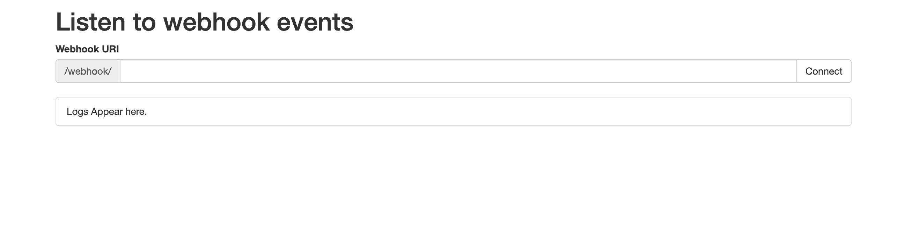

- Select `Connect`

  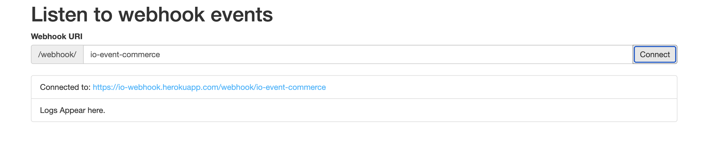

Now we will be able to inspect all messages sent to our webhook.

### Create a new AppBuilder project

- Select `Create project from template`, this will ensure we can create an AppBuilder project.

  

- Select `AppBuilder`

    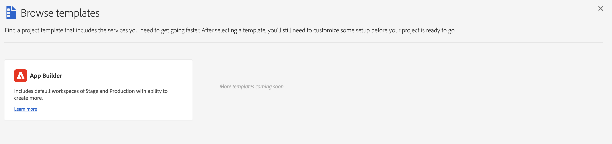

    - Provide a project name and and an App name
    - Optionally you can create more Workspaces. By default Production and Stage are created.
    - Make sure `Include Runtime each Workspace`

    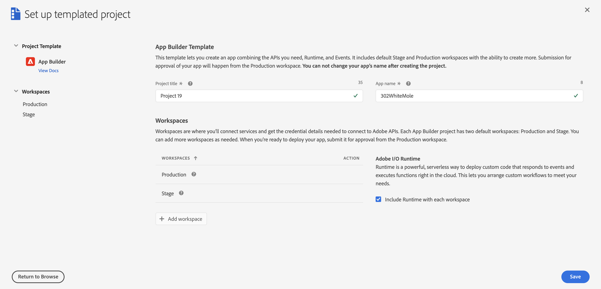

- Welcome to your new Project, select the `Stage` workspace

  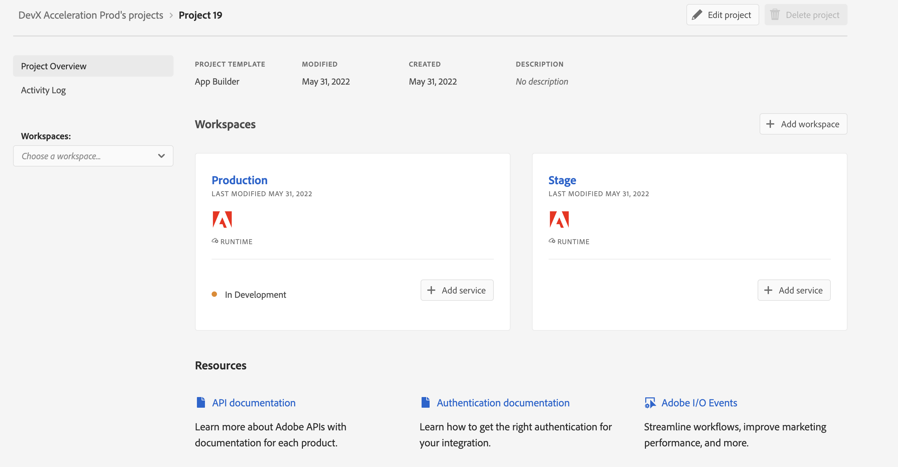

- Select `Add Service` and the `Event`

  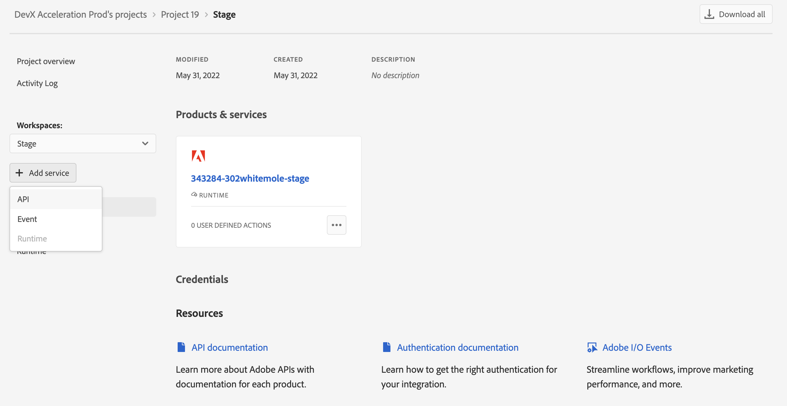

- Scroll until you find your event provider `My Commerce Instance`

  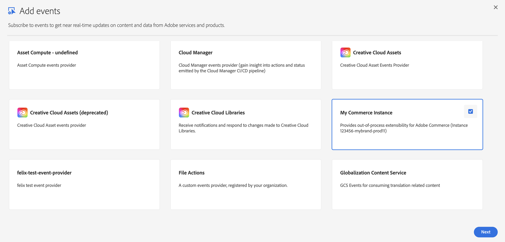

- Select both event suscription `Product Created` and `Product Updated`

  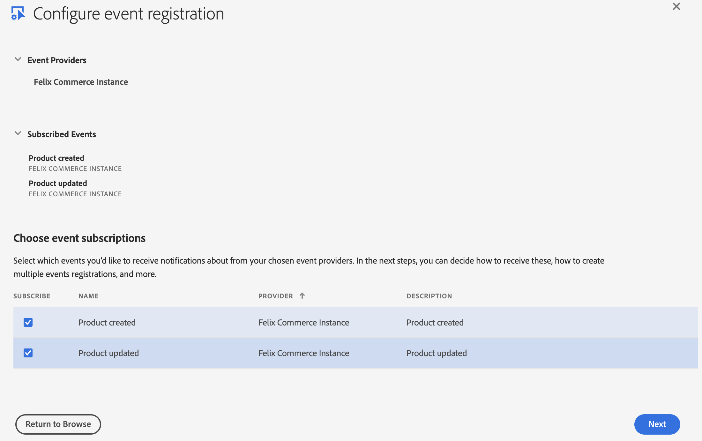

- Set up JWT Credentials (either generate a new key pair or upload a public key).

  

- Select `Option 1 Webhook` and enter the URL we were given in the previous step. In our case : https://io-webhook.herokuapp.com/webhook/io-event-commerce

  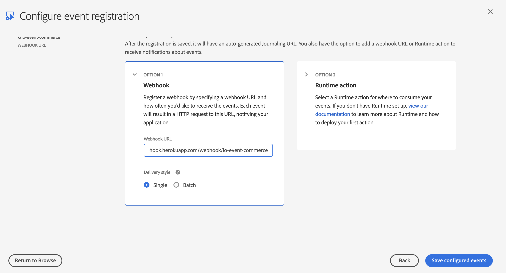

- Select `Save configured events`

  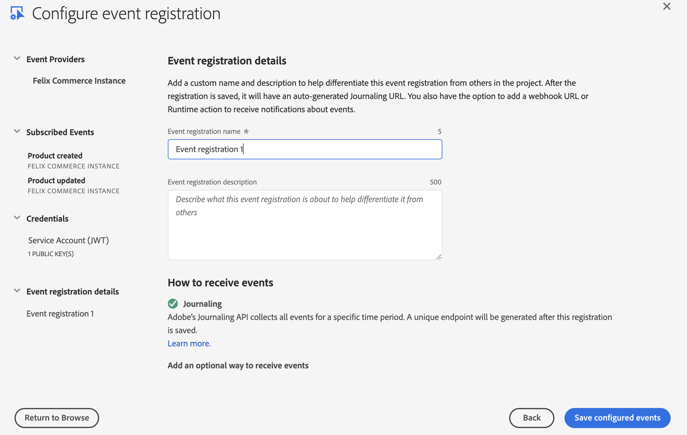

### Sending and receiving events

- Login to your Adobe Commerce Admin page

- Select `Catalog`, then Select `Products`

  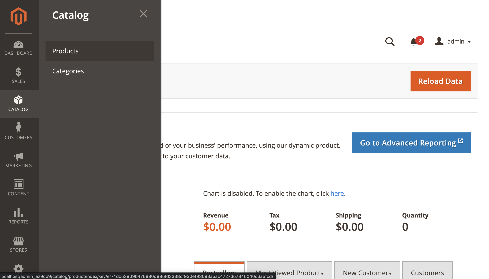
 
- Select any product existing

  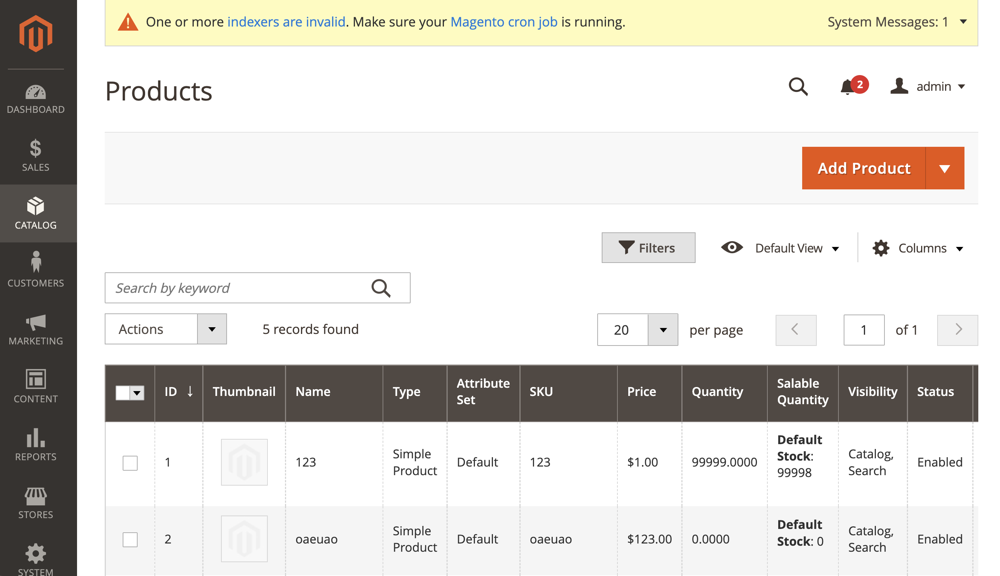

- Click Save

  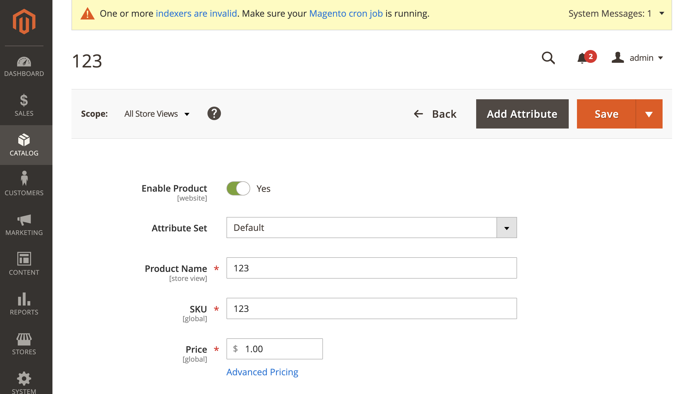

- Event has been received 

  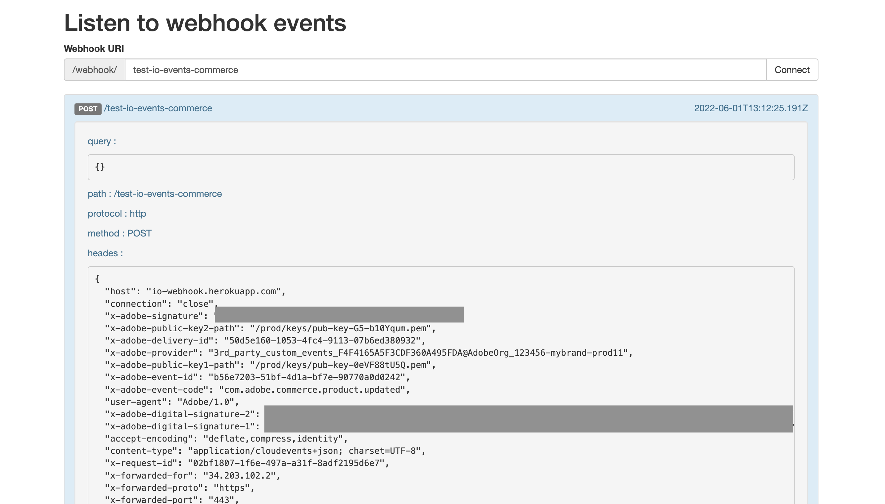
