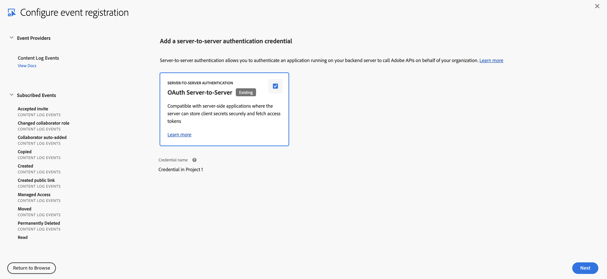
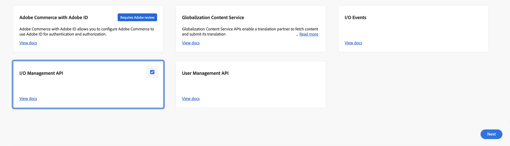

# Setting up Content Log Events Streaming with Adobe I/O Events

These instructions describe how to set up and get started using Adobe I/O Events for streaming content log events. You can use Adobe I/O for streaming Content Logs that captures events when end users interact with the assets using actions such as create/update/delete.

## Introduction

Content Logs events provide all details of end user interactions with the assets. This is ideal for enterprises that require automated compliance tracking, security analytics, or integration into existing operational workflows.

It allows real-time ingestion into security and monitoring platforms such as Splunk, Microsoft Sentinel, Sumo Logic, and other SIEM or data analytics tools.

## Setup Adobe I/O

See [Getting Started with Adobe I/O Events](../../../index.md)

For basic instructions for this use case, starting from [developer.adobe.com/console](https://developer.adobe.com/console/):

- Select `Create new project`

  

- Select `Add event`

  

- Filter by `Creative Cloud`
  

- Select `Select Content Log Events and click Next`

  

- Subscribe to the content log event types of your choosing and click `Next`

  

- Set up OAuth Server-to-Server Credentials and click `Next`
    - The OAuth Server-to-Server credential relies on the OAuth 2.0 client_credentials grant type to generate access tokens.

  

- Set up Event Registration and click `Next`
    - Provide a name and description for this event subscription

  

- Configure Event Registration and click `Save configured events`

  

    - Journaling is selected by default which is used for Streaming.
    - Optionally choose whether to enable Webhook or Runtime action
        - Enable Webhook
            - We recommend batch over single webhooks
            - For `Webhook URL` a public https endpoint must be provided
            - The endpoint must be able to handle get and post requests
            - The get request must respond with the challenge query if it exists
            - The post request must respond that it received the message or the webhook will re-attempt to send several times before giving up and automatically disabling the webhook sends
        - Enable Runtime action
            - [See Setting up your Runtime Environment](https://developer.adobe.com/runtime/docs/guides/getting-started/)
            - Select a non-web runtime action to process events from your namespace.
- After Saving we need to add I/O Management API as a requirement to project
- Select `Add API to Project`

  

- Filter by `Adobe Services`

  

- Select `I/O Management API and click Next`

  

- Select existing OAuth Server-to-Server Authentication and click `Save configured API`

  

- Verify Streaming of Content Logs Working. Click Event Registration

  

- Go to Event Browser

  

- Click `Go to End`

  

- Verify Response status 204

  

- Open event registration in new tab

  

- Click on send sample event say Updated

  

- Go to Event Browser Tab. Click on `Go To Next Batch`

  

- Verify Response Status 200 with content log of the updated sample event

  
  


## Programmatic Setup for Consumption of Content Logs Stream

Once the above setup is complete and validated, we can continuously consume the stream of content logs from Adobe I/O events as and when operations are performed on assets.

- Use the exposed event registration endpoint for the project.

  

- Auth token needs to be passed in the request. Which can be generated using the cURL and all credentials under Oauth of the project.

  

- Sample cURL for consuming the events stream

  

- Once we invoke the API, response headers has `rel="next"` link which can be used to fetch more events.

  

- Sample cURL using the next link from headers.

  

[Using Journaling API](../../../guides/api/journaling-api.md) has more details on how to use the Journaling API to consume the stream of IO events.

## Event Data Structure

Content Log Events are structured in JSON format using the [CloudEvents](https://cloudevents.io/) spec

*Example Event*

````json
{
    "specversion": "1.0",
    "id": "6b810378-0348-5931-8168-868910a71c9a",
    "source": "urn:aio_provider_metadata:content_logs",
    "type": "com.adobe.acp.contentlogs.read",
    "datacontenttype": "application/json",
    "time": "2025-06-30T17:37:44.744110791Z",
    "eventid": "1abfc513-da4b-45ad-91ed-439ba7273b45",
    "recipientclientid": "cd549c3e50314c8fb345f27e8be27dc2",
    "data": {
      "Action": "Read",
      "Date": "2025-06-30T17:37:44.690Z",
      "User Name": "Test User",
      "User Email": "testUser@adobe.com",
      "Item Path": "[Test User] /cloud-content/testDir/testFile.jpg",
      "Item Version": "0",
      "Item Name": "testFile.jpg",
      "Item ID": "urn:aaid:sc:US:70b007f6-13ef-5fa8-a660-4e1da11d97b4",
      "Item Type": "File",
      "IP Address": "13.114.46.33",
      "Created": "2025-06-30T17:37:44.502Z",
      "Last Modified": "2025-06-30T17:37:44.502Z"
    }
}

````
[Content Logs Helpx](https://helpx.adobe.com/in/enterprise/using/content-logs.html) has more details on content log events, different actions supported and the fields present in the payload. 