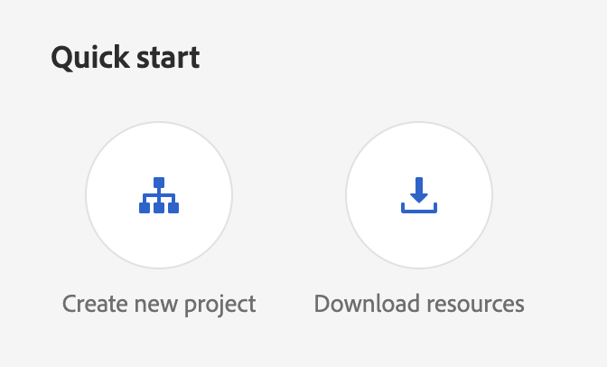
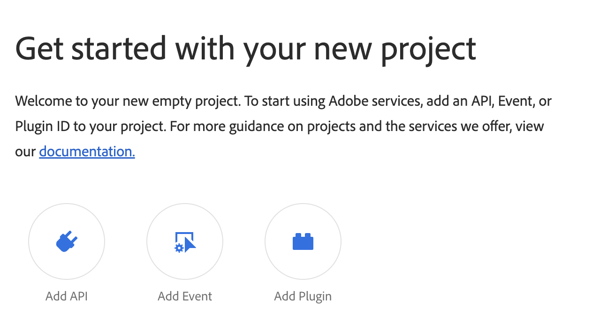
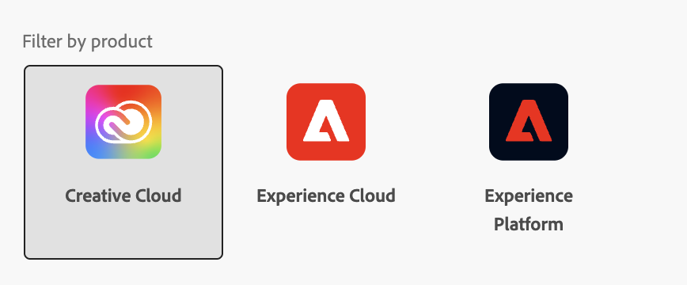
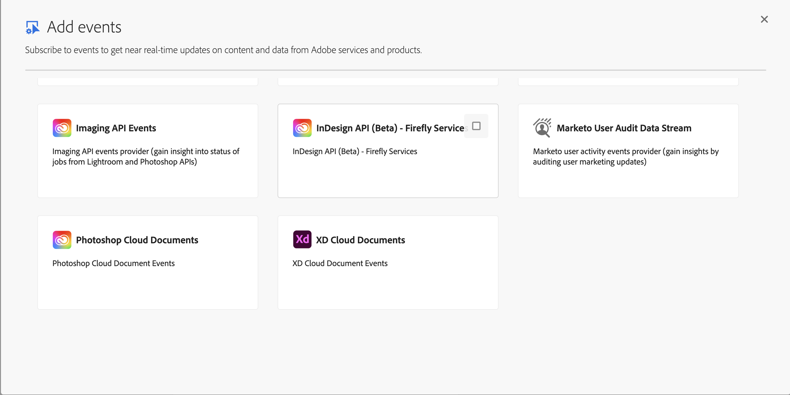
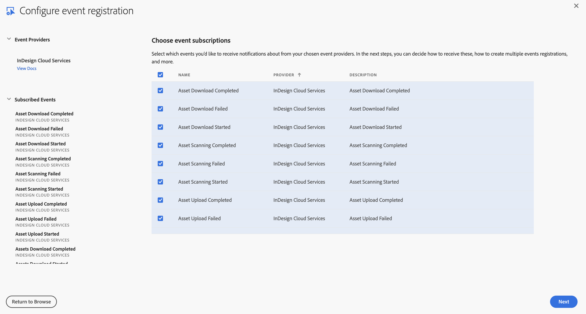
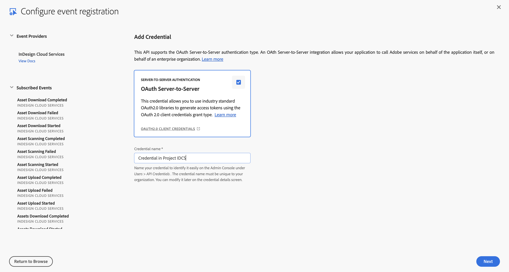
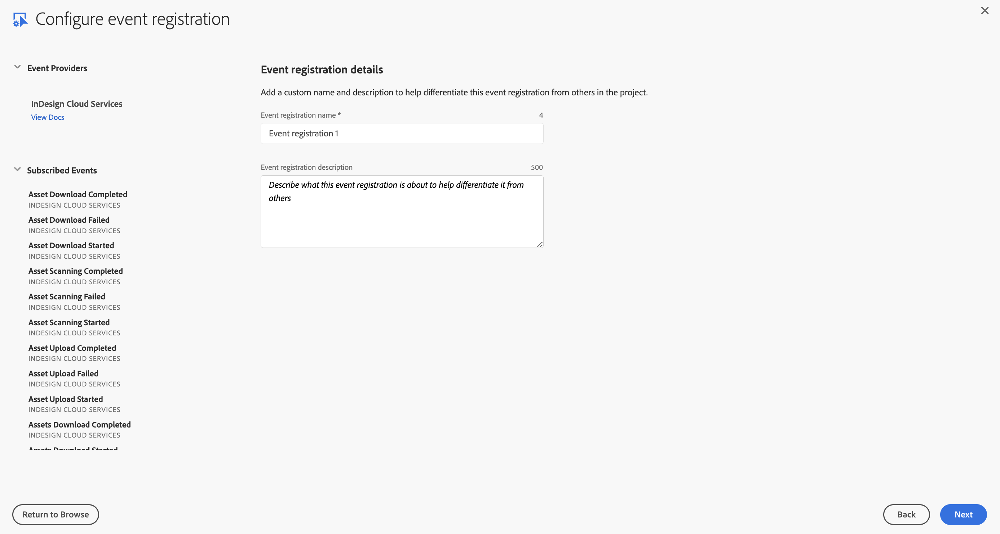
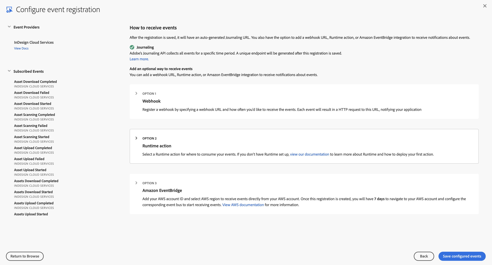
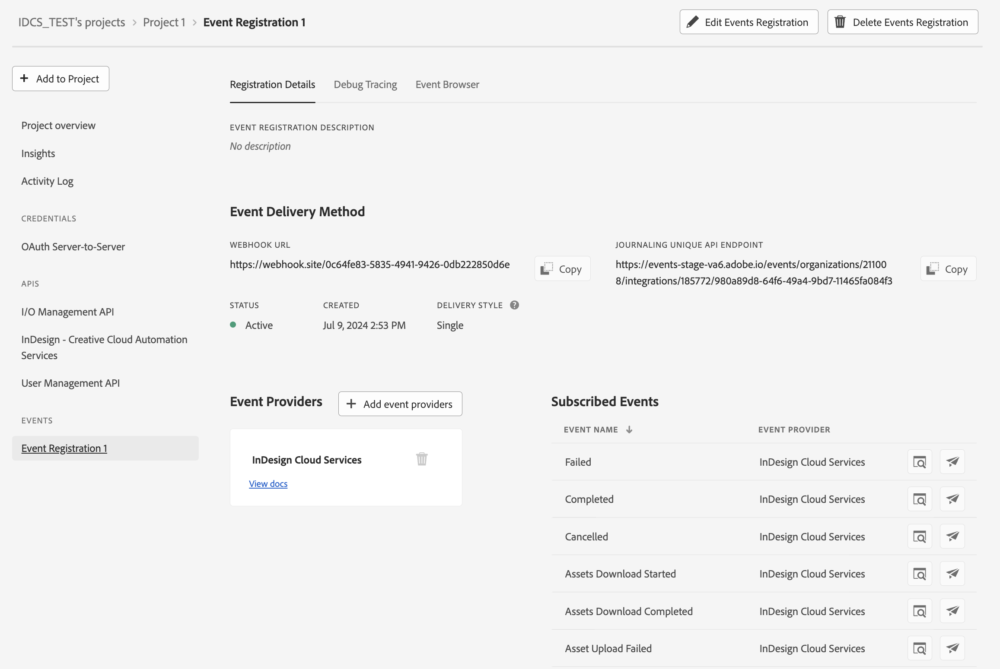

# Setting up InDesign Cloud Services User Events Stream with Adobe I/O Events

These instructions describe how to set up and get started using Adobe I/O Events for IDCS user driven job processing events. You can use Adobe I/O for streaming IDCS job processing events such as the downloading of assets, engine processing, uploading of assets etc.

## Introduction

IDCS events provide all the job processing details, similar to those shown in the sync status calls of InDesign Cloud Services APIs. However, IDCS events are more comprehensive and real-time, unlike the sync status calls which only include "not-started," "running," "completed," and "failed" statuses.

## Setup events browsing/listning in IDCS

InDesign cloud services is currently a Beta Product and thus cannot be enabled without a PreRelease agreement. After a PreRelease agreement is in place, you should be able to see InDesign cloud services events tile in developer console.

## Setup Adobe I/O

See [Getting Started with Adobe I/O Events](/src/pages/index.md)

For basic instructions for this use case, starting from [console.adobe.io](/console/):

*When prompted, click the designated button to proceed*

- Select `Create new project`

  

- Select `Add event`

  

- Filter by `Creative Cloud`
  

- Select `Select InDesign Cloud Services`

  

- Subscribe to the user driven change events of your choosing

  

- Set up OAuth Server-to-Server Credentials.
  - The OAuth Server-to-Server credential relies on the OAuth 2.0 client_credentials grant type to generate access tokens.

  

- Set up Event Registration
  - Provide a name and description for this event subscription

  
  
- Configure Event Registration

  

  - Optionally choose whether to enable Webhook or Runtime action
    - Enable Webhook
      - We recommend batch over single webhooks
      - For `Webhook URL` a public https endpoint must be provided
      - The endpoint must be able to handle get and post requests
      - The get request must respond with the challenge query if it exists
      - The post request must respond that it received the message or the webhook will re-attempt to send several times before giving up and automatically disabling the webhook sends
    - Enable Runtime action
      - [See Setting up your Runtime Environment](/runtime/docs/guides/getting-started/)
      - Select a pre-made runtime action/runtime namespace
- After Saving

  
  
  - Verify that the Status is `Active`
  - If Webhook was selected, verify that it successfully passed the challenge without errors

<DeveloperGuidelines/>

### Event Data Structure

*We are still finalizing the data structure as we prepare for Beta release. While we don't expect any major changes, there may be some minor modifications.*

Events are structured in JSON format using the [CloudEvents](https://cloudevents.io/) spec

*Example Event (batch)*

````json

{
  "events": [
    {
      "position": "tuna:a1db5e65-7863-4110-bd45-2c4d2076871b.salmon:e1a7e7e0-39e2-453f-8c72-d70725020941.420c1092-a7fd-4132-9ee8-de7a41c01bcd.3.1720631450.o9y0pbhmarc-id2dxvat",
      "event": {
        "data": {
          "key": "ec1b9eaf-a0b2-4bcf-9f6d-bd394e2586d7",
          "source": "indesign",
          "value": {
            "jobId": "8b524c70-6779-47f1-ac2a-ce93c23b3f5f",
            "eventId": "ec1b9eaf-a0b2-4bcf-9f6d-bd394e2586d7",
            "state": "QUEUED",
            "timestamp": 1720631447943
          }
        },
        "id": "e414ef62-92f7-48f9-841b-b22d38f6141e",
        "source": "urn:uuid:5c8f2d48-a2a7-4d0e-bb49-aabf9a72bd1e",
        "specversion": "1.0",
        "type": "QUEUED",
        "datacontenttype": "application/json",
        "time": "2024-07-10T17:10:48.985Z",
        "event_id": "420c1092-a7fd-4132-9ee8-de7a41c01bcd",
        "recipient_client_id": "7af7ab96045640b5a6e4724810145eb9"
      }
    },
    {
      "position": "tuna:a1db5e65-7863-4110-bd45-2c4d2076871b.salmon:e1a7e7e0-39e2-453f-8c72-d70725020941.d1c47805-a971-4685-8e63-863ba4ecd325.2.1720631450.ckqreqbzok2_pfpln03d",
      "event": {
        "data": {
          "key": "f1dbc354-3878-4273-8a9e-c2a6b57543cc",
          "source": "indesign",
          "value": {
            "jobId": "8b524c70-6779-47f1-ac2a-ce93c23b3f5f",
            "eventId": "f1dbc354-3878-4273-8a9e-c2a6b57543cc",
            "state": "ASSETS_DOWNLOAD_STARTED",
            "timestamp": 1720631448826
          }
        },
        "id": "70b8efcb-38f2-4781-84ee-036013d3f5bc",
        "source": "urn:uuid:5c8f2d48-a2a7-4d0e-bb49-aabf9a72bd1e",
        "specversion": "1.0",
        "type": "ASSETS_DOWNLOAD_STARTED",
        "datacontenttype": "application/json",
        "time": "2024-07-10T17:10:49.165Z",
        "event_id": "d1c47805-a971-4685-8e63-863ba4ecd325",
        "recipient_client_id": "7af7ab96045640b5a6e4724810145eb9"
      }
    },
    {
      "position": "tuna:a1db5e65-7863-4110-bd45-2c4d2076871b.salmon:e1a7e7e0-39e2-453f-8c72-d70725020941.1bf6e136-967f-47c3-a64e-afe90f6656d0.1.1720631450.krwtyp81wqfhdbmbhpqa",
      "event": {
        "data": {
          "key": "2196c45f-8721-4587-8136-b92147a5efa6",
          "source": "indesign",
          "value": {
            "jobId": "8b524c70-6779-47f1-ac2a-ce93c23b3f5f",
            "eventId": "2196c45f-8721-4587-8136-b92147a5efa6",
            "state": "ASSET_DOWNLOAD_STARTED",
            "timestamp": 1720631448998,
            "data": {
              "destination": "b4adb91c-806a-4b80-92b9-e958a6bb1f13",
              "source": {
                "type": "CAPABILITY_BUNDLE",
                "url": "stage/capability-bundles/indesign/rendition/pdf/1.0.46/67a46077-7944-4100-9236-35bb739baa9b"
              }
            }
          }
        },
        "id": "740798e9-0827-4efd-a769-78b9a67c0ee8",
        "source": "urn:uuid:5c8f2d48-a2a7-4d0e-bb49-aabf9a72bd1e",
        "specversion": "1.0",
        "type": "ASSET_DOWNLOAD_STARTED",
        "datacontenttype": "application/json",
        "time": "2024-07-10T17:10:49.238Z",
        "event_id": "1bf6e136-967f-47c3-a64e-afe90f6656d0",
        "recipient_client_id": "7af7ab96045640b5a6e4724810145eb9"
      }
    }
  ],
  "_page": {
    "last": "tuna:a1db5e65-7863-4110-bd45-2c4d2076871b.salmon:e1a7e7e0-39e2-453f-8c72-d70725020941.1bf6e136-967f-47c3-a64e-afe90f6656d0.1.1720631450.krwtyp81wqfhdbmbhpqa",
    "count": 3
  }
}
````

*Example Event (single)*

````json
{
  "events": [
    {
      "position": "tuna:e54a7fa0-eb13-4ad5-964c-5d682f03a188.salmon:3279e19f-7150-4e07-a223-795fb6c6fe8e.f60a502e-c16b-49c6-b3c1-770666a1921f.0.1720631451.o5nlq_28cmu1ajdkuhxc",
      "event": {
        "data": {
          "key": "70db1be2-cdde-4a00-bc41-5acd33db3cc7",
          "source": "indesign",
          "value": {
            "jobId": "8b524c70-6779-47f1-ac2a-ce93c23b3f5f",
            "eventId": "70db1be2-cdde-4a00-bc41-5acd33db3cc7",
            "state": "ASSET_DOWNLOAD_FAILED",
            "timestamp": 1720631449367,
            "data": {
              "destination": "doc.indd",
              "source": {
                "assetId": "urn:aaid:sc:VA6C2:6b14edb7-7acd-34ad-825e-b70c3b2569f4",
                "type": "ACP"
              }
            }
          }
        },
        "id": "7e3a89ce-d1f5-4b55-a9fc-682e3ac535e2",
        "source": "urn:uuid:5c8f2d48-a2a7-4d0e-bb49-aabf9a72bd1e",
        "specversion": "1.0",
        "type": "ASSET_DOWNLOAD_FAILED",
        "datacontenttype": "application/json",
        "time": "2024-07-10T17:10:49.509Z",
        "event_id": "f60a502e-c16b-49c6-b3c1-770666a1921f",
        "recipient_client_id": "7af7ab96045640b5a6e4724810145eb9"
      }
    }
  ],
  "_page": {
    "last": "tuna:e54a7fa0-eb13-4ad5-964c-5d682f03a188.salmon:3279e19f-7150-4e07-a223-795fb6c6fe8e.f60a502e-c16b-49c6-b3c1-770666a1921f.0.1720631451.o5nlq_28cmu1ajdkuhxc",
    "count": 1
  }
}

````

*Data Field Definitions:*

Field | Description
--- | ---
event_id | Unique UUID generated per event
id | Unique UUID generated per event
type | Type of event used for event subscription routing
source | Context in which an event happened
time | Timestamp of the completion of the action
data | Event data object
jobID | ID of the JOB in IDCS
timesamp | Time stamp in ISO 8601 format when event was triggered
state | Tells what this event represent in the sequence of JOB execution
imsOrgId | Internal Adobe organization identifier
userId | Email ID of the user in Marketo who completed the action

### Event List

*Note - This is a snapshot listing of most available events. There may be some events that don't show up or no longer exist.*

Event state | Description
--- | ---
QUEUED | The job is not yet running
ASSETS_DOWNLOAD_STARTED | Downloading has started for assets required to run this job
ASSET_DOWNLOAD_STARTED | Emmited for individual assets, once for each asset that is downloaded
ASSET_SCANNING_STARTED | Scanning the downloaded asset
ASSET_DOWNLOAD_COMPLETED | Downloading of an individual asset is comepleted
ASSET_SCANNING_COMPLETED | Scanning of an individual asset is comepleted
ASSET_DOWNLOAD_FAILED | Individual downloading of an asset has failed
ASSET_SCANNING_FAILED | Individual scanning of an asset has failed
ASSETS_DOWNLOAD_COMPLETED | Downloading of all assets is comepleted
ENGINE_PROCESSING_STARTED | The job was handed over to engine to be processed
RUNNING | Engine is still working on the job
ENGINE_PROCESSING_COMPLETED | Engine has completed the capability execution
ASSETS_UPLOAD_STARTED | Capability generated asset upload started
ASSET_UPLOAD_STARTED | Emmited for individual asset upload, once for each asset that starts uploading
ASSET_UPLOAD_COMPLETED | Capability generated asset upload comepleted
ASSET_UPLOAD_FAILED | One or more capability generated asset upload failed
ASSETS_UPLOAD_COMPLETED | All asset uploading is comepleted
COMPLETED | Job was completed
FAILED | Job was failed
<Debug/>
