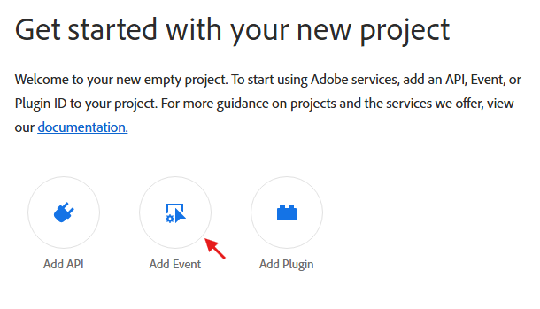

import DeveloperGuidelines from '/src/pages/guides/using/marketo/marketo-data-streams-developer-guidelines.md'
import Debug from '/src/pages/guides/using/marketo/marketo-data-streams-debug.md'

# Subscribing to the Marketo Events with Adobe I/O Events

These instructions describe how to set up and get started using Adobe I/O Events for the Marketo Data Streams.

- [Introduction](#introduction)
- [Subscribing to Marketo Events](#subscribing-to-marketo-events)
- [Developer Guidelines](#developer-guidelines)
- [Debug](#debug)

## Introduction

In order to allow for additional scalability and further programmatic automation of the Marketo platform, we have introduced the Marketo Data Streams.  The data streams are available to all CET and Performance Plus customers.  There are currently five data streams:

- [Lead Activity Data Stream](https://developers.marketo.com/data-streams/#overview_lead_activity_data_stream)
- Metrics Data Stream (Alpha)
- Notification Data Stream (Beta)
- [Observability Data Stream (Beta)](marketo-observability-data-stream-setup.md)
- [User Audit Data Stream (Beta)](marketo-user-audit-data-stream-setup.md)

At this time, only the Notification, Observability, and User Audit streams are available within Adobe I/O Events, the Lead and Metrics streams can be subscribed to via alternate paths.

Note: The Marketo Data Streams are currently in Beta

## Subscribing to Marketo Events

See the [Adobe I/O Events Docs](/src/pages/index.md)

Here are some basic getting started instructions that will be the same for each of the available Marketo data streams in I/O Events.

- Start from the [developer console](/console/):

- Select `Create new project`

  

- Select `Add event`

  

- Filter by `Experience Cloud`

You should see the three Marketo Data Streams available.  Please see the individual page for each stream for further setup instructions.

<DeveloperGuidelines/>

<Debug/>