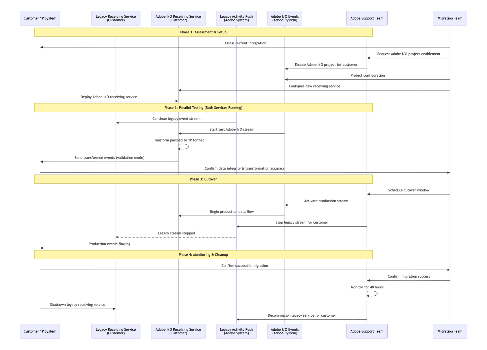

# Migrating from Legacy Lead Activity Data Stream to Adobe I/O Lead Activity Data Stream

This guide provides comprehensive instructions for migrating customers from the legacy Lead Activity Data Stream to the new Adobe I/O Lead Activity Data Stream (LADS).

<InlineAlert variant="info" slots="title, text"/>

Does this affect me?

This migration affects only a very small subset of customers who were onboarded to the Lead Activity Data Stream before it was integrated with Adobe I/O Events. If you are a newer data streams customer or already manage the Lead Activity Data Stream via I/O Events, this will have no impact on you.

We have reached out to all customers still using the legacy version of the stream to coordinate migration and will make sure to reach out again as a reminder of the action needed. Also, to clarify, this only affects the Lead Activity Data Stream, and no other Marketo Data Streams are affected.

If you think this might affect you, but are unsure, feel free to reach out to your account/support teams, and we will help confirm.

## Overview

The migration enables enhanced reliability, CloudEvents format, scalability, minimal downtime, better monitoring, and self-service capabilities.

## Migration Process Overview

The following diagram illustrates the suggested end-to-end migration process:



## Key Differences: Legacy vs Adobe I/O LADS

Understanding the differences between the legacy and new systems is critical for a successful migration:

| Aspect | Legacy Activity Push | Adobe I/O LADS | Migration Impact |
|--------|---------------------|----------------|------------------|
| **Payload Structure** | Custom Marketo format with batch wrapper | CloudEvents specification (v1.0) | Yes |
| **Authentication** | OAuth validation | Adobe I/O Digital Signature and mTLS | Yes |
| **Monitoring** | Basic delivery confirmation | Debug tracing, event browser, journaling | No |
| **Data History** | No historical data access | 7-day journaling with API access | No |

## Pre-Migration Requirements

### Adobe I/O Project Configuration

**Required Actions:**
When setting up a project to subscribe to events, there are four differnet ways to interact with those event subscriptions.

The Journaling is always available by default, which provides a pull model in which events can be pulled via API and stores up to 7 days of past events.
In addition to this, you can optionally choose one of the below options:

1. Webhooks, which can be configured to send events either as single events or batched to a webhook endpoint in near real-time with the event occurrence. 
2. Runtime, where you can set up your own custom function within Adobe that events will automatically run through near-real time. 
3. AWS Event Bridge, which enables you to route events between your own applications, third-party SaaS applications, and AWS services. For more information, refer to [Adobe Developer Docs for Event Bridge](https://developer.adobe.com/events/docs/guides/amazon-eventbridge/)

Depending on the mechanism, the following actions are required. 

- **Create Adobe I/O Project:** Set up a new project or use an existing one in [Adobe Developer Console](https://developer.adobe.com/console/)
- **Configure OAuth Server-to-Server:** Generate client credentials for authentication. The authentication will be required for Journaling.
- **Subscribe to Events:** Select specific Lead Activity events needed
- **Set Webhook URL:** Provide production-ready HTTPS endpoint to receive these events, if webhook is chosen as the subscription mechanism 

**Prerequisites:**

- Marketo Engage subscription (IMS-enabled)
- Marketo Prime and above package
- Developer or System Admin account in Adobe Experience Cloud

### Webhook Receiving Service Updates

Your webhook receiving service must be updated to handle the new payload structure.

#### Legacy Payload Structure

The legacy system sends activities in a batch wrapper format:

```json
{
    "sourceApplication": "Marketo",
    "munchkinId": "123-ABC-456",
    "messageId": "12345",
    "messageCreatedDate": "2025-09-10T15:28:49Z",
    "activities": [
        {
            "marketoGUID": "12345678-9876-a191-4567-000000054321",
            "leadId": 12345,
            "activityDate": "2025-09-10T15:26:49Z",
            "campaignId": 1234,
            "campaignName": "My Campaign Name.Form",
            "primaryAttributeValueId": 15,
            "primaryAttributeValue": "Some asset name",
            "activityTypeId": 3,
            "activityType": "Click Link",
            "attributes": [...]
        }
    ]
}
```

#### New Adobe I/O LADS Payload Structure

The new system uses the CloudEvents specification. See [Setting up Marketo Lead Activity Data Stream](https://developer.adobe.com/events/docs/guides/using/marketo/marketo-lead-activity-data-stream-setup) for more details.

```json
{
  "eventid": "4109a990-da28-4c5b-bad9-22df8903ed9a",
  "specversion": "1.0",
  "type": "com.adobe.platform.marketo.activity.standard.clicklink",
  "source": "urn:marketo_activity_stream",
  "id": "570b455e-203f-4983-91a8-5a03f597fda5",
  "time": "2024-12-17T18:43:56Z",
  "datacontenttype": "application/json",
  "data": {
    "munchkinId": "123-ABC-456",
    "leadId": "1234",
    "activityDate": "2024-12-17T18:43:56Z",
    "activityTypeId": 3,
    "activityType": "Click Link",
    "activityLogItemId": 1234567890,
    "primaryAttributeValueId": 1234,
    "primaryAttributeValue": "Attribute Value",
    "attributes": [
      {
        "name": "Link ID",
        "dataType": "object",
        "value": 1234
      },
      {
        "name": "Client IP Address",
        "dataType": "string",
        "value": "11.22.33.44"
      }
    ]
  },
  "recipientclientid": "<your_client_id>"
}
```

#### Key Mapping Changes

When updating your service, note these field mappings:

- **marketoGUID:** `activities[].marketoGUID` → `id` (top level)
- **munchkinId:** Top level → `data.munchkinId`
- **Activity Data:** `activities[]` → `data` object
- **Removed Fields:** `sourceApplication`, `messageId`, `messageCreatedDate`
- **Event Type:** New `type` field with standardized naming (e.g., "com.adobe.platform.marketo.activity.standard.clicklink")

## Migration Cutover Strategy

### Recommended Approach: Parallel Stream with Validation

The safest migration approach involves running both systems in parallel before switching over.

#### Phase 1: Dual Stream

- Run both legacy and Adobe I/O streams simultaneously
- Only the legacy stream is integrated with first-party systems initially
- Validate new payload processing
- Ensure downstream systems can handle the new payload or configure the receiving service to transform data
- Test failure scenarios and recovery procedures

#### Phase 2: Gradual Cutover

- Schedule maintenance window for your system (typically 2-4 hours)
- Integrate the Adobe I/O streams receiving service with first-party systems and handle dedeuplication
- Verify Adobe I/O stream receiving service and downstream systems are receiving all events
- Stop legacy stream at predetermined time
- Monitor for 24-48 hours

## Data Loss Prevention

### Data Loss Prevention Strategy

**1. Overlap Window**

- **Buffer Period:** Maintain 2-hour overlap between streams during cutover
- **Deduplication:** Implement logic to handle duplicate events during overlap
- **Validation:** Cross-reference events between streams. The events have been validated by Adobe.

**2. Journaling Utilization**

- **Pre-Migration:** Set up Adobe I/O journaling before cutover
- **During Cutover:** Use journaling API to retrieve events if needed
- **Post-Migration:** Verify data continuity using journal history

**3. Rollback Plan**

- **Immediate Rollback:** Ability to reactivate legacy stream within 24 hours if needed
- **Data Recovery:** Use journaling to recover events from missed periods

#### Journal Recovery Example

If you need to recover events from journaling:

```bash
#!/bin/bash
# Recover events from Adobe I/O Journaling API

JOURNAL_URL="https://api.adobe.io/events/organizations/{orgId}/integrations/{integrationId}/journal"
ACCESS_TOKEN="your_access_token"
FROM_POSITION="last_known_position"

curl -X GET \
  https://events-va6.adobe.io/organizations/xxxxx/integrations/xxxx/xxxxxxxx-xxxx-xxxx-xxxx-xxxxxxxxxxxx \
  -H "x-ims-org-id: $ORG_ID" \
  -H "Authorization: Bearer $oauth_s2s_token" \
  -H "x-api-key: $API_KEY"

  | jq '.events[] | .event' \
  | while read -r event; do
    # Process recovered event
    curl -X POST "https://your-endpoint.com/webhook" \
      -H "Content-Type: application/json" \
      -d "$event"
  done
```
Refer to [Journaling API](https://developer.adobe.com/events/docs/guides/api/journaling-api) for details

## Migration Activities and Phases

| Phase | Activities | Owner | Success Criteria |
|-------|-----------|-------|------------------|
| **Assessment** | Audit current integration; Identify payload dependencies; Plan service updates | Customer + Adobe | Migration plan approved |
| **Development** | Create new receiving service for Adobe I/O Webhook integration; Set up Adobe I/O project | Customer | Test environment working |
| **Testing** | Parallel stream validation; New receiving service used for validation but not integrated with first-party systems; Load testing; Failure scenario testing | Customer + Adobe | 100% data accuracy |
| **Cutover** | Legacy stream shutdown; Production cutover with new receiving service integrated with first-party systems; 48-hour monitoring | Customer + Adobe | Zero data loss |
| **Stabilization** | Performance optimization; Documentation update | Customer | Stable operations |

## Failure Handling and Recovery

Understanding how to handle failures ensures minimal disruption during and after migration.

| Scenario | Detection Method | Immediate Response | Recovery Action |
|----------|------------------|-------------------|-----------------|
| **Webhook Failure** | HTTP 5xx responses, timeouts | Automatic retry with exponential backoff; Automatic email notification to project admin | Fix endpoint, fetch from journal |
| **Adobe I/O Outage** | No events received for >1 hour | Alert operations team | Use journaling to recover missed events |
| **Payload Corruption** | JSON parsing errors | Log error, continue processing | Refer to sample events to confirm structure |

## Post-Migration Benefits

After completing the migration, you'll gain access to several enhanced capabilities:

- **Enhanced Reliability:** Built on Adobe I/O Events platform with better SLA
- **Data Recovery:** 7-day journaling with API access for event pull
- **Standardized Format:** CloudEvents specification for better interoperability
- **Scalability:** Handles high-volume customers with automatic scaling
- **Self Service:** The new LADS allows to self serve and subscribe to events as needed.


## Support and Resources

### Migration Support

- **Developer Resources:** [Adobe I/O Events Documentation](https://developer.adobe.com/events/docs/)
- **Account Support:** Reach out to your Adobe Account or Support representative for any concerns

### Related Documentation

- [Setting up Marketo Lead Activity Data Stream](marketo-lead-activity-data-stream-setup.md)
- [Debug Tracing](../../../support/tracing.md)
