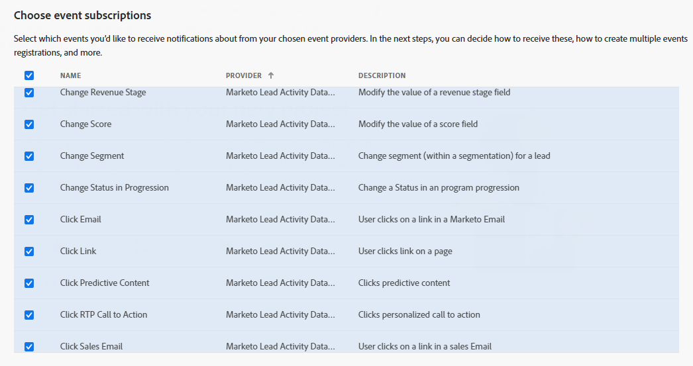

import DeveloperGuidelines from 'marketo-data-streams-developer-guidelines.md'
import Debug from 'marketo-data-streams-debug.md'

# Setting up Marketo Lead Activity Data Stream with Adobe I/O Events

These instructions describe how to set up and get started using Adobe I/O Events for Marketo lead-based activities and change events.

## Introduction

The Lead Activity Data Stream provides near real-time streaming of audit tracking Lead Activities where large volumes of Lead Activities can be sent to a customer’s external system. Streams enable customers to effectively audit Lead-related events, usage patterns, provide views into Lead changes and trigger processes and workflows based upon the different types of Lead Events.

## Setup Lead Activity Data Stream in Marketo

Data Streams are available to those that have purchased a Marketo Engage Performance Tier Package. Once a Performance Tier agreement is in place, work with your TAM and Customer Engineering team to enable this Data Stream for your subscription.

We typically just need to know the MunchkinId for the subscription, and the associated Adobe OrgId, which enables access to the Adobe IO Developer Console.

For the Lead Activity Data Stream, we will also need to know the specific types of events that you would like to subscribe to, which can be found in the [Event List](#event-list) below.

## Setup Adobe I/O

See [Getting Started with Adobe I/O Events](../../../index.md)

For basic instructions for this use case, starting from [console.adobe.io](https://developer.adobe.com/console/):

*When prompted, click the designated button to proceed*:

- Select `Create new project`

  

- Select `Add event`

  

- Filter by `Experience Cloud`
- Select `Marketo Lead Activity Data Stream`

  

- Subscribe to the lead-driven change events of your choosing

  

- Set up OAuth Server-to-Server Credentials

  

- Set up Event Registration

  

  - Provide a name and description for this event subscription
  - Optionally choose whether to enable Webhook or Runtime action
    - Enable Webhook
      - We recommend batch over single webhooks
      - For `Webhook URL` a public https endpoint must be provided
      - The endpoint must be able to handle get and post requests
      - The get request must respond with the challenge query if it exists
      - The post request must respond that it received the message or the webhook will re-attempt to send several times before giving up and automatically disabling the webhook sends
    - Enable Runtime action
      - [See Setting up your Runtime Environment](https://developer.adobe.com/app-builder/docs/get_started/runtime_getting_started/)
      - Select a pre-made runtime action/runtime namespace
- After Saving

  

  - Verify that the Status is `Active`
  - If Webhook was selected, verify that it successfully passed the challenge without errors

<DeveloperGuidelines/>

### Event Data Structure

Events are structured in JSON format using the [CloudEvents](https://cloudevents.io/) spec

*Example Event (batch)*:

````json
[
  {
    "eventid": "ec2c6092-1e94-45e9-b2dd-0b6bad0baa6f",
    "specversion": "1.0",
    "type": "com.adobe.platform.marketo.activity.standard.openemail",
    "source": "urn:marketo_activity_stream",
    "id": "a1764870-4f4b-4f8c-82d6-59b0fff2d39c",
    "time": "2024-12-17T18:39:33Z",
    "datacontenttype": "application/json",
    "data": {
      "munchkinId": "123-ABC-456",
      "leadId": "1234",
      "activityDate": "2024-12-17T18:39:33Z",
      "activityTypeId": 10,
      "activityType": "Open Email",
      "activityLogItemId": 1234567890,
      "primaryAttributeValueId": 1234,
      "primaryAttributeValue": "Attribute Value",
      "attributes": [
        {
          "name": "Campaign Run ID",
          "dataType": "integer",
          "value": 1234
        },
        {
          "name": "Platform",
          "dataType": "string",
          "value": "Platform Name"
        },
        {
          "name": "Device",
          "dataType": "string",
          "value": "Device Name"
        },
        {
          "name": "Mailing ID",
          "dataType": "object",
          "value": 1234
        },
        {
          "name": "User Agent",
          "dataType": "string",
          "value": "Mozilla/5.0 (Windows NT 10.0; Win64; x64) AppleWebKit/537.36"
        },
        {
          "name": "Is Mobile Device",
          "dataType": "boolean",
          "value": false
        }
      ]
    },
    "recipientclientid": "<your_client_id>"
  },
  {
    "eventid": "97980214-3c8f-4964-88a3-75b42833a1f9",
    "specversion": "1.0",
    "type": "com.adobe.platform.marketo.activity.standard.visitwebpage",
    "source": "urn:marketo_activity_stream",
    "id": "a434d7ee-fe91-4b96-aaf2-61f1c6f4c46e",
    "time": "2024-12-17T18:42:49Z",
    "datacontenttype": "application/json",
    "data": {
      "munchkinId": "123-ABC-456",
      "leadId": "1234",
      "activityDate": "2024-12-17T18:42:49Z",
      "activityTypeId": 1,
      "activityType": "Visit Webpage",
      "activityLogItemId": 1234567890,
      "primaryAttributeValueId": 1234,
      "primaryAttributeValue": "Attribute Value",
      "attributes": [
        {
          "name": "Client IP Address",
          "dataType": "string",
          "value": "11.22.33.44"
        },
        {
          "name": "Query Parameters",
          "dataType": "string",
          "value": ""
        },
        {
          "name": "Referrer URL",
          "dataType": "string",
          "value": ""
        },
        {
          "name": "User Agent",
          "dataType": "string",
          "value": "Mozilla/5.0 (Windows NT 10.0; Win64; x64) AppleWebKit/537.36"
        },
        {
          "name": "Webpage ID",
          "dataType": "object",
          "value": 1234
        },
        {
          "name": "Webpage URL",
          "dataType": "string",
          "value": "/lp/123-ABC-456/MyLandingPage.html"
        }
      ]
    },
    "recipientclientid": "<your_client_id>"
  }
]
````

*Example Event (single)*:

````json
{
  "eventid": "4109a990-da28-4c5b-bad9-22df8903ed9a",
  "specversion": "1.0",
  "type": "com.adobe.platform.marketo.activity.standard.clicklink",
  "source": "urn:marketo_activity_stream",
  "id": "570b455e-203f-4983-91a8-5a03f597fda5",
  "time": "2024-12-17T18:43:56Z",
  "datacontenttype": "application/json",
  "data": {
    "munchkinId": "123-ABC-456",
    "leadId": "1234",
    "activityDate": "2024-12-17T18:43:56Z",
    "activityTypeId": 3,
    "activityType": "Click Link",
    "activityLogItemId": 1234567890,
    "primaryAttributeValueId": 1234,
    "primaryAttributeValue": "Attribute Value",
    "attributes": [
      {
        "name": "Link ID",
        "dataType": "object",
        "value": 1234
      },
      {
        "name": "Client IP Address",
        "dataType": "string",
        "value": "11.22.33.44"
      },
      {
        "name": "Query Parameters",
        "dataType": "string",
        "value": ""
      },
      {
        "name": "Referrer URL",
        "dataType": "string",
        "value": "https://marketo.com/lp/123-ABC-456/MyLandingPage.html"
      },
      {
        "name": "User Agent",
        "dataType": "string",
        "value": "Mozilla/5.0 (Windows NT 10.0; Win64; x64) AppleWebKit/537.36"
      },
      {
        "name": "Webpage ID",
        "dataType": "object",
        "value": 1234
      }
    ]
  },
  "recipientclientid": "<your_client_id>"
}
````

### Data Field Definitions

Many of the fields are common across the different types of events.  The `data` object will contain the specific details of the event.
In particular, the `attributes` array will contain a subset of all possible attributes (or none at all!) depending on the event type, and the event context.

| Field               | Type              | Description    |
|---------------------|-------------------|---------------------------------------------------|
| eventid            | String            | Unique UUID generated per event                   |
| specversion         | String            | CloudEvents version specification being used      |
| type                | String            | Type of event used for event subscription routing |
| source              | String            | Context in which an event happened                |
| id                  | String            | Unique UUID generated per event                   |
| time                | String (DateTime) | Timestamp of the completion of the action         |
| datacontenttype     | String            | Content type of the data object                   |
| data                | Object            | Event data object (**see below**)                 |
| recipientclientid | String            | The ID of the client that is receiving the event  |

The `type` field will always be the Event Type name, all lowercase with spaces removed, appended to the string "**com.adobe.platform.marketo.activity.standard**". For example, for the "Open Email" Event Type, the `type` string will be "**com.adobe.platform.marketo.activity.standard.openemail**".

All customer-defined activity types will be delivered with an identical event type "**com.adobe.platform.marketo.activity.custom**", with no suffix.

The `data` field contains the following data:

| Field                   | Type              | Description                                                         |
|-------------------------|-------------------|---------------------------------------------------------------------|
| munchkinId              | String            | The Munchkin ID of the Marketo instance                             |
| leadId                  | String (Number)   | The ID of the lead that the event is related to                     |
| lead                    | Object            | (**optional**) The lead object that the event related to            |
| lead.id                 | Number            | The ID of the lead                                                  |
| lead.firstName          | String            | The first name of the lead                                          |
| lead.lastName           | String            | The last name of the lead                                           |
| lead.email              | String            | The email address of the lead                                       |
| lead.leadScore          | Number            | The lead score of the lead                                          |
| lead.country            | String            | The country of the lead                                             |
| activityDate            | String (DateTime) | The timestamp of the event                                          |
| activityTypeId          | Number            | The ID of the activity type                                         |
| activityType            | String            | The name of the activity type                                       |
| activityLogItemId       | Number            | The ID of the activity log item                                     |
| primaryAttributeValueId | Number            | The ID of the primary modified attribute                            |
| primaryAttributeValue   | String            | The value of the primary modified attribute                         |
| programId               | Number            | (**optional**) The ID of the program the lead is associated with    |
| programName             | String            | (**optional**) The name of the program the lead is associated with  |
| campaignId              | Number            | (**optional**) The ID of the campaign the lead is associated with   |
| campaignName            | String            | (**optional**) The name of the campaign the lead is associated with |
| attributes              | Array (Attribute) | An array of attribute objects (**see below**)                       |

And finally, all Attribute objects in the `attributes` array will contain the following fields:

| Field     | Type   | Description                    |
|-----------|--------|--------------------------------|
| name      | String | The name of the attribute      |
| dataType  | String | The data type of the attribute |
| value     | Any    | The value of the attribute     |

## Event List

These are all of the currently supported Lead Activity Event Types in alphabetical order. If you have a "firehose" endpoint configured that is subscribed to more than one event type, you can identify the type of event in three different ways.

Here are examples using the "Open Email" event type:

1. Text match on the `activityType` field under the `data` object (e.g. `payload.data.activityType` = "Open Email")
2. Number match on the `actitityTypeId` field under the `data` object (e.g. `payload.data.activityTypeId` = 10)
3. Text match on the `type` field with the concatenated, lower-cased Event Type (e.g. `payload.type` = "com.adobe.platform.marketo.activity.standard.openemail")

*Note - This is a snapshot listing of most available events.  There may be some events that don't show up or no longer exist.*

| Event Type                      | Event ID  | Attributes                                                                                                                      |
|---------------------------------|-----------|---------------------------------------------------------------------------------------------------------------------------------|
| Custom                          | 10000+    |                                                                                                                                 |
| Achieve Goal In Referral        | 403       | Social Network, Social App Type ID, Webpage ID                                                                                  |
| Add To List                     | 24        | List ID, Campaign                                                                                                               |
| Add To Nurture                  | 113       | Program ID, Track ID, Track Name                                                                                                |
| Call Webhook                    | 110       | Error Type                                                                                                                      |
| Change Data Value               | 13        | Reason, Attribute Name, New Value, Old Value, Source, Campaign, Channel                                                         |
| Change Lead Partition           | 100       | New Partition ID, Old Partition ID, Reason                                                                                      |
| Change Nurture Cadence          | 115       | New Nurture Cadence, Program ID                                                                                                 |
| Change Nurture Track            | 114       | Previous Track ID, New Track ID, Track Name, Program ID, Previous Track Name                                                    |
| Change Revenue Stage            | 101       | Reason, Old Stage ID, Model ID, New Stage ID                                                                                    |
| Change Score                    | 22        | Reason, Change Value, New Value, Old Value, Score Name                                                                          |
| Change Segment                  | 108       | New Segment ID, Segmentation ID                                                                                                 |
| Change Status In Progression    | 104       | Acquired By, Old Status, New Status ID, Success, New Status, Program ID, Old Status ID                                          |
| Click Email                     | 11        | Campaign Run ID, Mailing ID, Link                                                                                               |
| Click Link                      | 3         | Link ID, Client IP Address, Query Parameters, Referrer URL, User Agent, Webpage ID                                              |
| Click Predictive Content        | 133       | Asset ID, Type                                                                                                                  |
| Click RTP Call to Action        | 132       | Asset ID                                                                                                                        |
| Click Sales Email               | 41        | Sent by, Artifact ID, Template ID, Link                                                                                         |
| Click Shared Link               | 405       | Social Network, Social App Type ID, Sharer ID, Webpage ID                                                                       |
| Delete Lead                     | 37        |                                                                                                                                 |
| Disqualify Sweepstakes          | 408       | Disqualified Reason, Social Network, Webpage ID                                                                                 |
| Earn Entry In Social App        | 409       | Social Network, Social App Type ID, Webpage ID                                                                                  |
| Email Bounced                   | 8         | Subcategory, Category, Email, Mailing ID, Details                                                                               |
| Email Bounced Soft              | 27        | Campaign Run ID, Subcategory, Category, Email, Mailing ID, Details                                                              |
| Email Delivered                 | 7         | Choice Number, Campaign Run ID, Mailing ID                                                                                      |
| Enter Sweepstakes               | 407       | Social Network, Webpage ID                                                                                                      |
| Fill Out Facebook Lead Ads Form | 131       | Lead Ad Form ID                                                                                                                 |
| Fill Out Form                   | 2         | Client ID Address, Query Parameters, Referrer URL, User Agent, Webpage ID, Form Fields                                          |
| Interesting Moment              | 46        | Source, Date, Type                                                                                                              |
| Merge Leads                     | 32        | Merge IDs, Merge Fields                                                                                                         |
| New Lead                        | 12        | Created Date, Source Type                                                                                                       |
| Open Email                      | 10        | Campaign Run ID, Platform, Device, Mailing ID, User Agent, Is Mobile Device                                                     |
| Open Sales Email                | 40        | Sent by, Artifact ID, Template ID                                                                                               |
| Push Lead to Marketo            | 145       | Reason, Source                                                                                                                  |
| Receive Forward to Friend Email | 112       | Mailing ID, LeadID                                                                                                              |
| Receive Sales Email             | 45        | Artifact ID, Received by                                                                                                        |
| Refer to Social App             | 410       | Social Network, Social App Type ID, Webpage ID, Referred Type                                                                   |
| Remove from List                | 25        | List ID, Campaign, Channel                                                                                                      |
| Request Campaign                | 47        | Campaign ID, Source                                                                                                             |
| Sales Email Bounced             | 48        |                                                                                                                                 |
| Send Alert                      | 38        | Send To Owner, Send To List, Mailing ID                                                                                         |
| Send Email                      | 6         | Campaign Run ID, Step ID, Mailing ID                                                                                            |
| Send Sales Email                | 39        | Sent by, Artifact ID                                                                                                            |
| Send Forward to Friend Email    | 111       | Mailing ID, Lead ID                                                                                                             |
| Share Content                   | 400       | Share Message, Social Network, Social App Type ID, Webpage ID                                                                   |
| Sign Up for Referral Offer      | 402       | Social Network, Social App Type ID, Webpage ID                                                                                  |
| Sync Lead to Microsoft          | 300       | Assign To, Sync As                                                                                                              |
| Unsubscribe Email               | 9         | Campaign Run ID, Client ID Address, Mailing ID, Query Parameters, Referrer URL, User Agent, Webpage ID, Webform ID, Form Fields |
| Visit Webpage                   | 1         | Client IP Address, Query Parameters, Referrer URL, User Agent, Webpage ID, Webpage URL                                          |
| Vote in Poll                    | 401       | Vote Choice, Social Network, Webpage ID                                                                                         |
| Win Sweepstakes                 | 406       | Drawing Date, Social Network, Webpage ID                                                                                        |

<Debug/>
