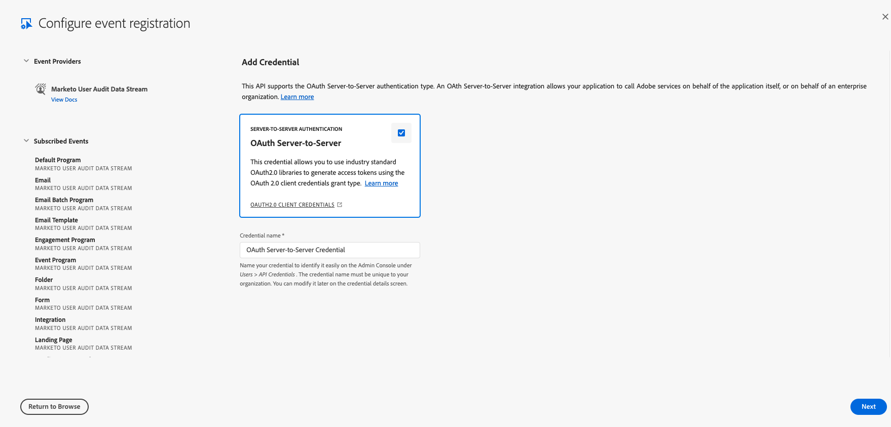
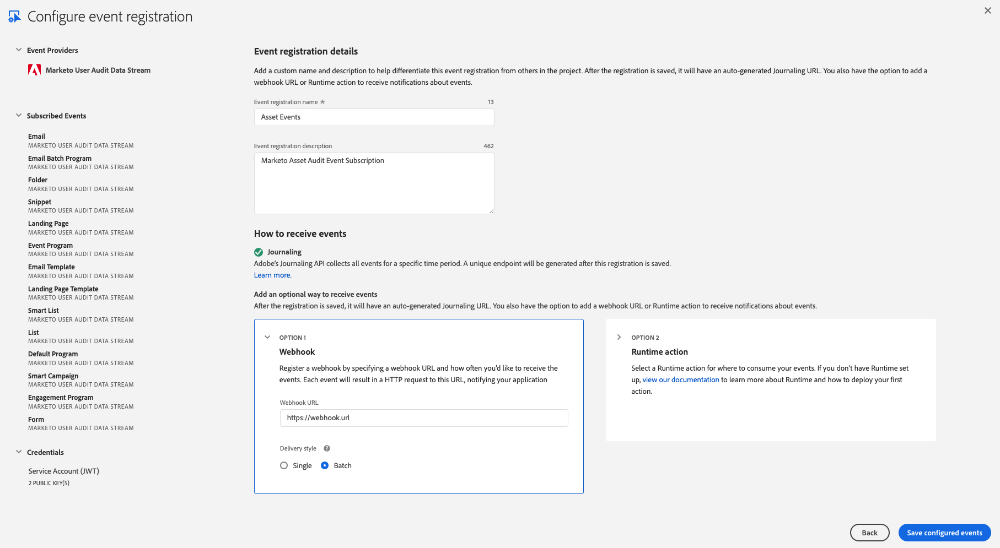

import DeveloperGuidelines from 'marketo-data-streams-developer-guidelines.md'
import Debug from 'marketo-data-streams-debug.md'

# Setting up Marketo Lead Activity Data Stream with Adobe I/O Events

These instructions describe how to set up and get started using Adobe I/O Events for Marketo lead-based activities and change events.

## Introduction

The Lead Activity Data Stream provides near real-time streaming of audit tracking Lead Activities where large volumes of Lead Activities can be sent to a customer’s external system. Streams enable customers to effectively audit Lead-related events, usage patterns, provide views into Lead changes and trigger processes and workflows based upon the different types of Lead Events.

## Setup Lead Activity Data Stream in Marketo

Data Streams are available to those that have purchased a Marketo Engage Performance Tier Package. Once a Performance Tier agreement is in place, work with your TAM and Customer Engineering team to enable this Data Stream for your subscription.

We typically just need to know the MunchkinId for the subscription, and the associated Adobe OrgId, which enables access to the Adobe IO Developer Console.

For the Lead Activity Data Stream, we will also need to know the specific types of events that you would like to subscribe to, which can be found in the [Event List](#event-list) below.

## Setup Adobe I/O

See [Getting Started with Adobe I/O Events](../../../index.md)

For basic instructions for this use case, starting from [console.adobe.io](https://developer.adobe.com/console/):

*When prompted, click the designated button to proceed*

- Select `Create new project`

  

- Select `Add event`

  

- Filter by `Experience Cloud`
- Select `Marketo Lead Activity Data Stream`

  

- Subscribe to the lead-driven change events of your choosing

  

- Set up OAuth Server-to-Server Credentials

  

- Set up Event Registration

  

  - Provide a name and description for this event subscription
  - Optionally choose whether to enable Webhook or Runtime action
    - Enable Webhook
      - We recommend batch over single webhooks
      - For `Webhook URL` a public https endpoint must be provided
      - The endpoint must be able to handle get and post requests
      - The get request must respond with the challenge query if it exists
      - The post request must respond that it received the message or the webhook will re-attempt to send several times before giving up and automatically disabling the webhook sends
    - Enable Runtime action
      - [See Setting up your Runtime Environment](https://developer.adobe.com/runtime/docs/guides/getting-started/)
      - Select a pre-made runtime action/runtime namespace
- After Saving

  
  
  - Verify that the Status is `Active`
  - If Webhook was selected, verify that it successfully passed the challenge without errors

