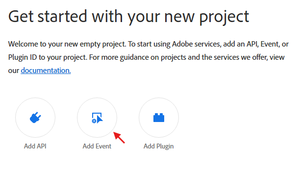
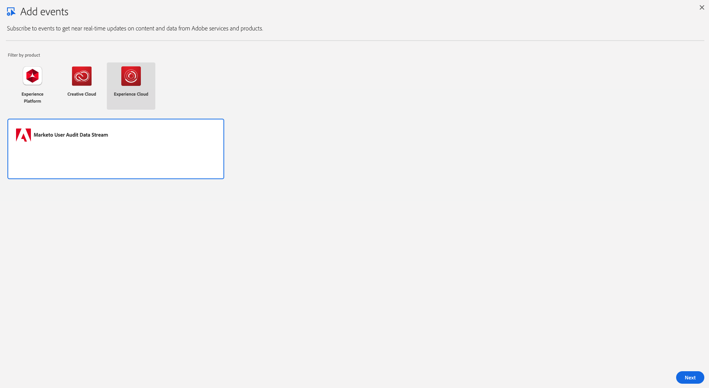
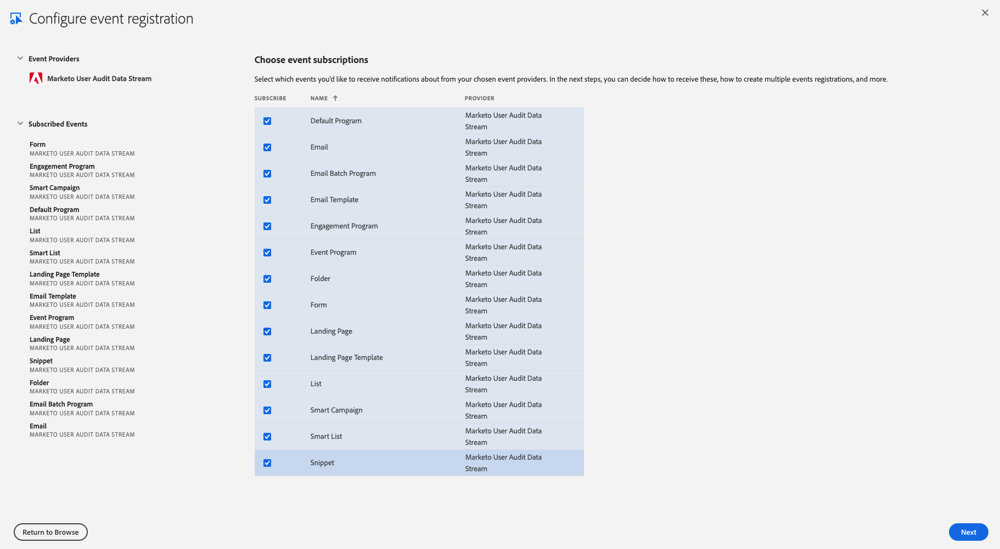
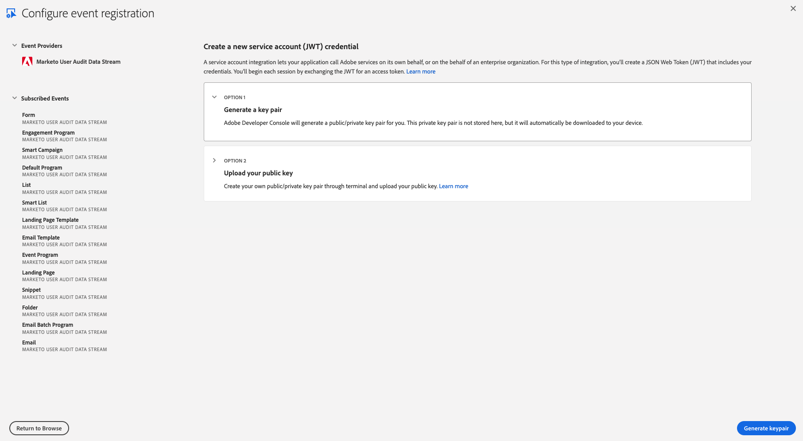
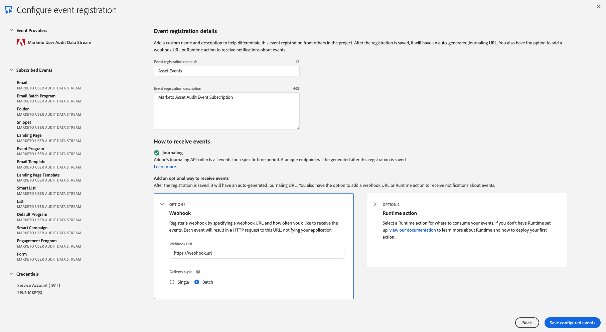
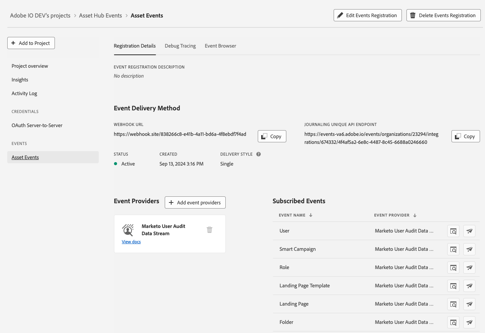

import DeveloperGuidelines from 'marketo-data-streams-developer-guidelines.md'
import Debug from 'marketo-data-streams-debug.md'

# Setting up Marketo Notification Data Stream with Adobe I/O Events

These instructions describe how to set up and get started using Adobe I/O Events for Marketo notification events. This will provide you with an event stream for all Marketo in-app notifications, in near-real-time.

## Introduction

The Marketo Notification Data Stream provides a near real-time stream of all Marketo in-app notifications. This includes Campaign Abort, Campaign Failure, and Web Services / API errors as well as quota notifications.

## Setup User Audit Data Stream in Marketo

Data Streams are available to those that have purchased a Marketo Engage Performance Tier Package. Once a Performance Tier agreement is in place, work with your TAM and Customer Engineering team to enable this Data Stream for your subscription.

We typically just need to know the MunchkinId for the subscription, and the associated Adobe OrgId, which enables access to the Adobe IO Developer Console.

## Setup Adobe I/O

See [Getting Started with Adobe I/O Events](../../../index.md)

For basic instructions for this use case, starting from [console.adobe.io](https://developer.adobe.com/console/):

*When prompted, click the designated button to proceed*:

- Select `Create new project`

  

- Select `Add event`

  

- Filter by `Experience Cloud`
- Select `Marketo Notification Data Stream`

  

- Subscribe to the notification event types of your choosing

  

- Set up OAuth Server-to-Server Credentials

  

- Set up Event Registration

  

  - Provide a name and description for this event subscription
  - Optionally choose whether to enable Webhook or Runtime action
    - Enable Webhook
      - We recommend batch over single webhooks
      - For `Webhook URL` a public https endpoint must be provided
      - The endpoint must be able to handle get and post requests
      - The get request must respond with the challenge query if it exists
      - The post request must respond that it received the message or the webhook will re-attempt to send several times before giving up and automatically disabling the webhook sends
    - Enable Runtime action
      - [See Setting up your Runtime Environment](https://developer.adobe.com/runtime/docs/guides/getting-started/)
      - Select a pre-made runtime action/runtime namespace
- After Saving

  
  
  - Verify that the Status is `Active`
  - If Webhook was selected, verify that it successfully passed the challenge without errors

<DeveloperGuidelines/>

### Event Data Structure

Events are structured in JSON format using the [CloudEvents](https://cloudevents.io/) spec

*Example Event (batch)*:

````json
[
  {
    "eventid": "64e73a16-c903-4faf-9502-9603ce887759",
    "event": {
      "body": {
        "specversion": "1.0",
        "source": "urn:mlm",
        "time": "2024-12-18T07:32:30Z",
        "type": "com.adobe.platform.marketo.notification.web_services",
        "dataschema": "V1.0",
        "datacontenttype": "application/json",
        "data": {
          "munchkinId": "123-ABC-456",
          "imsOrgId": "<your_ims_org_id>@AdobeOrg",
          "componentType": "web_services",
          "subType": "dailyQuota",
          "eventAction": {
            "dailyQuota": 1000000,
            "percent": 25,
            "serviceNames": [
              "service"
            ]
          }
        }
      }
    },
    "recipientclientid": "0f13cce22f4645328e01b90262b3ee51"
  },
  {
    "eventid": "1519a09d-0331-4e96-a91a-908037d78e88",
    "event": {
      "body": {
        "specversion": "1.0",
        "source": "urn:mlm",
        "time": "2024-12-18T07:34:20Z",
        "type": "com.adobe.platform.marketo.notification.campaign_failure",
        "dataschema": "V1.0",
        "datacontenttype": "application/json",
        "data": {
          "munchkinId": "123-ABC-456",
          "imsOrgId": "<your_ims_org_id>@AdobeOrg",
          "componentType": "campaign_abort",
          "subType": "user_campaign_abort",
          "eventAction": {
            "campaignId": 1234,
            "userId": "foo@bar.com"
          }
        }
      }
    },
    "recipientclientid": "0f13cce22f4645328e01b90262b3ee51"
  }
]
````

*Example Event (single)*:

````json
{
  "eventid": "661cbe45-753a-49fc-95f7-1bb2378d13d5",
  "event": {
    "body": {
      "specversion": "1.0",
      "source": "urn:mlm",
      "time": "2024-12-18T07:35:12Z",
      "type": "com.adobe.platform.marketo.notification.campaign_abort",
      "dataschema": "V1.0",
      "datacontenttype": "application/json",
      "data": {
        "munchkinId": "123-ABC-456",
        "imsOrgId": "<your_ims_org_id>@AdobeOrg",
        "componentType": "campaign_abort",
        "subType": "user_campaign_abort",
        "eventAction": {
          "campaignId": 1234,
          "userId": "foo@bar.com"
        }
      }
    }
  },
  "recipientclientid": "0f13cce22f4645328e01b90262b3ee51"
}
````

### Data Field Definitions

Many of the fields are common across the different types of events. The `event.body.data` object will contain the specific details of the event.

| Field           | Type              | Description                                       |
|-----------------|-------------------|---------------------------------------------------|
| eventid        | String            | Unique UUID generated per event                   |
| specversion     | String            | CloudEvents version specification being used      |
| type            | String            | Type of event used for event subscription routing |
| source          | String            | Context in which an event happened. It's values can be "urn:mlm", "urn:userservice", "urn:asset_api"                         |
| time            | String (DateTime) | Timestamp of the completion of the action         |
| datacontenttype | String            | Content type of the data object                   |
| dataschema      | String            | User Audit Data Stream event schema version       |
| data            | Object            | Event data object                                 |

The `data` object contains the following fields:

| Field         | Type   | Description                                           |
|---------------|--------|-------------------------------------------------------|
| munchkinId    | String | Internal Marketo subscription identifier              |
| imsOrgId      | String | Internal Adobe organization identifier                |
| componentType | String | The type of notification event                        |
| subType       | String | The specific type of event under the subtype          |
| eventAction   | Object | Details about the notification event (varies by type) |

The `eventAction` object will vary depending on the `componentType` of the event. The following are examples of the `eventAction` object fields for the different `componentType` values:

| componentType   | Field        | Type           | Description                             |
|-----------------|--------------|----------------|-----------------------------------------|
| web_services    | dailyQuota   | Number         | The current daily quota allowance       |
| web_services    | percent      | Number         | The percentage of the daily quota used  |
| web_services    | serviceNames | Array (String) | The services that are using the quota   |
| campaign_abort  | campaignId   | Number         | The ID of the campaign that was aborted |
| campaign_abort  | userId       | String         | The user that aborted the campaign      |

### Event List

*Note - This is a snapshot listing of most available events.  There may be some events that don't show up or no longer exist.*

|                         |                            |                           |
|-------------------------|----------------------------|---------------------------|
| Campaign Abort          | Campaign Failure           | Web Services Daily Quota  |

<Debug/>
