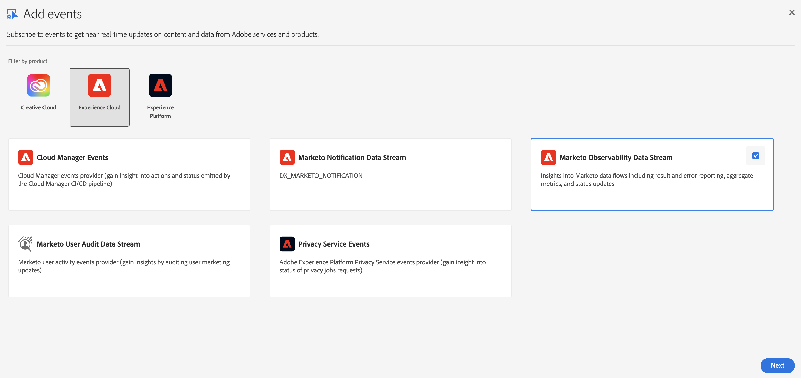
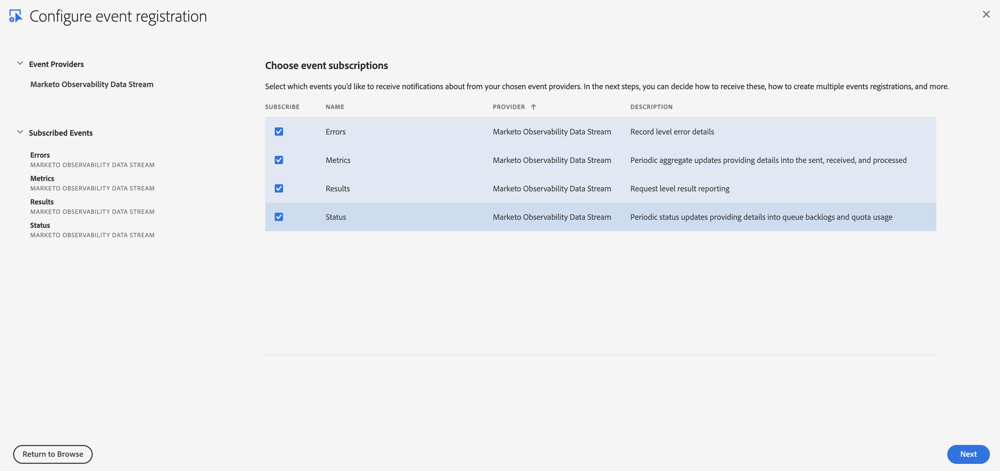
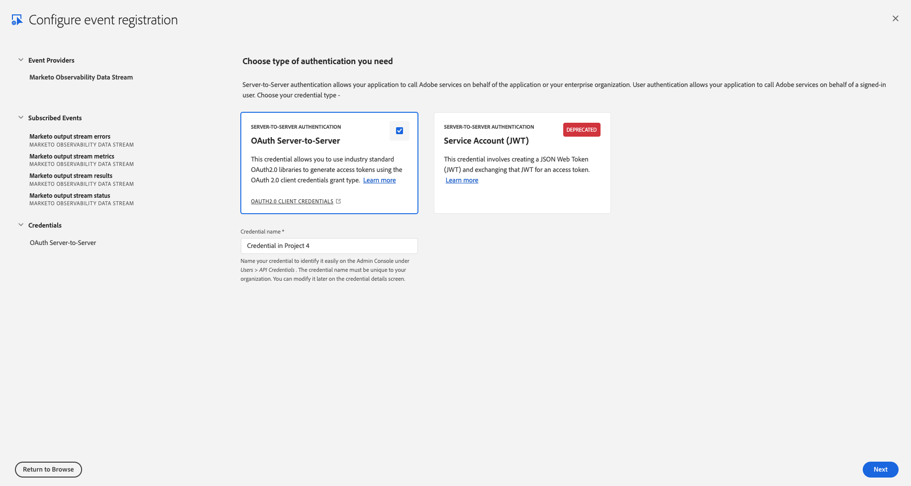
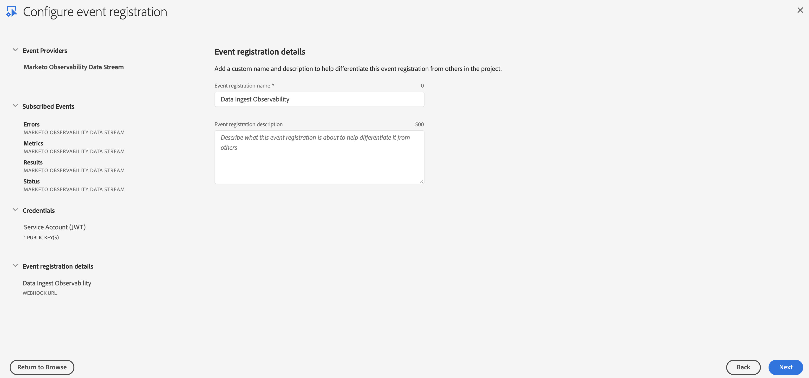
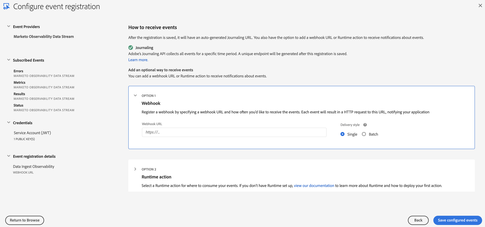
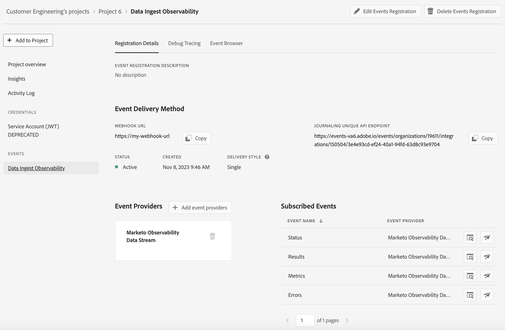

import DeveloperGuidelines from '/src/pages/guides/using/marketo/marketo-data-streams-developer-guidelines.md'
import Debug from '/src/pages/guides/using/marketo/marketo-data-streams-debug.md'

# Setting up the Marketo Observability Data Stream

These instructions describe how to set up and get started using Adobe I/O Events to subscribe to Marketo Observability events.

- [Introduction](#introduction)
- [Prerequisite Setup](#prerequisite-setup)
- [Setup Adobe I/O](#getting-started-with-adobe-io)
- [Developer Guidelines](#developer-guidelines)
- [Debug](#debug)

## Introduction

The Marketo Observability Data Stream (MODS) provides insights about the data flow into Marketo through the [Data Ingestion Service](https://developers.marketo.com/rest-api/data-ingestion/).  The stream offers several different event types:

- Metrics - Periodic aggregated metrics showing all data sent to the API and processed into Marketo
- Results - Per API request results for tracking and verification
- Status - Periodic notices providing insight into the remaining API quota and any request processing backlog

Note: MODS (Marketo Observability Data Stream) is currently a Beta Product

## Prerequisite Setup

The following are required to be able to subscribe to the data stream:

- Marketo Engage subscription that is IMS-enabled
- Marketo Engage subscription provisioned with a Performance Tier or CET package
- Developer or admin account in the Experience Cloud

## Getting Started with Adobe I/O

See the [Adobe I/O Events Docs](/src/pages/index.md)

Basic instructions for this use case, starting from the [developer console](/console/):

*When prompted, click the designated button to proceed*

- Select `Create new project`

  

- Select `Add event`

  

- Filter by `Experience Cloud`
- Select `Marketo Observability Data Stream`

  

- Subscribe to observability events that you're interested in

  

- Set up authentication (either JWT or OAuth) to be used for accessing the Journaling API

  

- Set the name and description for your event registration

  

- Finish Event Registration Setup

  

  - Provide a name and description for this event subscription
  - Optionally choose whether to enable Webhook or Runtime action
    - Enable Webhook
      - We recommend batch over single webhooks
      - For `Webhook URL` a public https endpoint must be provided
      - The endpoint must be able to handle get and post requests
      - The get request must respond with the challenge query if it exists
      - The post request must respond that it received the message or the webhook will re-attempt to send several times before giving up and automatically disabling the webhook sends
    - Enable Runtime action
      - [Getting Started with Adobe I/O Runtime](/runtime/docs/guides/getting-started/)
      - [Runtime Actions as Webhook](../../runtime_webhooks/index.md)
- After Saving

  
  
  - Verify that the Status is `Active`
  - If Webhook was selected, verify that it successfully passed the challenge without errors

<DeveloperGuidelines/>

### Event Data Structure Examples

Events are structured in JSON format using the [CloudEvents](https://cloudevents.io/) spec

#### Metrics

````json
{
    "id": "b90382d8-6b23-11ee-b962-0242ac120002",
    "specversion": "1.0",
    "type": "com.adobe.platform.marketo.observability.metrics",
    "source": "urn:data_ingestion_service",
    "time": "2023-08-14T18:00:00Z",
    "datacontenttype": "application/json",
    "data": {
        "munchkinId": "123-ABC-456",
        "windowStart": "2023-08-14T17:00:00Z",
        "requests": {
            "received": 3,
            "processed": 1,
            "rejected": {  
                "606": 1,
                "607": 1
            }
        },
        "records": {
            "person": {
                "high": {
                    "received": 100,
                    "created": 90,
                    "updated": 5,
                    "failed": {
                        "503": 5
                    }
                },
                "normal": {
                    "received": 100,
                    "created": 90,
                    "updated": 5,
                    "failed": {
                        "503": 5
                    }
                }
            },
            "customObject": {
                "high": {
                    "received": 100,
                    "created": 90,
                    "updated": 5,
                    "failed": {
                        "503": 5
                    }
                },
                "normal": {
                    "received": 100,
                    "created": 90,
                    "updated": 5,
                    "failed": {
                        "503": 5
                    }
                }
            }
        }
    }
}
````

#### Results

Result events contain an array of processed requests indicating what was processed.
These may be complete or partial results depending on the size of the request payload.
Request payloads are processed in chunks, and if a request is split into multiple chunks,
the processing results could potentially be reported across multiple events.

````json
{
    "id": "b90382d8-6b23-11ee-b962-0242ac120002",
    "specversion": "1.0",
    "type": "com.adobe.platform.marketo.observability.results",
    "source": "urn:data_ingestion_service",
    "time": "2023-08-14T17:30:00Z",
    "datacontenttype": "application/json",
    "data": {
        "munchkinId": "123-ABC-456",
        "requests": [
            {
                "requestId": "cf0a1a20-668e-492a-8ec2-ce8747507068",
                "requestTime": "2023-08-14T17:20:00Z",
                "clientId": "foo@marketo.com",
                "correlationId": "6180bb48-8dc7-4fc5-85ca-a59dd1edb0f3",
                "requestSource": "Adobe Journey Optimizer",
                "objectType": "person",
                "priority": "high",
                "records": {
                    "received": 100,
                    "created": 90,
                    "updated": 10,
                    "failed": {}
                }
            },
            {
                "requestId": "67b28858-f5ee-45ac-aa40-63a04085e6be",
                "requestTime": "2023-08-14T17:20:00Z",
                "clientId": "foo@marketo.com",
                "correlationId": "6180bb48-8dc7-4fc5-85ca-a59dd1edb0f3",
                "requestSource": "Public API",
                "objectType": "customObject",
                "priority": "normal",
                "records": {
                    "received": 100,
                    "created": 10,
                    "updated": 10,
                    "failed": {
                        "503": 10,
                        "404": 10
                    }
                }
            }
        ]
    }
}
````

#### Status

````json
{
    "id": "b90382d8-6b23-11ee-b962-0242ac120002",
    "specversion": "1.0",
    "type": "com.adobe.platform.marketo.observability.status",
    "source": "urn:data_ingestion_service",
    "time": "2023-08-14T18:00:00Z",
    "datacontenttype": "application/json",
    "data": {
        "munchkinId": "123-ABC-456",
        "quota": 65432100,
        "queue": {
            "high": {
                "lagSeconds": 15,
                "requestBacklog": 1,
                "recordBacklog": 100
            },
            "normal": {
                "lagSeconds": 135,
                "requestBacklog": 10,
                "recordBacklog": 1000
            }
        },
    }
}
````

#### Data Field Definitions

Field | Description
--- | ---
id | Unique UUID generated per event
specversion | CloudEvents version specification being used
type | Type of event used for event subscription routing
source | Context in which an event happened
time | Timestamp of the completion of the action
datacontenttype | Content type of the data object
data | Event data object
munchkinId | Internal Marketo subscription identifier
clientId | Marketo API User Id or Adobe IMS Client Id
correlationId | An id representation of where the request originated from (empty if from public API)
origin | Name representation of the correlationId component
objectType | Marketo object type that's being processed (account, custom object, person, etc.)
priority | Priority of the request (high or normal)
received | Count of requests/records received to the Data Ingest Service
created | Count of records created from processing the requests to the Data Ingest Service
updated | Count of records updated from processing the requests to the Data Ingest Service
failed | Count of records failed while processing the requests to the Data Ingest Service broken down by error code
rejected | Count of requests rejected (never accepted by the Data Ingest Service) by error code
quota | Remaining daily quota for the Data Ingest Service
queue | Stats of the processing queue backlog
lagSeconds | Difference between now and the oldest message in the processing queue
requestBacklog | Number of requests in the processing queue
recordBacklog | Number of records in the processing queue
recipient_client_id | Auto generated by IO Events, can be used for security checks
event_id | Auto generated by IO Events, it matches the x-adobe-event-id header

<Debug/>
