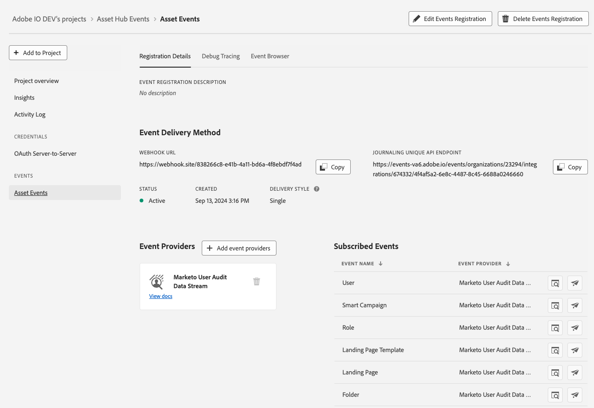

# Setting up Marketo User Audit Data Stream with Adobe I/O Events

These instructions describe how to set up and get started using Adobe I/O Events for Marketo user driven change events.  You can use Adobe I/O for streaming Marketo user driven change events such as the modification of emails, campaigns, and landing pages.

## Introduction

User Audit Data Stream provides all the user driven change events that are shown in the MLM Audit Trail as an event stream to which you can subscribe.

## Setup User Audit Data Stream in Marketo

User Audit Data Stream is currently a Beta Product and thus cannot be enabled in Marketo without a Beta agreement.  After a Beta agreement is in place, work with your TAM and Customer Engineering team to enable User Audit Data Stream for your subscription.

## Setup Adobe I/O

See [Getting Started with Adobe I/O Events](/src/pages/index.md)

For basic instructions for this use case, starting from [console.adobe.io](/console/):

*When prompted, click the designated button to proceed*

- Select `Create new project`

  

- Select `Add event`

  

- Filter by `Experience Cloud`
- Select `Marketo User Audit Data Stream`

  

- Subscribe to the user driven change events of your choosing

  

- Set up JWT Credentials (either generate a new key pair or upload a public key)

  

- Set up Event Registration

  

  - Provide a name and description for this event subscription
  - Optionally choose whether to enable Webhook or Runtime action
    - Enable Webhook
      - We recommend batch over single webhooks
      - For `Webhook URL` a public https endpoint must be provided
      - The endpoint much be able to handle get and post requests
      - The get request must respond with the challenge query if it exists
      - The post request must respond that it received the message or the webhook will re-attempt to send several times before giving up and automatically disabling the webhook sends
    - Enable Runtime action
      - [See Setting up your Runtime Environment](/runtime/docs/guides/getting-started/setup/)
      - Select a pre-made runtime action/runtime namespace
- After Saving

  
  
  - Verify that the Status is `Active`
  - If Webhook was selected, verify that it successfully passed the challenge without errors

## Developer Guidelines

When setting up a project to subscribe to events, there are three ways to interact with those event subscriptions in order to receive the events.  The first is Journaling, which provides a pull model in which events can be pulled via API and stores up to 7 days of past events.  The second is Webhooks, which can be configured to send events either as single events or batched to a webhook endpoint in near real-time with the event occurrence.  Third is Runtime, where you can set up your own custom function within Adobe that events will automatically run through near-real time.

### Journaling
[Getting Started with Journaling](../../journaling_intro.md)

Important Takeaways:

- Stores up to 7 days of history
- Can be iterated through from any previous event within the history
- Will still receive and store events even if webhook is failing
- Useful for fetching events that were missed due to webhook issues or for a pulling mechanism instead of webhook push

### Webhooks
[Getting Started with Adobe I/O Events Webhooks](../../index.md)

Webhook Endpoint Requirements:

- Handle GET and POST requests
- Respond with a 200-type response within a reasonable time period
- Challenge Request
  - GET request with challenge query parameter
  - Must respond with value of challenge query parameter
- Webhook Events
  - POST request with JSON data body with one or more events
  - *Recommended to set up webhook as batch*

### Event Data Structure

*We are still finalizing the data structure as we prepare for Beta release.  While we don't expect any major changes, there may be some minor modifications.*

Events are structured in JSON format using the [CloudEvents](https://cloudevents.io/) spec

*Example Event (batch)*

    [
        {
            "event_id": "cf904f43-56bc-4f80-935d-a484de6e4181",
            "event": {
                "body": {
                    "specversion": "1.0",
                    "id": "b77c743a-8e28-40f2-8aab-9541bbc85e68",
                    "type": "com.adobe.platform.marketo.audit.user.email",
                    "source": "https://www.marketo.com",
                    "time": "2020-05-28T19:14:44.807Z",
                    "datacontenttype": "application/json",
                    "dataschema": "V2.0",
                    "data": {
                        "componentId": 232459,
                        "componentType": "Email",
                        "eventAction": "approve",
                        "munchkinId": "123-ABC-456",
                        "imsOrgId": "49C579695EA927530A494036@AdobeOrg",
                        "userId": "user@marketo.com"
                    }
                }
            }
        },
        {
            "event_id": "e931c3ec-9d76-406b-ac89-626e9650813a",
            "event": {
                "body": {
                    "specversion": "1.0",
                    "id": "afcb6581-198c-4056-a395-6f77cf242d05",
                    "type": "com.adobe.platform.marketo.audit.user.landingpage",
                    "source": "https://www.marketo.com",
                    "time": "2020-05-28T19:14:46.221Z",
                    "datacontenttype": "application/json",
                    "dataschema": "V2.0",
                    "data": {
                        "componentId": 123321,
                        "componentType": "Landing Page",
                        "eventAction": "approve",
                        "munchkinId": "123-ABC-456",
                        "imsOrgId": "49C579695EA927530A494036@AdobeOrg",
                        "userId": "user@marketo.com"
                    }
                }
            }
        }
    ]

*Example Event (single)*

    {
        "event_id": "a9ef9c3c-bafe-48b8-9eae-bc63dfaed28c",
        "event": {
            "body": {
                "specversion": "1.0",
                "id": "72dd1983-decb-4390-afde-2fa1307c9770",
                "type": "com.adobe.platform.marketo.audit.user.email",
                "source": "https://www.marketo.com",
                "time": "2020-05-28T19:20:47.283Z",
                "datacontenttype": "application/json",
                "dataschema": "V2.0",
                "data": {
                    "componentId": 232459,
                    "componentType": "Email",
                    "eventAction": "approve",
                    "munchkinId": "123-ABC-456",
                    "imsOrgId": "49C579695EA927530A494036@AdobeOrg",
                    "userId": "user@marketo.com"
                }
            }
        }
    }

*Data Field Definitions:*

Field | Description
--- | ---
event_id | Unique UUID generated per event
specversion | CloudEvents version specification being used
id | Unique UUID generated per event
type | Type of event used for event subscription routing
source | Context in which an event happened
time | Timestamp of the completion of the action
datacontenttype | Content type of the data object
dataschema | User Audit Data Stream event schema version
data | Event data object
componentId | ID of the asset in Marketo
componentType | Type of the asset in Marketo
eventAction | Asset action that occurred in Marketo
munchkinId | Internal Marketo subscription identifier
imsOrgId | Internal Adobe organization identifier
userId | Email ID of the user in Marketo who completed the action

### Event List
*Note - This is a snapshot listing of most available events.  There may be some events that don't show up or no longer exist.*

Component | Event Type List
--- | ---
Default Program | clone, create, delete, edit channel, export, modify program setup, modify program token, rename
Email | approve, clone, create, delete, edit, move, rename, unapprove
Email Batch Program | approve, childUpdate, clone, create, delete, edit, edit channel, modify program schedule, modify program setup, modify program token, rename, unapprove
Email Template | approve, clone, create, delete, draftCreate, draftDiscard, edit, rename, unapprove
Engagement Program | clone, create, delete, edit channel, modify program setup, modify program stream, modify program token, rename
Event Program | clone, create, delete, edit channel, modify program schedule, modify program setup, modify program token, rename
Folder | create, delete, edit
Form | approve, clone, create, delete, draftCreate, edit, move, rename
Landing Page | approve, clone, create, delete, draftDiscard, edit, move, rename, unapprove
Landing Page Template | approve, clone, create, delete, draftCreate, draftDiscard, edit, rename, unapprove
List | clone, create, delete, rename
Marketing Folder | create, delete, edit
Nurture Program | clone, create, delete, edit channel, modify program setup, modify program stream, modify program token, rename
Segment | create, delete, edit, rename
Segmentation | approve, create, delete, draftCreated, draftDiscarded, rename, unapprove
Smart Campaign | abort, activate, clone, create, deactivate, delete, edit, modify campaign schedule, modify flow step action, modify smart list setup, move, rename
Smart List | clone, create, delete, edit, export, modify smartlist setup, rename
Snippet | approve, approve with no-draft, clone, create, delete, edit, rename, unapprove

## Debug

[Debug Tracing](/src/pages/support/tracing.md)

Once you have successfully completed your setup and event subscription registration, events should start being stored in the journal.  In addition, if you have webhooks or runtime set up, the events will go through those flows.  From the project's page in the event registration details, you should see a tab for Debug Tracing.  For webhooks, this will show a record of failed and successful challenge attempts as well as webhook attempts.  Each request includes the request/response details to help debug.