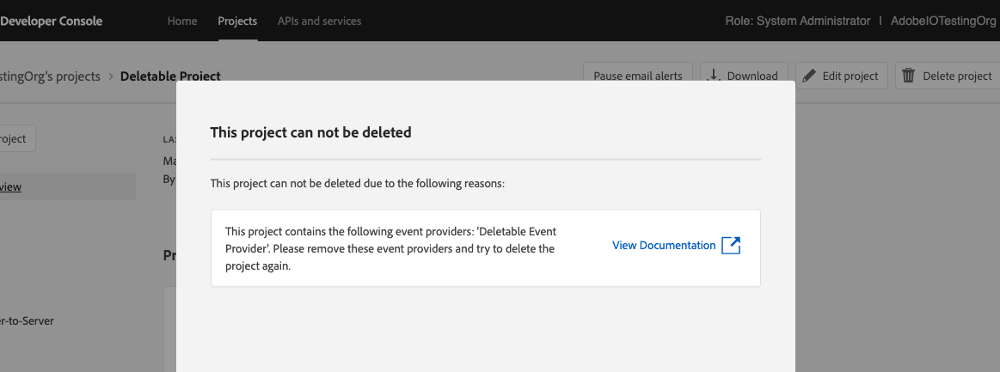
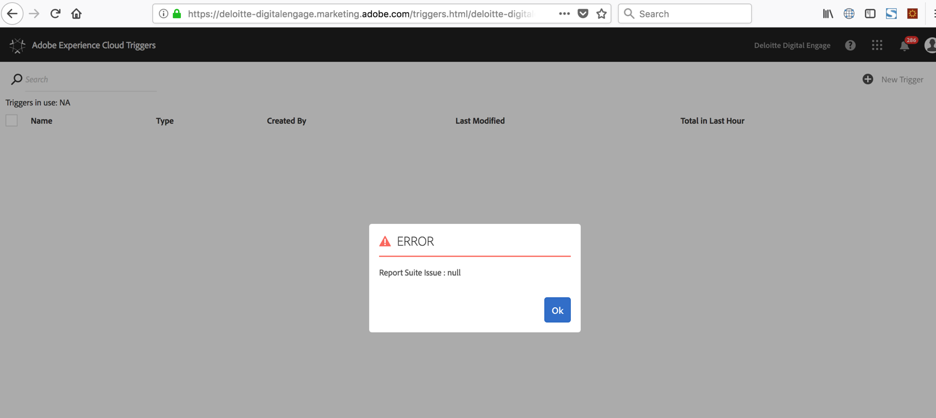
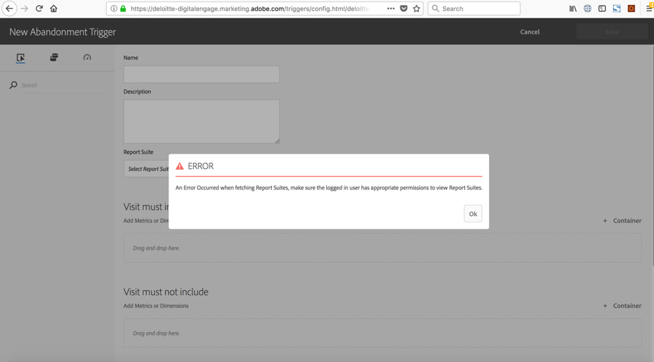

import RetryDoc from '../common/retry-doc.md'

# Adobe I/O Events Frequently Asked Questions (FAQ)

## General questions

### Which events are currently supported by `Adobe I/O Events`?

We are adding new events providers regularly, at the time of writing, the following Adobe solutions are supported via I/O Events:

* [Creative Cloud Assets](https://www.adobe.com/go/devs_events_cc_docs) (deprecated)
* Creative Cloud Libraries (replacing the above)
* Imaging API
* Adobe XD

* Adobe Document Cloud

* [Platform notifications](https://www.adobe.com/go/devs_events_aep_docs)
* [Analytics Triggers](https://www.adobe.com/go/devs_events_triggers_docs)
* [Marketo Data Streams](../guides/using/marketo/marketo-data-streams.md)
* [Privacy Service](https://www.adobe.com/go/devs_events_privacy_docs)
* [Cloud Manager](https://www.adobe.com/go/devs_events_cloudmanager_docs)
* Asset Compute
* [AEM](../guides/using/aem/index.md)
* Adobe Campaign Standard

You can also register [your own `Custom Events Provider`](../guides/using/custom-events.md)

### What is the guarantee of events delivery?

`Adobe I/O Events` provides durable delivery. **It delivers each event at least once for each registration**.
If the webhook endpoint doesn't acknowledge receipt of an event, `Adobe I/O Events` retries the delivery of the event (see the [webhook FAQ](#webhook-faq) section below).

Note that `Adobe I/O Events`:

* Currently doesn't guarantee the order of events delivery, so subscribers may receive them out of order (this applies to our Journaling API as well).
* May send the same events more than once.
* Is adding a unique event uuid in the event payload.
* Is passing the same uuid in the `x-adobe-event-id` header of the webhook request.

### Do you guarantee the order of events delivery?

No, see the paragraph above for details.

### What permissions are required to use I/O Events?

The various required permissions and entitlements vary according to the events provider, (see the list above) some are opened to all Adobe customers, others to enterprise developers or administrators only.
Some of these events providers will require licensing, while others will be available to all.
Please reach out to your Adobe account manager for licensing related questions.

### Which subscription types do I/O Events support?

I/O Events supports [webhooks](../guides/index.md) for near-real time notifications (push) as well as [a Journaling API](../guides/journaling-intro.md) (pull) to grab groups of events at a time.

### What should I do if I am unable to delete a project because of a conflicting provider?

If while deleting a project in developer console, you get an error as shown in the screenshot below, it means that you created an event provider associated with the same workspace, and until you delete that event provider you cannot go ahead with the project deletion.



If you are sure that the event provider can be deleted, then follow the steps documented below to remove the conflicting event provider:

1. Select Project overview in the left-side links menu.
2. Click on the "Download" button from the top menu on the right to download the project metadata json file. Open the downloaded json file with your favorite editor, and make note of the following:
   1. Your consumer organization id (at `project.org.id`)
   2. Your project id (at `project.id`)
   3. Your workspace id (at `project.workspace.id`)
3. Using the [provider API](/guides/api/provider-api.md), fetch [your I/O Events providers entitled to the provided organization id](/events/docs/api/#tag/Providers/operation/getProvidersByConsumerOrgId), using the consumer organization id noted from above.
4. Find the conflicting provider against your workspace id (found at `project.workspace.id` from the project json file) from the provider API response, and make a note of the provider `id`.
5. Delete the provider via the [provider API](/events/docs/api/#tag/Providers/operation/deleteProvider), using the ids noted in above steps.
6. Repeat the above steps for all conflicting event providers and try deleting the project again. Your project deletion should now go through successfully.

## Webhook FAQ

### What happens if my webhook is down? Why is my event registration marked as `Unstable`?

<RetryDoc/>

Note: You can then use the [Journaling API](../guides/journaling-intro.md) to **retrieve** events that were published while your webhook was down. Once your webhook gets restored, you can re-enable your event registration (see the question below).

### How can I re-enable my event registration (disabled after a downtime)? How can I retrieve the events I missed?

To restart the flow of requests, fix the problem preventing your webhook from responding. Then, log into the `Adobe Developer Console` and edit your event registration. This re-triggers a webhook challenge request, and eventually a re-activation of your event registration.

While your event registration is marked `Disabled`, Adobe will continue to log events in your Journal, allowing you to retrieve all events for the past 7 days (see our [Journaling documentation](../guides/journaling-intro.md)).

### What happens if my webhook is unable to handle a specific event but handles all other events gracefully?

Please note that if an event delivery fails with a response status code of [429 Too Many Requests](https://developer.mozilla.org/en-US/docs/Web/HTTP/Status/429), or with any response status code in the range of 500 to 599 except for [505 HTTP Version Not Supported](https://developer.mozilla.org/en-US/docs/Web/HTTP/Status/505), then those events are retried. Events that fail with any other response status codes are **not retried**.

We continue to retry the event delivery for 24 hours. If all retry attempts are exhausted and the event still isn't delivered, the event will be dropped.
However, do note that the event registration will remain as **Active** and shall continue to process events.

### Does every Adobe I/O Events webhook HTTP request come with a signature?

Yes, to allow your webhook to reject forged requests, Adobe I/O Events adds a [`x-adobe-signature`](../guides/index.md#security-considerations) header to every single HTTP request it makes to your webhook URL (even the first `challenge` GET request).

### Do Adobe I/O Events notifications come from a range of static IPs?

We had a few customers asking this in the context of securing their endpoint;  their requirement: accepting traffic only from a range of static IPs.

The answer is **no**. Adobe I/O Events notifications services are hosted on AWS and Azure, their IPs change over time.

*Reminder*: Each Adobe I/O Events HTTP request holds a signature header (see the previous question), however if this is not enough and if the above is a non-negotiable requirement, you may choose to use the pull model instead, and leverage our [Journaling API](../guides/journaling-intro.md).

### What is the size of notifications when in batch delivery style?

When registering a webhook to receive Adobe I/O Events notifications, you can select the delivery style:

* Either receiving one event at a time ("Single"): each event resulting in an HTTP request to the webhook URL.
* Or multiple events together ("Batch"): in this case, HTTP requests will still remain near-real time, the batch size will vary depending on the incoming traffic and the batch size will be at max 2MB bytes and will contain a maximum of 20 events.

### How to debug and see logs for successful invocations to my runtime_action (configured as webhook)

To improve the debugging experience for successful invocations, user can relay the `activation_id` of
his target user action as a new response header (for example, you can use this header `x-target-action-activation-id`)
from that action itself.
So, even without enabling the `x-ow-extra-logging=on` header and impacting runtime performance,
user can get hold of the successful activation via the debug tracing on Developer Console.

## Journaling FAQ

### How far back are I/O Events available via the Journaling API?

Adobe I/O stores 7 days of subscribed events that can be retrieved via the Journaling API.

### Why do I only get one event, irrespective of the `limit` I use?

Our Journaling API `limit` parameter is used to specify the “maximum” number of events that may be returned by the API.
It is used to specify an upper bound to the number of events to ensure that the consumer can handle the response gracefully. The behavior you observe is expected.
It is perfectly ok to get 1 event when you specify a limit greater than 1.
The number of events that gets returned in a response can vary depending on the incoming traffic (upper bound being equal to the limit parameter).
See our [Journaling API documentation](../guides/api/journaling-api.md#limiting-the-size-of-the-batch) for more details.

### Is there a way to retrieve all events in one request?

No, our journaling API does not support retrieving all events in a single query.

However, by using the `since` parameter, you can fetch events incrementally by following the journal's [rel=next Link](../guides/api/journaling-api.md#fetching-the-next-batch-of-newer-events-from-the-journal) in the response headers until all events have been retrieved.

## Custom Events FAQ

### I created a `Custom Events Provider`, why is it not showing up in the `Adobe Developer Console`?

If you successfully create a `Custom Events Provider` using our [Provider API](../guides/api/provider-api.md), it will only appear in the `Adobe Developer Console` once you create at least one `Event Metadata` associated with it.

Once associated with its `Event Metadata`, your `Custom Events Provider` will be ready to be used:

1. It will appear in your (refreshed) `Adobe Developer Console` project.
2. You will be able to register against it.
3. And to start emitting events on its behalf use our [Events Publishing API](../guides/api/eventsingress-api.md).

### Does `Custom Events Provider` support High Volume ? Do you have a throttling policy in place ?

We do have a throttling policy in place, read our [Events Publishing API guide](../guides/api/eventsingress-api.md) for more details.
However, if you have a high volume use-case in mind, contact us, we'd love to hear about it
and discuss how we could accommodate it.

## Analytics Triggers Events

### Where can I find instructions on setting up Analytics Triggers for I/O?

You'll find it in this guide at [Integrate Analytics Triggers with Adobe I/O Events](../guides/using/analytics-triggers-event-setup.md).

### Where do I configure Analytics Triggers for I/O?

Analytics Triggers are set up and managed via the Experience Cloud Activation UI. Once a Trigger has been created, it will appear in the `Adobe Developer Console` under the available I/O Events list.

### What does an Analytics Triggers payload look like?

Here is a sample:

```json
{
  "event_id": "52ebf673-8aeb-4347-8852-bf86a18292e4",
  "event": {
    "envelopeType": "DATA",
    "partition": 13,
    "offset": 438465548,
    "createTime": 1516324157242,
    "topic": "triggers",
    "com.adobe.mcloud.pipeline.pipelineMessage": {
      "header": {
        "messageType": "TRIGGER",
        "source": "triggers",
        "sentTime": 1516324157228,
        "imsOrg": "C74F69D7594880280A495D09@AdobeOrg",
        "properties": [
          {
            "name": "trace",
            "value": "false"
          },
          {
            "name": "sourceFirstTimestamp",
            "value": "1516324106"
          },
          {
            "name": "sourceLastTimestamp",
            "value": "1516324128"
          },
          {
            "name": "triggerFiredTimestamp",
            "value": "1516324153995"
          }
        ],
        "messageId": "1a69fc40-7600-4928-b7bb-d66588a045f3"
      },
      "com.adobe.mcloud.protocol.trigger": {
        "triggerId": "697514a8-3337-4efc-ba75-1f0ba896c288",
        "triggerTimestamp": 1516324157228,
        "mcId": "00000000000000000000000000000000000000",
        "enrichments": {
          "analyticsHitSummary": {
            "dimensions": {
              "eVar3": {
                "type": "string",
                "data": [
                  "localhost:4502/content/we-retail.html",
                  "localhost:4502/content/we-retail/us/en/men.html",
                  "localhost:4502/content/we-retail.html",
                  "localhost:4502/content/we-retail/us/en.html",
                  "localhost:4502/content/we-retail/us/en.html",
                  "localhost:4502/content/we-retail/us/en/products/men/shirts/eton-short-sleeve-shirt.html",
                  "localhost:4502/content/we-retail/us/en/products/men/shirts/eton-short-sleeve-shirt.html",
                  "localhost:4502/content/we-retail/us/en/men.html",
                  "localhost:4502/content/we-retail/us/en/user/cart.html"
                ],
                "name": "eVar3",
                "source": "session summary"
              },
              "pageURL": {
                "type": "string",
                "data": [
                  "http://localhost:4502/content/we-retail.html",
                  "",
                  "",
                  "http://localhost:4502/content/we-retail/us/en.html",
                  "",
                  "",
                  "http://localhost:4502/content/we-retail/us/en/products/men/shirts/eton-short-sleeve-shirt.html",
                  "http://localhost:4502/content/we-retail/us/en/men.html",
                  "http://localhost:4502/content/we-retail/us/en/user/cart.html"
                ],
                "name": "pageURL",
                "source": "session summary"
              }
            },
            "products": {}
          }
        },
        "triggerPath": [
          {
            "timestamp": 1516324118010,
            "stateId": "start_and_and",
            "transition": "null"
          },
          {
            "timestamp": 1516324148711,
            "stateId": "vmi_and_1",
            "transition": "conditional -> select * where evars.evars.eVar3 like 'localhost:4502/content/we-retail/us/en/user/cart.html'"
          },
          {
            "timestamp": 1516324148711,
            "stateId": "notify_wait",
            "transition": "states visited -> [StateVisitedNode [stateId=vmi_and_1, count=1, operator=GE]]"
          },
          {
            "timestamp": 1516324153994,
            "stateId": "notify",
            "transition": "inactive_timeout -> 5"
          }
        ]
      }
    }
  }
```

**I receive errors trying to access Triggers.**

The company/org is entitled for Analytics Triggers but I receive the following errors when trying to set up a Trigger:





**To fix:**  Ensure that Triggers is enabled in the Analytics Product Profile in the Admin Console.


