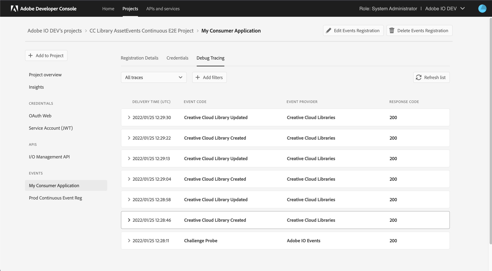
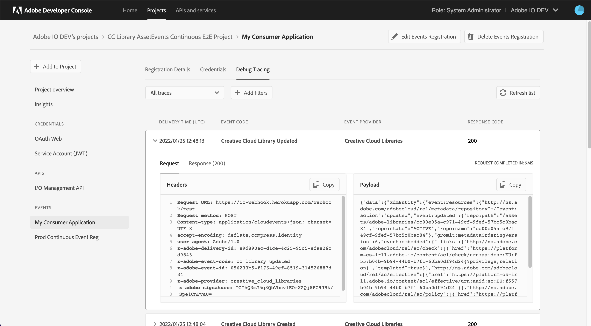
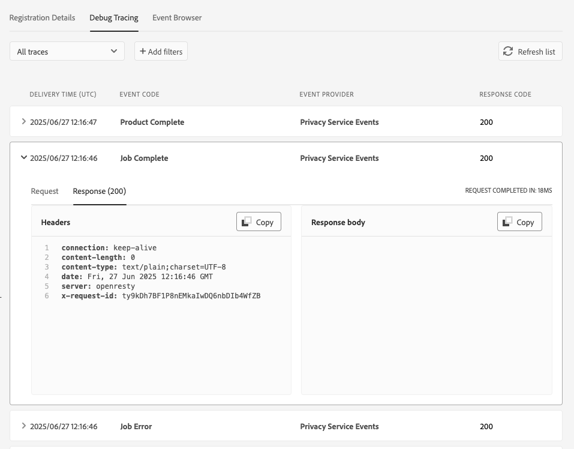
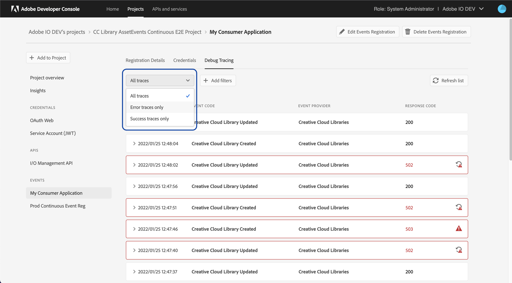
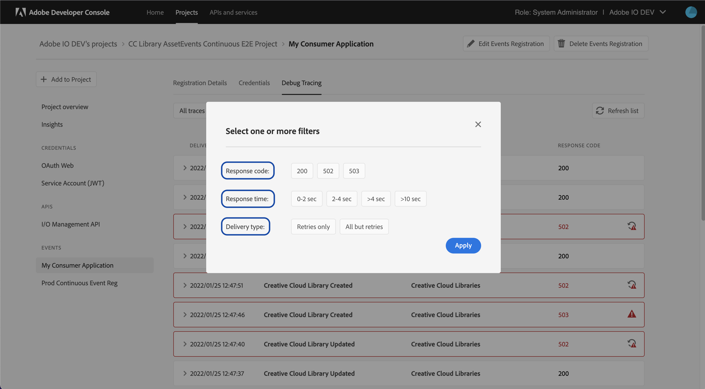

# Tracing Adobe I/O Events

To troubleshoot issues with event-registrations, Adobe offers Debug Tracing feature. Using Debug Tracing, you can inspect the activity between the Adobe service and your integration to see what data is being sent and how your integration is responding.
Each trace comprises of the event delivery HTTP request (sent by I/O Events), and response by the consumer application. This information can be of critical importance to your debugging efforts.

*Debug Tracing is only available for event registrations with either a Webhook, Runtime Action or Amazon EventBridge as their delivery destination.*

<InlineAlert variant="info" slots="text"/>
Note that the maximum size of 'request-body' and 'response-body' in a trace is 64 KB. If any of these fields are larger than 64 KB, then they are trimmed at 64 KB boundary. The delivered event payload is not trimmed.

## Access Debug Tracing

* Log into [Adobe Developer Console](https://developer.adobe.com/console/) and select the project containing the event registration.
* From the *Project Overview* page, select the event registration under *Events* in the left navigation.
* On the *Registration Details* page, click the *Debug Tracing* tab to see all event delivery traces, with the most recent entries shown first.

## What's in Debug Tracing

* The *Debug Tracing* tab shows last 100 traces for your event registration.
* Select any trace in the list to expand its view and see more details. By default, the request (sent by Adobe) is shown, with headers and body. Select *Response* to view your integration's response to the event.

By inspecting the details of the request and response, you can examine the communication loop between Adobe and your integration to diagnose any breakdown in the flow or processing of events.  

## Status Codes

Selecting a specific trace, you can also display the HTTP response (`body` and `codes`) received by Adobe IO Events HTTP Client from your webhook.

These [HTTP response codes](https://developer.mozilla.org/en-US/docs/Web/HTTP/Reference/Status) are three-digit numbers sent by **your** server 
to indicate the result of Adobe I/O Events HTTP client request. 
They are categorized into five classes: 
* `1xx` (Informational), 
* `2xx` (Successful), 
* `3xx` (Redirection), 
* `4xx` (Client Error), 
* `5xx` (Server Error)
*  On top of these, Adobe I/O Events uses a set of custom error codes in the `6xx` range (see below).

If the code is not `Successful` Adobe I/O Events HTTP client will retry see our [Retry Delivery](../guides/index.md#troubleshooting-unstabledisabled-registration-status) documentation for more details.

### `6XX` Custom Status Codes
To ease even further debugging, this Debug Tracing UI uses a set of custom status `6xx` codes to indicate specific issues encountered during event delivery, 
when no HTTP response was received from your webhook server.

These codes are

* `601`: Similar to `Not Implemented` HTTP `501` status code.
  This error code indicates that Adobe I/O Events HTTP client
  failed with an unexpected error while trying to `POST` the event to the target webhook endpoint.
* `602`: Similar to `Bad Gateway` HTTP `502` status code.
  This status code indicates that Adobe I/O Events HTTP client 
  faced network issues or failures to connect to the target webhook endpoint
  (errors such, `No Route To Host` or `Socket` exception).
* `604` Somewhat similar to `Gateway Timeout` HTTP `504` status code. 
  This status code indicates that your webhook server did not respond within the
  expected time frame. And that Adobe I/O Events HTTP client failed, timing out.
* `611` Somewhat similar to `Network Authentication Required` HTTP `511` status code.
  This error code will be used when the ssl handshake with the webhook server failed,
  mostly due to your server's TLS (or mTLS) configuration issue.
  See our [Security Considerations](../guides/index.md#security-considerations) documentation for more details.

In such cases, the `Debug Tracing` UI also displays details about the error in the `Response body` section.
In there, you'll find a `uuid` that could be communicated to Adobe support team to help them investigate the issue.

For instance, you might see there:

    611 : SSLHandshake ERROR(`<a_uuid_string>`) :
    | SSLHandshakeException(`PKIX path building failed: sun.security.provider.certpath.SunCertPathBuilderException: unable to find valid certification path to requested target`)
    | ValidatorException(`PKIX path building failed: sun.security.provider.certpath.SunCertPathBuilderException: unable to find valid certification path to requested target`) 
    | SunCertPathBuilderException(`unable to find valid certification path to requested target`)

This error indicates that your server HTTPS/TLS certificate was not issued by a trusted Certificate Authority (CA),
or that your server not sending the full certificate chain with the intermediate certificate.
To fix this, you will need to re-create a fullchain certificate and update your web server. 
Once done, we should be able to run the below command (assuming your webhook is hosted on `your.webhook.com`):

    openssl s_client -connect your.webhook.com:443 -showcerts  

and see all the certificates in the chain and no verification errors

### Filters

1. Use the "delivery status" dropdown to selectively fetch "success" or "error" traces only.

2. Use the "Add Filter" button to filter traces by one or more granular metrics, like response-time, response-code and retry-deliveries. These filtering options work seamlessly offline without fetching new data from the server.

### Retention of Traces

1. All traces older than 7 days are deleted for GDPR compliance.

2. Traces from last 100 'success' and 'error' deliveries are retained. All older traces are automatically deleted.
